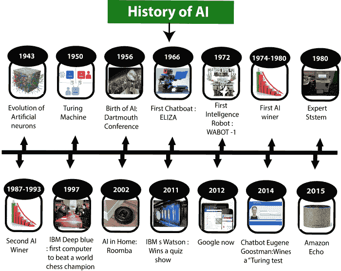

# 人工智能的历史

> 原文：<https://www.javatpoint.com/history-of-artificial-intelligence>

人工智能对研究人员来说不是一个新词，也不是一项新技术。这项技术比你想象的要古老得多。甚至在古希腊和埃及神话中也有机械人的神话。以下是人工智能历史上的一些里程碑，定义了从人工智能产生到目前为止发展的旅程。

## 人工智能的成熟(1943-1952)

*   **1943 年:**第一个现在被认为是 AI 的工作是由沃伦·麦卡洛克和沃尔特·皮斯在 1943 年完成的。他们提出了一个 T2 人工神经元的模型。
*   【1949 年: Donald Hebb 演示了一个修改神经元之间连接强度的更新规则。他的统治现在被称为**赫布边学**。
*   **1950 年:**英国数学家、1950 年开创机器学习先河的艾伦·图灵。艾伦·图灵出版了**《计算机械与智能》**，他在书中提出了一个测试。该测试可以检查机器展现相当于人类智能的智能行为的能力，称为**图灵测试**。

## 人工智能的诞生(1952-1956)

*   【1955 年:一个艾伦·纽厄尔和司马贺创造的“第一个人工智能程序”被命名为**“逻辑理论家”**。这个程序已经证明了 52 个数学定理中的 38 个，并且为一些定理找到了新的更优雅的证明。
*   【1956 年:美国计算机科学家约翰·麦卡锡在达特茅斯会议上首次采用“人工智能”一词。人工智能第一次被创造为一个学术领域。

当时发明了高级计算机语言，如 FORTRAN、LISP 或 COBOL。而且当时对 AI 的热情非常高。

## 黄金岁月-早期热情(1956-1974)

*   【1966 年:研究人员强调开发能够解决数学问题的算法。Joseph Weizenbaum 在 1966 年创造了第一个 chatbot，它的名字是 ELIZA。
*   【1972 年:日本造出第一台智能人形机器人，命名为 WABOT-1。

## 第一个人工智能冬天(1974-1980)

*   1974 年至 1980 年的持续时间是人工智能的第一个冬季持续时间。人工智能冬季指的是计算机科学家应对政府为人工智能研究提供的资金严重短缺的时期。
*   在人工智能的冬天，对人工智能的宣传兴趣降低了。

## 人工智能的繁荣(1980-1987)

*   【1980 年:AI 冬令时过后，AI 带着“专家系统”回来了。专家系统被设计成模拟人类专家的决策能力。
*   1980 年，美国人工智能协会第一次全国会议**在斯坦福大学**召开。

## 人工智能的第二个冬天(1987-1993)

*   1987 年至 1993 年的持续时间是第二个人工智能冬季持续时间。
*   同样，投资者和政府停止了对人工智能研究的资助，因为成本高，但效果不佳。像 XCON 这样的专家系统非常划算。

## 智能代理的出现(1993-2011)

*   **1997 年:**1997 年，IBM 深蓝击败世界象棋冠军加里·卡斯帕罗夫，成为第一个击败世界象棋冠军的计算机。
*   【2002 年:AI 第一次以吸尘器 Roomba 的形式进入家庭。
*   **2006 年:** AI 进入商业世界直到 2006 年。脸书、推特和网飞等公司也开始使用人工智能。

## 深度学习、大数据和人工通用智能(2011 年至今)

*   **2011 年:**2011 年，IBM 的沃森赢得了智力竞赛节目《危险》(jeopardy)的冠军，在那里它必须解决复杂的问题以及谜语。沃森已经证明了它能理解自然语言，并能快速解决棘手的问题。
*   【2012 年:谷歌推出了安卓应用功能“Google now”，能够向用户提供信息作为预测。
*   **2014 年:**2014 年，Chatbot“Eugene Goostman”在臭名昭著的“图灵测试”中赢得了一场比赛
*   【2018 年:来自 IBM 的“项目辩手”与两位大师级辩手就复杂话题展开辩论，表现也极其出色。
*   谷歌展示了一个人工智能程序“双工”，这是一个虚拟助理，随时待命接受美发师的预约，另一边的一位女士没有注意到她正在和机器说话。

现在 AI 已经发展到了一个令人瞩目的水平。深度学习、大数据和数据科学的概念现在正呈现出蓬勃发展的趋势。如今，像谷歌、脸书、IBM 和亚马逊这样的公司正在与人工智能合作，创造出令人惊叹的设备。人工智能的未来令人鼓舞，将伴随着高智能而来。

* * *