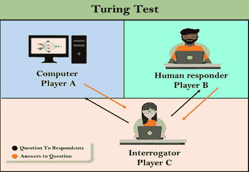

# 人工智能中的图灵测试

> 原文：<https://www.javatpoint.com/turing-test-in-ai>

1950 年，艾伦·图灵引入了一种测试来检查机器是否能像人类一样思考，这种测试被称为图灵测试。在这次测试中，图灵提出，如果计算机能够在特定条件下模仿人类的反应，就可以说是智能的。

图灵测试是图灵在 1950 年的论文《计算机械与智能》中提出的，该论文考虑了“机器能思考吗？”

图灵测试是基于一个派对游戏“模仿游戏”，做了一些修改。这个游戏涉及三个玩家，其中一个玩家是电脑，另一个玩家是人类应答者，第三个玩家是人类查询器，与其他两个玩家隔离，他的工作是在其中两个玩家中找到哪个玩家是机器。

考虑一下，玩家 A 是电脑，玩家 B 是人，玩家 C 是审讯者。审讯者意识到其中一个是机器，但他需要根据问题和他们的回答来识别这一点。

所有玩家之间的对话都是通过键盘和屏幕进行的，因此结果不取决于机器将单词转换为语音的能力。

测试结果并不取决于每一个正确的答案，而只取决于它的反应有多像人类的答案。计算机被允许尽一切可能迫使询问者进行错误的识别。

问题和答案可以是这样的:

**询问器:**你是电脑吗？

**PlayerA(计算机):**否

**询问器:**乘以两个大数，如(256896489*456725896)

**A 号选手:**长时间停顿，给出错误答案。

在这个游戏中，如果一个询问器不能识别哪个是机器，哪个是人，那么计算机就成功通过了测试，机器被认为是智能的，可以像人一样思考。

“1991 年，纽约商人休·罗布纳宣布了奖金竞赛，为第一台通过图灵测试的计算机提供 10 万美元的奖金。然而，迄今为止，还没有任何人工智能程序接近于通过一个未经稀释的图灵测试”。

## 试图进行图灵测试的聊天机器人:

**伊莱扎:**伊莱扎是由约瑟夫·韦森鲍姆创建的自然语言处理计算机程序。它的创建是为了展示机器和人类之间的交流能力。这是最早尝试图灵测试的聊天机器人之一。

**帕里:**帕里是肯尼斯·科尔比在 1972 年创造的话匣子。帕里被设计成模拟一个患有**偏执型精神分裂症**(最常见的慢性精神障碍)的人。帕里被描述为“有态度的伊莱扎”。帕里在 20 世纪 70 年代早期使用图灵测试的变体进行了测试。

**尤金·古斯曼:**尤金·古斯曼是 2001 年在圣彼得堡开发的聊天机器人。这个机器人参加了各种图灵测试。2012 年 6 月，在一次活动中，Goostman 赢得了被宣传为有史以来最大规模图灵测试内容的竞赛，在该竞赛中，它让 29%的评委相信它是人类。古斯特曼看起来像一个 13 岁的虚拟男孩。

## 中国房间论:

有许多哲学家真的不同意人工智能的完整概念。这份清单中最著名的论点是“中国房间”

在 1980 年，约翰·塞尔在他的论文《**思维、大脑和程序》**中提出了“**中文室**思维实验”，这与图灵测试的有效性相悖。根据他的论点，“**对计算机编程可能会使其理解一种语言，但不会在计算机中产生对语言或意识的真正理解**”

他认为，像伊莱扎和帕里这样的机器可以通过操纵关键词和符号轻松通过图灵测试，但他们对语言没有真正的理解。所以不能用人类这样的机器的“思考”能力来形容。

## 机器通过图灵测试所需的特征:

*   **自然语言处理:**需要 NLP 以英语等一般人类语言与查询器进行通信。
*   **知识表示:**在测试过程中存储和检索信息。
*   **自动推理:**使用预先存储的信息回答问题。
*   **机器学习:**适应新的变化并能检测广义模式。
*   **视觉(用于全图灵测试):**在测试过程中识别询问者的动作和其他物体。
*   **运动控制(用于全图灵测试):**如果需要，作用于物体。

* * *