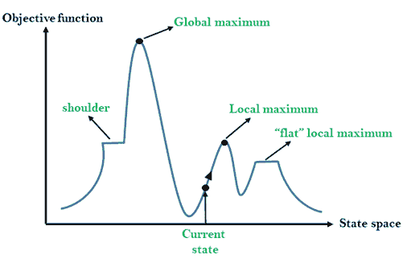
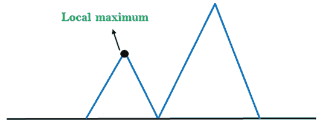
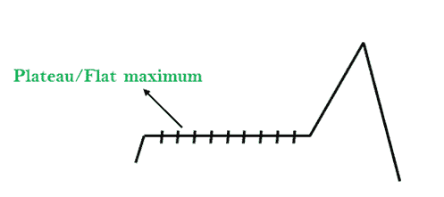
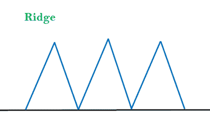

# 人工智能中的爬山算法

> 原文：<https://www.javatpoint.com/hill-climbing-algorithm-in-ai>

*   爬山算法是一种局部搜索算法，它不断向海拔/值增加的方向移动，寻找山峰或问题的最佳解。当它达到没有邻居具有更高值的峰值时，它终止。
*   爬山算法是一种用于优化数学问题的技术。爬山算法的一个广泛讨论的例子是旅行推销员问题，在这个问题中，我们需要最小化推销员旅行的距离。
*   它也被称为贪婪局部搜索，因为它只关注它的好的近邻状态，而不超越它。
*   爬山算法的一个节点有两个组成部分:状态和值。
*   爬山主要用于有好的启发式方法的时候。
*   在这个算法中，我们不需要维护和处理搜索树或图，因为它只保持单一的当前状态。

## 爬山的特点:

以下是爬山算法的一些主要特征:

*   **生成和测试变体:**爬坡是生成和测试方法的变体。生成和测试方法产生反馈，帮助决定在搜索空间中向哪个方向移动。
*   **贪婪方法:**爬山算法搜索向优化成本的方向移动。
*   **不回溯:**不回溯搜索空间，因为不记得之前的状态。

## 爬山的状态空间图:

状态空间景观是爬山算法的图形表示，它显示了算法和目标函数/成本的各种状态之间的图形。

在 Y 轴上，我们取了可以是目标函数或成本函数的函数，以及 x 轴上的状态空间。如果 Y 轴上的函数是成本，那么搜索的目标是找到全局最小值和局部最小值。如果 Y 轴的函数是目标函数，那么搜索的目标就是找到全局最大值和局部最大值。

## 国家空间景观中的不同区域:

**局部最大值:**局部最大值是比其相邻状态更好的状态，但也有比其更高的另一个状态。

**全局最大值:**全局最大值是状态空间景观的最佳可能状态。它具有目标函数的最高值。

**当前状态:**这是一种在风景图中代理当前存在的状态。

**平坦局部最大值:**是景观中所有当前状态的相邻状态具有相同值的平坦空间。

**路肩:**是高原地区，有上坡边缘。

## 爬山算法的类型:

*   简单爬山:
*   最陡-爬坡-爬山:
*   随机爬山:

### 1.简单爬山:

简单的爬山是实现爬山算法最简单的方法。**一次只评估邻居节点状态，选择优化当前开销的第一个，设置为当前状态**。它只检查它是一个继承国，如果它发现比当前状态更好，那么 move else 将处于相同的状态。该算法具有以下特点:

*   耗时更少
*   最优解较少，且解得不到保证

### 简单爬山算法:

*   **第一步:**评估初始状态，如果是目标状态，则返回成功并停止。
*   **步骤 2:** 循环，直到找到解决方案或没有新的操作符可供应用。
*   **第 3 步:**选择一个运算符并将其应用于当前状态。
*   **步骤 4:** 检查新状态:
    1.  如果是目标状态，那么返回成功退出。
    2.  否则，如果它优于当前状态，则分配新状态作为当前状态。
    3.  否则，如果没有好于当前状态，则返回步骤 2。
*   **第五步:**退出。

### 2.最陡-爬坡:

最陡上升算法是简单爬山算法的变体。该算法检查当前状态的所有邻居节点，并选择一个最接近目标状态的邻居节点。该算法在搜索多个邻居时会消耗更多的时间

### 最陡爬坡算法；

*   **第一步:**评估初始状态，如果是目标状态则返回成功并停止，否则将当前状态作为初始状态。
*   **步骤 2:** 循环，直到找到解决方案或当前状态不变。
    1.  让 SUCC 成为一个这样的国家，即当前国家的任何继承者都将比它更好。
    2.  对于适用于当前状态的每个运算符:
        1.  应用新运算符并生成新状态。
        2.  评估新状态。
        3.  如果是目标状态，那么返回并退出，否则将其与 SUCC 进行比较。
        4.  如果比 SUCC 好，那就把新州设为 SUCC。
        5.  如果 SUCC 比当前状态好，那么将当前状态设置为 SUCC。
*   **第五步:**退出。

### 3.随机爬山:

随机爬山在移动之前不会检查所有的邻居。相反，这种搜索算法随机选择一个邻居节点，并决定是选择它作为当前状态还是检查另一个状态。

## 爬山算法中的问题:

**1。局部最大值:**局部最大值是景观中比其每个相邻状态都好的峰值状态，但也存在另一个高于局部最大值的状态。

**求解:**回溯技术可以是状态空间景观中局部最大值的求解。创建一个有希望的路径列表，以便算法可以回溯搜索空间并探索其他路径。

**2。plateau:**plateau 是搜索空间的平坦区域，其中当前状态的所有邻居状态都包含相同的值，因为该算法没有找到任何最佳的移动方向。在高原地区爬山搜索可能会迷路。

**解决方法:**高原的解决方法是边搜索边大步或小步，解决问题。随机选择一个远离当前状态的状态，这样算法就有可能找到非平稳区域。

**3。脊:**脊是局部极大值的一种特殊形式。它有一个比周围区域高的区域，但它本身有一个斜坡，一次移动无法到达。

**解决方法:**利用双向搜索，或者通过向不同方向移动，可以改善这个问题。

### 模拟退火:

一种爬山算法，它从不向一个较低的值移动，保证是不完整的，因为它会陷入局部最大值。如果算法通过移动后继者来应用随机游走，那么它可能会完成但效率不高。**模拟退火**是一种既高效又完整的算法。

机械术语**退火**是将金属或玻璃硬化到高温，然后逐渐冷却的过程，因此这允许金属达到低能结晶状态。模拟退火中使用了相同的过程，其中算法选择随机移动，而不是选择最佳移动。如果随机移动改善了状态，那么它遵循相同的路径。否则，算法遵循概率小于 1 的路径，或者它向下移动并选择另一条路径。

* * *