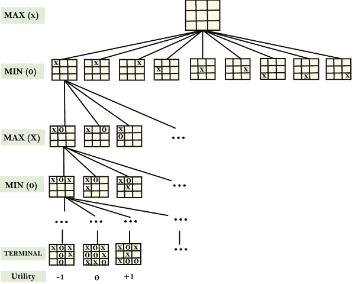
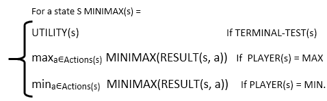

# 对抗搜查

> 原文：<https://www.javatpoint.com/ai-adversarial-search>

**对抗性搜索是一种搜索，在这种搜索中，我们检查当我们试图提前计划世界，而其他代理正在计划针对我们时出现的问题。**

*   在之前的主题中，我们已经研究了仅与单个代理相关联的搜索策略，该代理旨在找到通常以一系列动作的形式表达的解决方案。
*   但是，可能会出现多个代理在同一个搜索空间中搜索解决方案的情况，这种情况通常发生在游戏中。
*   具有多个代理的环境被称为**多代理环境**，其中每个代理都是其他代理的对手并相互对抗。每个代理都需要考虑其他代理的行为以及该行为对其性能的影响。
*   因此，两个或两个以上目标冲突的玩家试图探索相同的搜索空间来寻找解决方案的**搜索被称为对抗性搜索，通常被称为游戏**。
*   游戏被建模为搜索问题和启发式评估函数，这是人工智能中帮助建模和解决游戏的两个主要因素。

## 人工智能中的游戏类型:

|  | 确定性的 | 机会移动 |
| **完美信息** | 象棋、跳棋、围棋、奥赛罗 | 双陆棋，大富翁 |
| **信息不完善** | 战列舰，瞎子，井字游戏 | 桥牌、扑克、拼字游戏、核战争 |

*   **完美信息:**一个拥有完美信息的游戏，是代理人可以查看完整棋盘的游戏。特工有关于游戏的所有信息，他们也能看到对方的动作。例如象棋、跳棋、围棋等。
*   **不完全信息:**如果在一个游戏中，代理人没有关于游戏的所有信息，不知道发生了什么，这种类型的游戏被称为不完全信息游戏，如井字游戏、战舰游戏、盲人游戏、桥牌游戏等。
*   **确定性游戏:**确定性游戏是那些遵循游戏的严格模式和规则集，并且没有与之相关的随机性的游戏。例如象棋、跳棋、围棋、井字游戏等。
*   **非确定性游戏:**非确定性是指那些有各种不可预测的事件，并且有机会或运气因素的游戏。这种机会或运气的因素是由骰子或纸牌引入的。这些都是随机的，每个动作反应都不是固定的。这种游戏也被称为随机游戏。
    例子:双陆棋、大富翁、扑克等。

#### 注:在本主题中，我们将讨论确定性博弈、完全可观察的环境、零和以及每个代理交替行动的情况。

## 零和游戏

*   零和游戏是对抗性的搜索，涉及纯粹的竞争。
*   在零和博弈中，每个代理人的效用得失正好被另一个代理人的效用得失所平衡。
*   游戏中的一个玩家试图最大化一个单一的价值，而另一个玩家试图最小化它。
*   游戏中一个玩家的每一步都被称为走步。
*   象棋和井字游戏是零和游戏的例子。

### 零和游戏:嵌入式思维

零和游戏包含了一种嵌入的思维，其中一个代理或玩家试图弄清楚:

*   该怎么办。
*   如何决定搬家
*   也需要考虑他的对手
*   对手也在想该怎么办

每个球员都试图找出对手对自己行为的反应。这就需要嵌入式思维或者逆向推理来解决 AI 中的游戏问题。

### 问题的形式化:

**游戏可以定义为 AI 中的一种搜索类型，它可以由以下元素形式化:**

*   **初始状态:**指定游戏开始时如何设置。
*   **玩家:**指定哪个玩家在状态空间中移动过。
*   **动作:**返回状态空间中的合法动作集。
*   **结果(s，a):** 是过渡模型，指定状态空间中移动的结果。
*   **终端测试:**如果游戏结束，终端测试为真，否则无论如何都是假的。游戏结束的状态称为终端状态。
*   **效用(s，p):** 效用函数给出了以玩家 p 的终端状态 s 结束的游戏的最终数值，也称为支付函数。对于国际象棋，结果是赢、输或平，其支付值为+1、0、。对于井字游戏，效用值为+1、-1 和 0。

## 游戏树:

游戏树是一棵树，其中树的节点是游戏状态，树的边是玩家的移动。游戏树包括初始状态、动作函数和结果函数。

**示例:井字游戏树:**

下图是井字游戏的部分游戏树。以下是游戏的一些要点:

*   有两个玩家 MAX 和 MIN。
*   玩家有一个交替回合，从 MAX 开始。
*   最大化游戏树的结果
*   最小化结果。

**示例说明:**

*   从初始状态，MAX 有 9 个可能的移动，因为他首先开始。最大位置 x 和最小位置 o，两个玩家交替玩，直到我们到达一个叶子节点，其中一个玩家有三个连续或所有的方块都被填满。
*   两个玩家将计算每个节点，最小最大值，最小最大值是对抗最佳对手的最佳效用。
*   假设两个玩家都很了解井字游戏，并且玩到了最好的玩法。每个玩家都在尽力阻止另一个玩家获胜。闵在比赛中与马克斯对抗。
*   所以在游戏树中，我们有一层 Max，一层 MIN，每一层称为 **Ply** 。Max 放 x，然后 MIN 放 o，防止 Max 赢，这个游戏一直持续到终端节点。
*   在这种情况下，要么是最小赢，最大赢，要么是平局。这个游戏树就是 MIN 和 MAX 交替玩井字游戏和轮流玩的可能性的整个搜索空间。

因此，最小最大值的对抗性搜索过程如下:

*   它旨在为 MAX 找到赢得游戏的最佳策略。
*   它遵循深度优先搜索的方法。
*   在游戏树中，最佳叶节点可以出现在树的任何深度。
*   将最小值和最大值向上传播到树中，直到发现终端节点。

在给定的博弈树中，最优策略可以由每个节点的 minimax 值来确定，可以写成 MINIMAX(n)。最大值优先移动到最大值状态，最小值优先移动到最小值状态，然后:

* * *