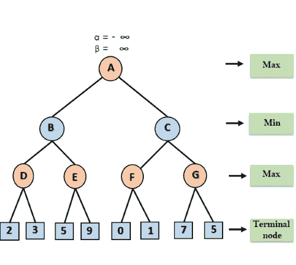
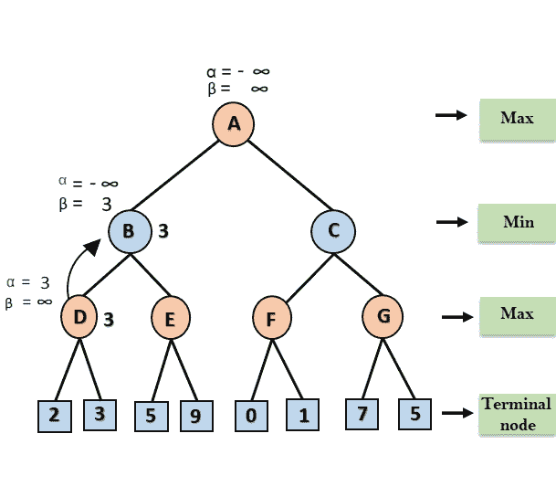
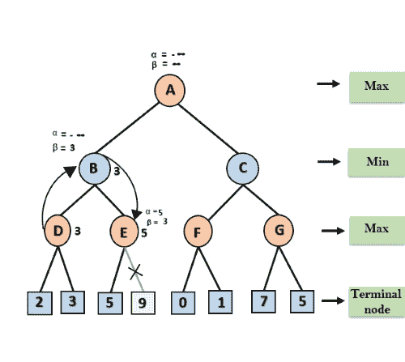
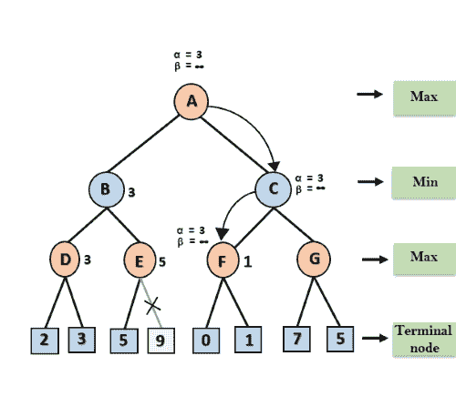
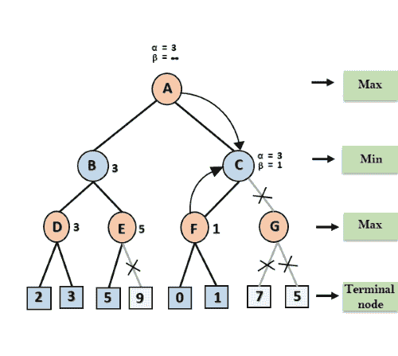
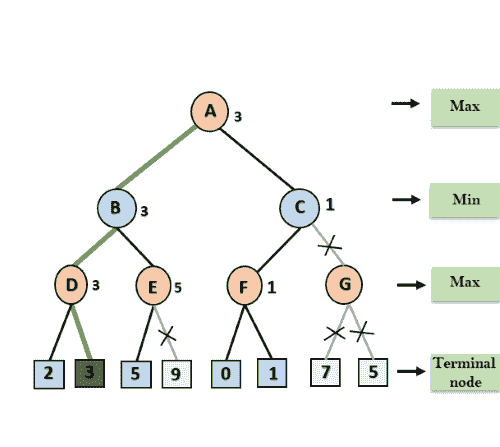

# α-β修剪

> 原文：<https://www.javatpoint.com/ai-alpha-beta-pruning>

*   Alpha-beta 剪枝是 minimax 算法的修改版本。这是一种用于极小极大算法的优化技术。
*   正如我们在极小极大搜索算法中看到的，它必须检查的游戏状态数量在树的深度上是指数级的。既然我们不能消除指数，但我们可以把它减半。因此，有一种技术，通过这种技术，不用检查游戏树的每个节点，我们就可以计算出正确的极小极大决策，这种技术被称为**修剪**。这涉及到两个阈值参数 Alpha 和 beta 以备将来扩展，所以称之为 **alpha-beta 剪枝**。也被称为**α-β算法**。
*   α-β修剪可以应用于树的任何深度，有时它不仅修剪树叶，还修剪整个子树。
*   双参数可以定义为:
    1.  **Alpha:** 我们迄今为止在最大化器路径上的任何一点找到的最佳(最高值)选择。阿尔法的初始值是**-∩**。
    2.  **Beta:** 在 Minimizer 路径上的任何一点上，我们迄今为止找到的最佳(最低值)选择。贝塔的初始值是 **+∞** 。
*   标准极小极大算法的阿尔法-贝塔剪枝返回与标准算法相同的移动，但是它删除了所有不真正影响最终决策但使算法变慢的节点。因此，通过修剪这些节点，它使算法更快。

#### 注意:为了更好地理解这个主题，请研究极小极大算法。

## α-β修剪的条件:

α-β修剪所需的主要条件是:

```

α>=β

```

## 关于α-β修剪的要点:

*   最大玩家只会更新阿尔法的值。
*   闵玩家只会更新 beta 的值。
*   回溯树时，节点值将被传递到上层节点，而不是α和β的值。
*   我们将只把α、β值传递给子节点。

## α-β修剪的伪代码:

```

function minimax(node, depth, alpha, beta, maximizingPlayer) is
if depth ==0 or node is a terminal node then
return static evaluation of node

if MaximizingPlayer then      // for Maximizer Player
   maxEva= -infinity          
   for each child of node do
   eva= minimax(child, depth-1, alpha, beta, False)
  maxEva= max(maxEva, eva) 
  alpha= max(alpha, maxEva)    
   if beta<=alpha
 break
 return maxEva

else                         // for Minimizer player
   minEva= +infinity 
   for each child of node do
   eva= minimax(child, depth-1, alpha, beta, true)
   minEva= min(minEva, eva) 
   beta= min(beta, eva)
    if beta<=alpha
  break        
 return minEva

```

## α-β修剪的工作:

让我们举一个两人搜索树的例子来理解 Alpha-beta 剪枝的工作原理

**第一步:**在第一步中，Max 玩家将首先从节点 A 开始移动，其中α= -∞和β= +∞，α和β的这些值向下传递到节点 B，其中α= -∞和β= +∞，节点 B 将相同的值传递给其子节点 d。



**第二步:**在节点 D，α的值将被计算为其最大值。首先将α的值与 2 进行比较，然后与 3 进行比较，最大值(2，3) = 3 将是节点 D 处的α值，节点值也将是 3。

**第三步:**现在算法回溯到节点 B，这里β的值会改变，因为这是 Min 的一个转弯，现在β= +∞，将与可用的后续节点值进行比较，即 Min(∩，3) = 3，因此在节点 B 现在α= -∞，β= 3。



在下一步中，算法遍历节点 B 的下一个后继节点，即节点 E，α= -∞，β= 3 的值也将被传递。

**第四步:**在节点 E，Max 会轮到自己，alpha 的值会发生变化。α的当前值将与 5 进行比较，因此 max (-∞，5) = 5，因此在节点 E α= 5 和β= 3，其中α > =β，因此 E 的右后继将被修剪，算法将不遍历它，并且节点 E 的值将是 5。



**第五步:**下一步，算法再次回溯树，从节点 B 到节点 A，在节点 A，α的值将被改变，最大可用值为 3 as max (-∞，3)= 3，β= +∞，这两个值现在传递给节点 c 的 A 的右后继者。

在节点 C，α=3 和β= +∞，相同的值将传递给节点 f。

**第六步:**在节点 F 处，再次将α的值与左子为 0，max(3，0)= 3 进行比较，然后与右子为 1 进行比较，max(3，1)= 3 仍然α保持为 3，但 F 的节点值变为 1。



**第七步:**节点 F 将节点值 1 返回到节点 C，在 C α= 3，β= +∞，这里β的值会发生变化，它会与 1 so min 进行比较(∞，1) = 1。现在在 C，α=3，β= 1，再次满足条件α > =β，所以 C 的下一个子节点，也就是 G 将被修剪，算法不会计算整个子树 G。



**第 8 步:** C 现在返回 1 到 A 的值，这里 A 的最佳值是 max (3，1) = 3。下面是最终的游戏树，它显示了已计算的节点和从未计算过的节点。因此，在这个例子中，最大化器的最佳值是 3。



## 阿尔法-贝塔修剪中的移动排序:

α-β修剪的有效性高度依赖于检查每个节点的顺序。移动顺序是 alpha-beta 修剪的一个重要方面。

它可以有两种类型:

*   **最差排序:**在某些情况下，α-β修剪算法不会修剪树的任何一片叶子，其工作方式与极小极大算法完全相同。在这种情况下，由于α-β因素，它也消耗更多的时间，这样的修剪动作被称为最差排序。在这种情况下，最佳移动发生在树的右侧。这样一个订单的时间复杂度为 0(b<sup>m</sup>)。
*   **理想排序:**α-β修剪的理想排序发生在树中发生大量修剪时，最佳移动发生在树的左侧。我们应用 DFS，因此它首先在树的左边搜索，并在相同的时间内比极小极大算法深入两倍。理想排序中的复杂度为 0(b<sup>m/2</sup>)。

## 寻找良好排序的规则:

以下是在 alpha-beta 修剪中寻找良好排序的一些规则:

*   从最浅的节点开始进行最佳移动。
*   对树中的节点进行排序，以便首先检查最佳节点。
*   使用领域知识，同时找到最佳举措。举个例子:对于国际象棋来说，试试顺序:先抓，然后威胁，然后向前移动，向后移动。
*   我们可以记录各州的情况，因为各州可能会重复。

* * *