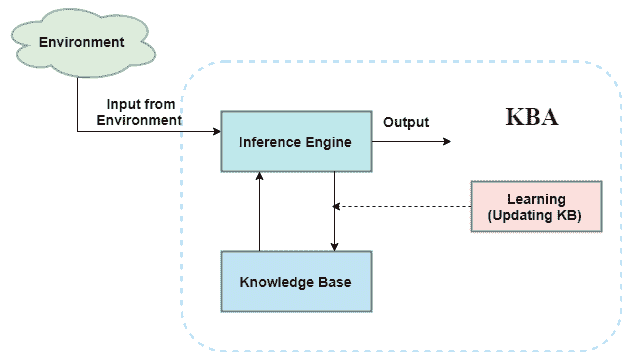

# 人工智能中基于知识的智能体

> 原文：<https://www.javatpoint.com/knowledge-based-agent-in-ai>

*   一个智能代理需要**关于现实世界的知识**来做决定和**推理**来有效地行动。
*   基于知识的智能体是那些有能力**保持知识的内部状态，对知识进行推理，在观察后更新知识并采取行动的智能体。这些代理可以用某种形式的表示来代表世界，并智能地行动**。
*   基于知识的代理由两个主要部分组成:
    *   **知识库和**
    *   **推理系统**。

知识型代理必须能够做到以下几点:

*   代理应该能够代表状态、动作等。
*   一个代理应该能够加入新的感知
*   代理可以更新世界的内部表示
*   代理可以推导出世界的内部表示
*   代理可以推断出适当的动作。

## 基于知识的代理的体系结构；



上图代表了基于知识的代理的通用架构。基于知识的代理(KBA)通过感知环境从环境中获取输入。输入由代理的推理机获取，推理机还与知识库通信，根据知识库中的知识进行决策。KBA 的学习元素通过学习新知识定期更新知识库。

**知识库:**知识库是基于知识的智能体的核心组成部分，也称为知识库。它是句子的集合(这里的“句子”是一个专业术语，与英语中的句子不完全相同)。这些句子用一种被称为知识表示语言的语言来表达。KBA 的知识库储存着关于世界的事实。

## 为什么要使用知识库？

更新知识需要知识库，以便代理根据经验学习并根据知识采取行动。

## 参照系

推理意味着从旧句子中推导出新句子。推理系统允许我们在知识库中添加新的句子。句子是关于世界的命题。推理系统将逻辑规则应用于知识库以推导新信息。

推理系统生成新的事实，以便代理可以更新知识库。推理系统主要在两个规则中工作，这两个规则如下:

*   **正向链接**
*   **反向链接**

## KBA 执行的操作

**以下是 KBA 为了展示智能行为而执行的三个操作:**

1.  **TELL:** 这个操作告诉知识库它从环境中感知到了什么。
2.  **ASK:** 此操作询问知识库应该执行什么操作。
3.  **执行:**执行选择的动作。

## 基于知识的通用代理:

以下是基于知识的通用代理程序的结构概要:

```

function KB-AGENT(percept):
persistent: KB, a knowledge base 
          t, a counter, initially 0, indicating time 
TELL(KB, MAKE-PERCEPT-SENTENCE(percept, t)) 
Action = ASK(KB, MAKE-ACTION-QUERY(t)) 
TELL(KB, MAKE-ACTION-SENTENCE(action, t))
 t = t + 1
 return action 

```

基于知识的代理将感知作为输入，并将动作作为输出返回。代理维护知识库 KB，它最初拥有一些真实世界的背景知识。它还有一个计数器来指示整个过程的时间，这个计数器用零初始化。

每次调用该函数时，它都会执行三个操作:

*   首先，它告诉知识库它所感知的。
*   其次，它询问知识库应该采取什么行动
*   第三个代理程序告诉知识库选择了哪个操作。

MAKE-PERCEPT-句子生成一个句子，作为代理在给定时间感知给定感知的设置。

MAKE-ACTION-QUERY 生成一个句子，询问当前应该执行哪个操作。

MAKE-ACTION-句子生成一个句子，断言所选择的动作已经执行。

## 基于知识的代理的各个级别:

基于知识的代理可以在不同的级别上查看，如下所示:

### 1.知识水平

知识层是知识型代理的第一层，在这一层中，我们需要明确代理知道什么，代理的目标是什么。有了这些规范，我们可以修复它的行为。例如，假设一个自动出租车代理需要从 A 站去 B 站，他知道从 A 到 B 的路，那么这就来到了知识层面。

### 2.逻辑级别:

在这个层次上，我们理解知识的知识表示是如何存储的。在这个层次上，句子被编码成不同的逻辑。在逻辑层面，知识被编码成逻辑句子。在逻辑层面，我们可以期待自动出租车代理到达目的地 b。

### 3.实施级别:

这是逻辑和知识的物理表示。在实现层，代理根据逻辑和知识水平执行操作。在这个层次上，自动出租车代理实际上实现了他的知识和逻辑，这样他就可以到达目的地。

## 设计基于知识的代理的方法:

构建基于知识的代理主要有两种方法:

1.  **1。声明式方法:**我们可以用一个空的知识库初始化，并告诉代理我们想要开始的所有句子，从而创建一个基于知识的代理。这种方法称为声明式方法。
2.  **2。过程方法:**在过程方法中，我们将期望的行为直接编码为程序代码。这意味着我们只需要编写一个已经编码了所需行为或代理的程序。

然而，在现实世界中，一个成功的代理可以通过结合声明性和过程性方法来构建，声明性知识通常可以编译成更高效的过程性代码。

* * *