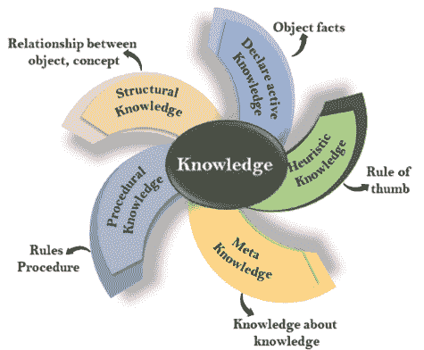
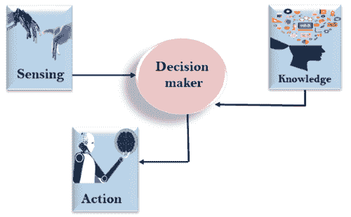
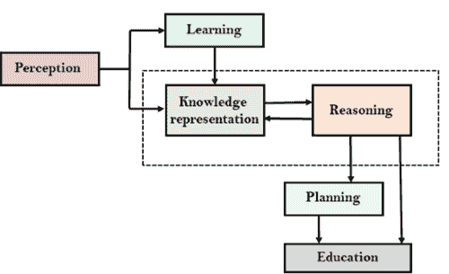
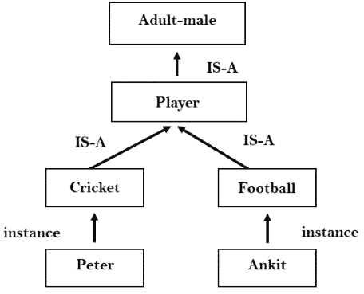

# 什么是知识表示？

> 原文：<https://www.javatpoint.com/knowledge-representation-in-ai>

人类最擅长理解、推理和解释知识。人类知道事情，这是知识，根据他们的知识，他们在现实世界中执行各种行动。**但是机器如何做所有这些事情属于知识表示和推理**。因此，我们可以将知识表示描述如下:

*   知识表示和推理(KR，KRR)是人工智能的一部分，涉及人工智能主体的思维以及思维如何促进主体的智能行为。
*   它负责表示关于现实世界的信息，以便计算机能够理解并利用这些知识来解决复杂的现实世界问题，例如诊断医疗状况或用自然语言与人类交流。
*   这也是描述我们如何在人工智能中表示知识的一种方式。知识表示不仅仅是将数据存储到某个数据库中，它还使智能机器能够从这些知识和经验中学习，从而能够像人类一样智能地工作。

## 代表什么:

以下是需要在人工智能系统中表示的知识类型:

*   **对象:**关于我们世界域中对象的所有事实。例如，吉他包含弦，小号是铜管乐器。
*   **事件:**事件是发生在我们这个世界上的行为。
*   **表现:**描述涉及如何做事的知识的行为。
*   **元知识:**是关于我们所知道的知识。
*   **事实:**事实是关于现实世界和我们所代表的事物的真相。
*   **知识库:**基于知识的代理的核心组件是知识库。它表示为 KB。知识库是一组句子(这里，句子是作为一个专业术语使用的，并不等同于英语)。

**知识:**知识是通过对事实、数据和情境的体验而获得的意识或熟悉度。以下是人工智能中的知识类型:

## 知识类型

以下是不同类型的知识:

**1。陈述性知识:**

*   陈述性知识是对某事的认识。
*   它包括概念、事实和对象。
*   它也被称为描述性知识，用陈述句来表达。
*   它比过程语言更简单。

**2。程序知识**

*   它也被称为命令式知识。
*   程序知识是一种负责知道如何做某事的知识。
*   它可以直接应用于任何任务。
*   它包括规则、策略、程序、议程等。
*   程序知识取决于应用它的任务。

**3。元知识:**

*   关于其他类型知识的知识被称为元知识。

**4。启发式知识:**

*   启发式知识是代表某一领域或学科的一些专家的知识。
*   启发式知识是基于以前的经验、对方法的认识的经验法则，这些知识很有用，但不能保证。

**5。结构知识:**

*   结构知识是解决问题的基础知识。
*   它描述了各种概念之间的关系，如某种事物的种类、部分和分组。
*   它描述了概念或对象之间存在的关系。

## 知识与智力的关系:

现实世界的知识在智能中起着至关重要的作用，对于创造人工智能也是如此。知识在展示人工智能主体的智能行为中起着重要的作用。一个代理只有在对某个输入有所了解或有所经验时，才能准确地对该输入采取行动。

让我们假设，如果你遇到了一个人，他说的是一种你不知道的语言，那么你将如何去做。代理的智能行为也是如此。

正如我们在下图中看到的，有一个决策者通过感知环境和使用知识来行动。但是如果知识部分不存在，它就不能显示智能行为。

## 人工智能知识周期:

人工智能系统具有以下用于显示智能行为的组件:

*   感觉
*   学问
*   知识表示和推理
*   规划
*   执行

上图显示了人工智能系统如何与现实世界交互，以及哪些组件有助于它显示智能。人工智能系统具有感知组件，通过该组件从其环境中检索信息。它可以是视觉、听觉或其他形式的感官输入。学习组件负责从感知组件捕获的数据中学习。在整个循环中，主要组成部分是知识表示和推理。这两个组成部分与展示类机器人类的智能有关。这两个组件相互独立，但也耦合在一起。计划和执行依赖于知识表示和推理的分析。

## 知识表示方法:

知识表示主要有四种方法，分别是:

### 1.简单的关系知识:

*   这是使用关系方法存储事实的最简单方式，并且关于一组对象的每个事实都以列的形式系统地列出。
*   这种知识表示方法在表示不同实体之间关系的数据库系统中很有名。
*   这种方法几乎没有推断的机会。

**例:以下是简单的关系知识表示。**

| 运动员 | 重量 | 年龄 |
| 玩家 1 | Sixty-five | Twenty-three |
| 玩家 2 | Fifty-eight | Eighteen |
| Player3 | Seventy-five | Twenty-four |

### 2.可继承的知识:

*   在可继承的知识方法中，所有数据都必须存储在类的层次结构中。
*   所有的类都应该以一种一般化的形式或层次化的方式排列。
*   在这种方法中，我们应用继承属性。
*   元素从类的其他成员继承值。
*   这种方法包含表示实例和类之间关系的可继承知识，称为实例关系。
*   每个单独的帧都可以表示属性及其值的集合。
*   在这种方法中，对象和值在装箱的节点中表示。
*   我们使用从对象指向其值的箭头。
*   **示例:**

### 3.推理知识:

*   推理知识方法以形式逻辑的形式表示知识。
*   这种方法可以用来推导更多的事实。
*   它保证了正确性。
*   **例:**假设有两种说法:
    1.  马库斯是个男人
    2.  所有的人都是凡人
        那么它可以表示为；

        **人(马库斯)
        ∀x =人(x) - >凡人(x)s**

### 4.程序知识:

*   过程知识方法使用小程序和代码，描述如何做具体的事情，以及如何进行。
*   在这种方法中，使用了一个重要的规则 **If-Then 规则**。
*   在这些知识中，我们可以使用各种编码语言，如 **LISP 语言**和 **Prolog 语言**。
*   使用这种方法，我们可以很容易地表示启发式或特定领域的知识。
*   但是我们没有必要用这种方法来代表所有的情况。

## 知识表示系统的要求:

一个好的知识表示系统必须具备以下特性。

1.  **1。表征准确性:**
    KR 系统应该有能力表示各种所需的知识。
2.  **2。推理充分性:**
    KR 系统应具有操纵表征结构的能力，以产生与现有结构相对应的新知识。
3.  **3。推理效率:**
    通过存储适当的指南，将推理知识机制引向最有效方向的能力。
4.  **4。获取效率-** 使用自动化方法轻松获取新知识的能力。

* * *