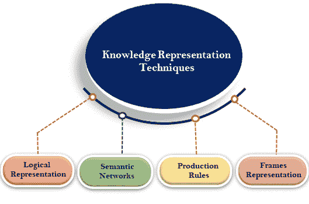
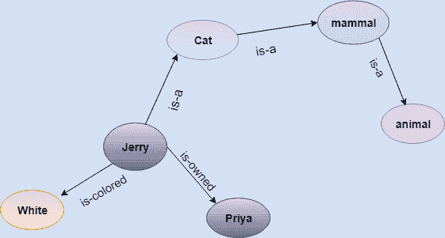

# 知识表示技术

> 原文：<https://www.javatpoint.com/ai-techniques-of-knowledge-representation>

知识表示主要有以下四种方式:

1.  逻辑表示
2.  语义网络表示
3.  框架表示
4.  生产规则

## 1.逻辑表示

逻辑表示是一种有具体规则的语言，它处理命题，在表示上没有歧义。逻辑表示意味着根据各种条件得出结论。这种表达方式规定了一些重要的沟通规则。它由支持声音推理的精确定义的语法和语义组成。每个句子都可以用句法和语义翻译成逻辑。

### 语法:

*   句法是决定我们如何在逻辑中构造法律句子的规则。
*   它决定了我们在知识表示中可以使用哪个符号。
*   如何书写这些符号？

### 语义:

*   语义是我们在逻辑中解释句子的规则。
*   语义也包括给每个句子赋予一个意义。

逻辑表示可以主要分为两种逻辑:

1.  命题逻辑
2.  谓词逻辑

#### 注:我们将在后面的章节中讨论介词逻辑和谓词逻辑。

### 逻辑表示的优点:

1.  逻辑表示使我们能够进行逻辑推理。
2.  逻辑表示是编程语言的基础。

### 逻辑表示的缺点:

1.  逻辑表示有一些限制，使用起来很有挑战性。
2.  逻辑表示技术可能不太自然，推理也不太有效。

#### 注意:不要把逻辑表示和逻辑推理混为一谈，因为逻辑表示是一种表示语言，推理是逻辑思维的过程。

## 2.语义网络表示

语义网络是谓词逻辑在知识表示中的替代。在语义网络中，我们可以用图形网络的形式来表示我们的知识。这个网络由表示对象的节点和描述这些对象之间关系的弧组成。语义网络可以以不同的形式对对象进行分类，也可以链接这些对象。语义网络很容易理解，也很容易扩展。

这种表示主要由两种关系组成:

1.  一种关系(继承)
2.  某种关系

**示例:**下面是一些我们需要用节点和弧的形式来表示的语句。

### 声明:

1.  杰瑞是一只猫。
2.  杰瑞是哺乳动物
3.  杰瑞归普里雅所有。
4.  杰瑞是棕色的。
5.  所有的哺乳动物都是动物。

在上图中，我们以节点和弧的形式表示了不同类型的知识。每个对象通过某种关系与另一个对象相连。

### 语义表示的缺点:

1.  语义网络在运行时需要更多的计算时间，因为我们需要遍历完整的网络树来回答一些问题。在最坏的情况下，遍历整个树后，我们可能会发现该网络中不存在该解决方案。
2.  语义网络试图建立类似人类的记忆模型(有 1015 个神经元和链接)来存储信息，但在实践中，不可能建立如此庞大的语义网络。
3.  这些类型的表示是不充分的，因为它们没有任何等价的量词，例如，对于所有的，对于一些，没有，等等。
4.  语义网络没有任何标准的链接名称定义。
5.  这些网络不是智能的，依赖于系统的创建者。

### 语义网络的优势:

1.  语义网络是知识的自然表示。
2.  语义网络以透明的方式传达意义。
3.  这些网络简单易懂。

## 3.框架表示

框架是一种类似记录的结构，由属性及其值的集合组成，用于描述世界上的实体。框架是人工智能的数据结构，它通过表示原型情境将知识分成子结构。它由插槽和插槽值的集合组成。这些槽可以是任何类型和尺寸。插槽有名称和值，称为方面。

**刻面:**插槽的各个方面被称为**刻面**。刻面是框架的特征，使我们能够对框架进行约束。示例:当需要任何特定槽的数据时，调用 IF-required 事实。框架可以由任意数量的槽组成，并且槽可以包括任意数量的面，并且面可以具有任意数量的值。框架在人工智能中也被称为**槽过滤知识表示**。

框架源自语义网络，后来演变成我们现代的类和对象。单帧没什么用。框架系统由一组相互连接的框架组成。在框架中，关于对象或事件的知识可以一起存储在知识库中。框架是一种广泛应用于各种应用的技术，包括自然语言处理和机器视觉。

### 示例:1

让我们举一个书的框架的例子

| 时间 | 过滤 |
| **标题** | 人工智能 |
| 型 | 计算机科学 |
| **作者** | 彼得·诺维格 |
| **版** | 第三版 |
| **年** | One thousand nine hundred and ninety-six |
| 页 | One thousand one hundred and fifty-two |

### 例 2:

假设我们在拿一个实体，彼得。彼得的职业是工程师，他 25 岁，住在伦敦，国家是英国。下面是这个的框架表示:

| 时间 | 过滤器 |
| **名称** | 耗尽 |
| **职业** | 医生 |
| **年龄** | Twenty-five |
| **婚姻状况** | 单一的 |
| **重量** | seventy-eight |

### 框架表示的优点:

1.  框架知识表示通过对相关数据进行分组，使得编程更加容易。
2.  框架表示相对灵活，在人工智能中有许多应用。
3.  为新属性和关系添加槽非常容易。
4.  包含默认数据和搜索缺失值很容易。
5.  框架表示易于理解和可视化。

### 框架表示的缺点:

1.  在框架系统中，推理机制不容易处理。
2.  推理机制不能通过框架表示顺利进行。
3.  框架表示有一种更通用的方法。

## 4.生产规则

生产规则系统由(**条件，动作**)对组成，意思是“如果条件，那么动作”。它主要有三个部分:

*   生产规则集
*   内存储器
*   认知-行为-循环

在生产规则中，代理检查条件，如果条件存在，则触发生产规则并执行相应的操作。规则的条件部分决定了哪个规则可以应用于问题。动作部分执行相关的问题解决步骤。这个完整的过程被称为认知-行为循环。

工作记忆包含解决问题的当前状态的描述，规则可以将知识写入工作记忆。这种知识匹配并可能触发其他规则。

如果有新的情况(状态)生成，那么多个生产规则将被一起激发，这被称为冲突集。在这种情况下，代理需要从这些集中选择一个规则，这被称为冲突解决。

### 示例:

*   **如果(在公交车站，公交车到达)然后行动(上车)**
*   **如果(在公共汽车上，付了钱，空了座位)然后行动(坐下)。**
*   **如果(在公共汽车上且未付款)则采取行动(支付费用)。**
*   **IF(公交车到达目的地)THEN action(下车)。**

### 生产规则的优势:

1.  生产规则用自然语言表达。
2.  生产规则是高度模块化的，因此我们可以轻松删除、添加或修改单个规则。

### 生产规则的缺点:

1.  生产规则系统不展示任何学习能力，因为它不存储问题的结果供将来使用。
2.  在程序执行期间，许多规则可能是活动的，因此基于规则的生产系统是低效的。

* * *