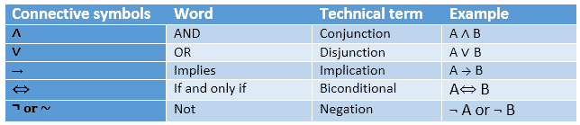
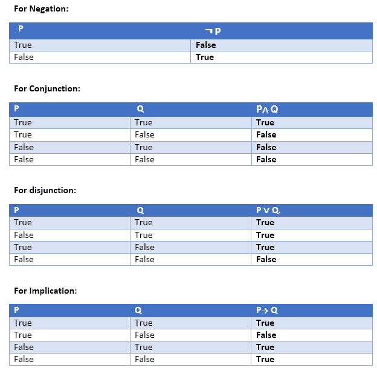
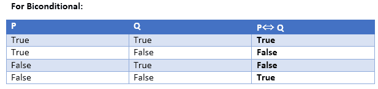
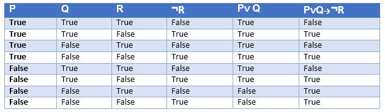
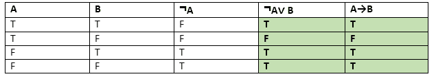

# 人工智能中的命题逻辑

> 原文：<https://www.javatpoint.com/propositional-logic-in-artificial-intelligence>

命题逻辑是最简单的逻辑形式，所有的陈述都是由命题构成的。命题是一种陈述性的陈述，它要么是真的，要么是假的。它是一种以逻辑和数学形式表示知识的技术。

### 示例:

```

a) It is Sunday.
b) The Sun rises from West (False proposition)
c) 3+3= 7(False proposition)
d) 5 is a prime number. 

```

**以下是关于命题逻辑的一些基本事实:**

*   命题逻辑也称为布尔逻辑，因为它对 0 和 1 起作用。
*   在命题逻辑中，我们用符号变量来表示逻辑，对于一个表示一个命题的 A，我们可以用任何符号，如 A、B、C、P、Q、R 等。
*   命题可以是真的，也可以是假的，但不能同时是真的和假的。
*   命题逻辑由一个对象、关系或函数以及**逻辑连接词**组成。
*   这些连接词也被称为逻辑运算符。
*   命题和连接词是命题逻辑的基本元素。
*   连接词可以说是连接两个句子的逻辑运算符。
*   一个永远为真的命题公式叫做**重言式**，也叫做有效句。
*   一个总是假的命题公式叫做**矛盾**。
*   一个既有真值又有假值的命题公式叫做
*   属于问题、命令或意见的陈述不是命题，如“**罗希尼在哪里**”、“**你好吗**”、“**你叫什么名字**”都不是命题。

### 命题逻辑的句法；

命题逻辑的句法定义了知识表示所允许的句子。命题有两种类型:

1.  **原子命题**
2.  **复合命题**

*   **原子命题:**原子命题是最简单的命题。它由一个命题符号组成。这些句子必须是真的或假的。

**示例:**

```

a) 2+2 is 4, it is an atomic proposition as it is a true fact.
b) "The Sun is cold" is also a proposition as it is a false fact. 

```

*   **复合命题:**复合命题是由比较简单的或原子的命题组合而成，使用插入语和逻辑连接词。

**示例:**

```

a) "It is raining today, and street is wet."
b) "Ankit is a doctor, and his clinic is in Mumbai." 

```

## 逻辑连接词:

逻辑连接词用于连接两个更简单的命题或逻辑地表示一个句子。我们可以借助逻辑连接词创造复合命题。主要有五个连接词，给出如下:

1.  **否定:**像 P 这样的句子叫做 P 的否定，字面可以是正字面，也可以是负字面。
2.  **连词:**有 **∧** 连接词如， **P ∧ Q** 的句子称为连词。
    **例:**罗汉聪明勤劳。可以写成，
    **P=罗汉聪明**，
    **Q=罗汉勤劳。→ P∧ Q** 。
3.  **析取:**有∨连接词的句子，如 **P ∨ Q** 。叫做析取，其中 P 和 Q 是命题。
    **例:“Ritika 是医生还是工程师”**
    这里 P= Ritika 是医生。Q= Ritika 是博士，所以我们可以写成 **P ∨ Q** 。
4.  **言外之意:**P→Q 这样的句子，叫做言外之意。暗示也被称为假设规则。可以用
    **来表示，如果**下雨，那么街道是湿的。
    让 P=下雨，Q=街湿，表示为 P → Q
5.  **双条件:**P⇔ Q 这样的句子是双条件句，例如如果我在呼吸，那么我是活的
    P=我在呼吸，Q=我是活的，它可以表示为 p⇔q。

### 以下是命题逻辑连接词的汇总表:



## 真值表:

在命题逻辑中，我们需要知道命题在所有可能情况下的真值。我们可以用逻辑连接词组合所有可能的组合，这些组合以表格形式的表示称为**真值表**。以下是所有逻辑连接词的真值表:

 

### 包含三个命题的真值表:

我们可以建立一个由三个命题 P、Q 和 r 组成的命题。这个真值表由 8n 个元组组成，因为我们取了三个命题符号。



### 连接词的优先顺序:

就像算术运算符一样，命题连接器或逻辑运算符也有优先顺序。评估命题问题时应该遵循这个顺序。以下是运算符的优先顺序列表:

| 优先 | 经营者 |
| 第一优先 | 圆括号 |
| 第二优先 | 否认 |
| 第三优先 | 连词(与) |
| 第四优先 | 析取 |
| 第五优先 | 含义 |
| 六优先 | 双条件的 |

#### 注意:为了更好的理解，请使用括号来确保正确的解释。比如 R∞Q，可以解释为(R) ∨ Q。

### 逻辑等价:

逻辑等价是命题逻辑的特征之一。当且仅当真值表中的列彼此相同时，两个命题被称为逻辑等价。

让我们拿两个命题 a 和 b 来说，为了逻辑等价，我们可以把它写成下面真值表中的 A⇔B.，我们可以看到 A∨ B 和 A→B 的列是相同的，因此 a 等价于 b



### 运算符的属性:

*   **交换性:**
    *   P∧ Q= Q ∧ P，或
    *   p∞Q = Q∞p。
*   **关联性:**
    *   (p-q)r = p(q-r)的缩写，
    *   (P∞Q)∞R = P∞(Q∞R)
*   **身份元素:**
    *   P ∧真= P，
    *   p∞真=真。
*   **分布式:**
    *   P∧(Q∨R)=(P∧Q)∞(P∧R)。
    *   P ∨ (Q ∧ R) = (P ∨ Q) ∧ (P ∨ R)。
*   **德摩根定律:**
    *   (P∧Q)=(P)∞(Q)
    *   (P ∨ Q) = ( P) ∧ ( Q)。
*   **双重否定消除:**
    *   (P) = P。

### 命题逻辑的局限性:

*   我们不能用命题逻辑来表示像 ALL、一些或没有这样的关系。示例:
    1.  **所有的女生都很聪明。**
    2.  **有些苹果是甜的。**
*   命题逻辑表达能力有限。
*   在命题逻辑中，我们不能用语句的属性或逻辑关系来描述语句。

* * *