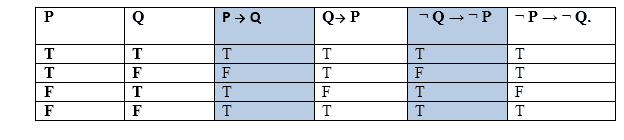
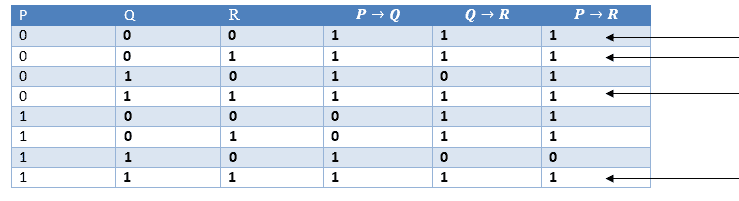
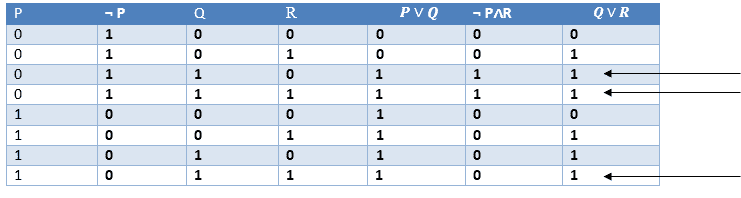

# 人工智能中的推理规则

> 原文：<https://www.javatpoint.com/rules-of-inference-in-artificial-intelligence>

## 推论:

在人工智能中，我们需要智能计算机，它可以从旧逻辑或通过证据创建新逻辑，**因此从证据和事实生成结论被称为推理**。

## 推理规则:

推理规则是生成有效参数的模板。在人工智能中，推理规则被用来推导证明，而证明是导致期望目标的一系列结论。

在推理规则中，所有连接词之间的蕴涵起着重要的作用。以下是一些与推理规则相关的术语:

*   **蕴涵:**是可以表示为 P → Q 的逻辑连接词之一，是布尔表达式。
*   **逆向:**蕴涵的逆向，意思是右手边的命题往左手边走，反之亦然。可以写成 Q → P。
*   **逆正:**逆的否定称为逆正，可以表示为 Q → P。
*   **逆:**蕴涵的否定叫做逆。可以表示为 P → Q。

从上面的术语来看，一些复合语句是相互等价的，我们可以用真值表来证明:

因此从上面的真值表，我们可以证明 P → Q 等价于 Q → P，Q→ P 等价于 P → Q

## 推理规则的类型:

### 1.modbusponens:

摩顿规则是最重要的推理规则之一，它规定如果 P 和 P → Q 为真，那么我们可以推断 Q 将为真。它可以表示为:

**示例:**

声明-1:“如果我困了那我就去睡觉”==> P→ Q
声明-2:“我困了”== > P
结论:“我去睡觉。”== > Q.
因此，我们可以说，如果 P→ Q 为真，P 为真，那么 Q 为真。

**真值表证明:**

### 2 . modbustollens:

Modus Tollens 规则规定，如果 P→ Q 为真， **Q 为真，那么 P** 也将为真。它可以表示为:

**声明-1:** “如果我困了那我就睡觉”= =>P→Q
T3】声明-2: “我不睡觉。”== > ~Q
**声明-3:** 由此推断“**我不困**”=>~ P

**真值表证明:**

### 3.假设三段论:

假设三段论规则规定，只要 P→Q 为真，P→R 为真，Q→R 为真。它可以表示为以下符号:

**示例:**

**声明-1:** 如果你有我家的钥匙，那么你可以解锁我的家。**P→Q**
T5】声明-2: 如果你能解锁我的家那你就能拿走我的钱。 **Q→R**
**结论:**如果你有我家钥匙，那你可以拿我的钱。 **P→R**

**<u>真值表证明:</u>**

### 4.析取三段论:

析取三段论规则规定，如果 P∞Q 为真，P 为真，那么 Q 为真。它可以表示为:

**示例:**

**声明-1:** 今天是周日还是周一。= =>P∨Q
T3】声明-2: 今天不是周日。== > P
**结论:**今天是周一。== >问

**真值表证明:**

### 5.添加:

加法规则是一种常见的推理规则，它规定如果 P 为真，那么 P∞Q 将为真。

**示例:**

**声明:**我有一个香草冰淇淋。= =>P
T3【声明-2: 我有巧克力冰淇淋。
**结论:**我有香草或巧克力冰淇淋。== > (P∨Q)

**真值表证明:**

### 6.简化:

简化规则规定如果 **P∧ Q** 为真，那么 **Q 或 P** 也为真。它可以表示为:

**真值表证明:**

### 7.分辨率:

分辨率规则规定，如果 P∞Q 和 P∞R 为真，那么 Q∞R 也将为真。**可以表示为**

**真值表证明:**

* * *