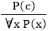
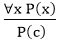
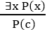
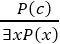
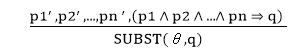

# 一阶逻辑中的推理

> 原文：<https://www.javatpoint.com/ai-inference-in-first-order-logic>

一阶逻辑中的推理用于从现有的句子中推导出新的事实或句子。在理解 FOL 推理规则之前，让我们先了解 FOL 中使用的一些基本术语。

**替代:**

替换是对术语和公式执行的基本操作。它出现在一阶逻辑的所有推理系统中。在 FOL 中有量词的情况下，替换是复杂的。如果我们写**F【a/x】**，那么它指的是用一个常量“ **a** 代替变量“ **x** ”。

#### 注:一阶逻辑能够表达宇宙中某些或所有物体的事实。

**相等:**

一阶逻辑不仅使用谓词和术语来制作原子句子，还使用另一种方式，即 FOL 中的等式。为此，我们可以使用**等同性符号**，指定这两个术语指的是同一个对象。

**例:兄弟(约翰)=史密斯。**

如上例所示，**兄弟(约翰)**所指的对象与**史密斯**所指的对象相似。等号也可以和否定连用，表示两个词不是同一个对象。

**例:￢(x=y)相当于 x≠y**

## 量词的 FOL 推理规则:

作为命题逻辑，我们在一阶逻辑中也有推理规则，所以下面是 FOL 中的一些基本推理规则:

*   **通用概括**
*   **通用实例化**
*   **存在性实例化**
*   **存在主义介绍**

**1。通用概括:**

*   普遍概括是一个有效的推理规则，它指出如果前提 P(c)对于话语宇宙中的任意元素 c 都是真的，那么我们可以有一个结论作为∀ x P(x)。
*   可以表示为:。
*   如果我们想证明每个元素都有相似的属性，可以使用这个规则。
*   在这个规则中，x 不能作为自由变量出现。

**例:**我们来表示，p(c):“**一个字节包含 8 位**，所以对于**∀x p(x)**”**所有字节都包含 8 位**，这也会是真的。

**2。通用实例化:**

*   通用实例化也称为通用排除或 UI 是有效的推理规则。它可以多次应用来添加新句子。
*   新的知识库在逻辑上等同于以前的知识库。
*   根据用户界面，**我们可以通过用一个基础术语代替变量**来推断任何句子。
*   UI 规则指出，我们可以通过用来自 **∀ x P(x)的基本项 c(域 x 中的常数)替换话语宇宙中的任何对象**来推断任何句子 P(c)。
*   可以表示为:。

**例:1。**

如果“每个人都喜欢冰淇淋”=> ∀x P(x)那么我们可以推断出
“约翰喜欢冰淇淋”= > P(c)

**例:2。**

让我们举一个著名的例子，

“所有贪婪的国王都是邪恶的。”所以让我们的知识库以 FOL 的形式包含这个细节:

**∀x 国王(x) ∧贪婪(x) →邪恶(x)**

因此，根据这些信息，我们可以使用通用实例化来推断以下任何语句:

*   **国王(约翰)∧贪婪(约翰)→邪恶(约翰)**
*   **国王(理查德)∧贪婪(理查德)→邪恶(理查德)**
*   **国王(父亲(约翰))∧贪婪(父亲(约翰))→邪恶(父亲(约翰))，**

**3。存在性实例化:**

*   存在性实例化又称为存在性消去，是一阶逻辑中有效的推理规则。
*   它只能用来代替存在句一次。
*   新的 KB 在逻辑上不等同于旧的 KB，但是如果旧的 KB 是可满足的，那么它将是可满足的。
*   这条规则规定，对于一个新的常数符号 c，人们可以从以∃x P(x)形式给出的公式中推断出 P(c)
*   此规则的限制是，规则中使用的 c 必须是 P(c)为真的新术语。
*   可以表示为:

**示例:**

从给定的句子:**∃x·克朗(x) ∧昂黑德(x，John)，**

所以我们可以推断: **Crown(K) ∧ OnHead( K，John)，**只要 K 不出现在知识库中。

*   上面使用的 K 是常量符号，称为**斯科勒姆常量**。
*   存在性实例化是**目的化过程**的特例。

**4。存在主义介绍**

*   存在引论也称为存在概括，是一阶逻辑中有效的推理规则。
*   这条规则指出，如果在话语的宇宙中有某种元素 c 具有性质 P，那么我们可以推断宇宙中存在某种具有性质 P 的东西。
*   可以表示为:
*   **例:这么说吧，**
    “普里扬卡英语成绩不错。”
    “所以，有人英语成绩很好。”

## 广义模顿规则:

对于 FOL 中的推理过程，我们有一个单一的推理规则，称为广义模子。它是摩顿的翻版。

广义模子可以概括为:“P 暗示 Q，P 被断言为真，因此 Q 必须为真。”

根据 Modus Ponens，对于原子句 **pi，pi’，q** 。如果有一个替代θ，使得 SUBST **(θ，pi '，)= SUBST(θ，pi)** ，则可以表示为:



**示例:**

**我们将这个规则用于王者是邪恶的，所以我们会找到一些 x 这样 x 是王者，x 是贪婪的所以我们可以推断 x 是邪恶的。**

```

Here let say, p1' is king(John)        p1 is king(x)
p2' is Greedy(y)                       p2 is Greedy(x)
θ is {x/John, y/John}                  q is evil(x)
SUBST(θ,q).                                                      

```

* * *