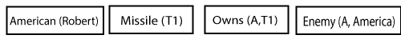
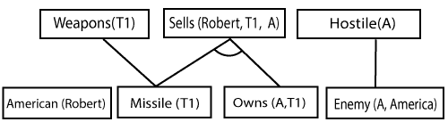
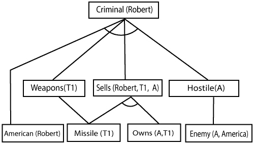
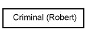
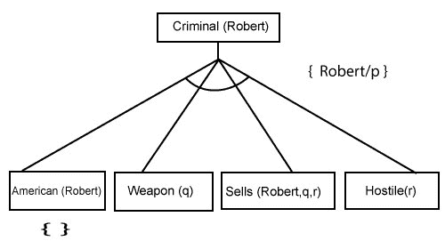
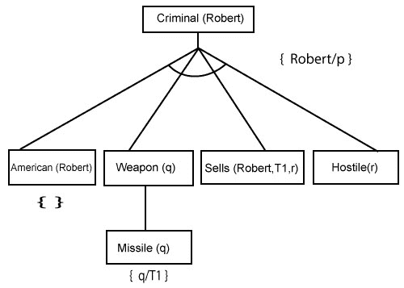
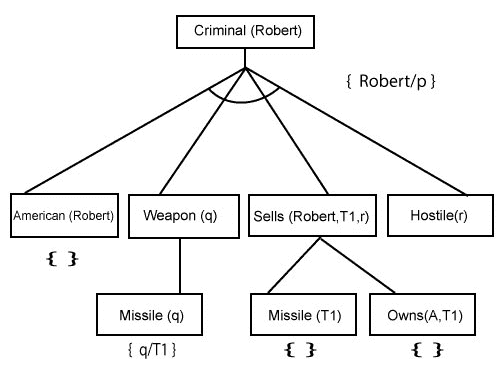
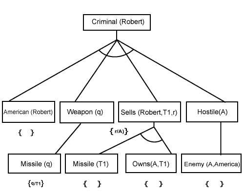

# 人工智能中的正向链接和反向链接

> 原文：<https://www.javatpoint.com/forward-chaining-and-backward-chaining-in-ai>

在人工智能中，正向和反向链接是重要的主题之一，但是在理解正向和反向链接之前，让我们先了解这两个术语是从哪里来的。

## 推理机:

推理机是人工智能中智能系统的组成部分，它将逻辑规则应用于知识库，从已知的事实中推断出新的信息。第一个推理机是专家系统的一部分。推理引擎通常以两种模式进行，它们是:

1.  **正向链接**
2.  **反向链接**

**喇叭从句和定冠词:**

Horn 子句和定子句是句子的形式，这使得知识库能够使用更有限制和更有效的推理算法。逻辑推理算法使用正向和反向链接方法，这需要以**一阶确定子句**的形式的知识库。

**定冠词:**一个是字面量与**恰好一个正字面量**的析取的从句被称为定冠词或严格的喇叭从句。

**Horn 子句:**一个由字面量和**至多一个正字面量**析取的子句被称为 Horn 子句。因此所有的定分句都是喇叭分句。

**例:(p V q V k)** 。它只有一个正的文字 k。

It is equivalent to p ∧ q → k.

## A.正向链接

当使用推理机时，正向链接也称为正向演绎或正向推理方法。正向链接是一种推理形式，它从知识库中的原子句子开始，并向前应用推理规则(Modus Ponens)来提取更多的数据，直到达到目标。

正向链接算法从已知事实开始，触发所有前提满足的规则，并将它们的结论添加到已知事实中。这个过程一直重复，直到问题得到解决。

**正向链接的属性:**

*   这是一种自下而上的方法，因为它是从下往上移动的。
*   它是根据已知的事实或数据，从初始状态出发，到达目标状态，从而得出结论的过程。
*   当我们使用可用数据达到目标时，正向链接方法也被称为数据驱动。
*   正向链接方法通常用于专家系统，如 CLIPS、商业和生产规则系统。

考虑以下我们将在两种方法中使用的著名示例:

### 示例:

**“根据法律，美国人向敌对国家出售武器是犯罪。A 国是美国的敌人，有一些导弹，所有的导弹都是美国公民罗伯特卖给它的。”**

证明**“罗伯特是罪犯。”**

为了解决上述问题，首先，我们将上述所有事实转换为一阶确定子句，然后我们将使用正向链接算法来达到目标。

### 事实转换为 FOL:

*   美国人向敌对国家出售武器是犯罪。(假设 p、q、r 都是变量)
    **美国人(p) ∧武器(q) ∧卖(p、q、r) ∧敌对(r) →罪犯(p)...(1)**
*   A 国有一些导弹。**？p 拥有(A，p) ∧导弹(p)** 。通过使用存在实例化，引入新的常量 T1，可以把它写成两个定分句。
    **拥有(A，T1)......(2)**
    **导弹(T1).......(3)**
*   所有的导弹都被罗伯特卖给了 A 国。
    **？导弹(p) ∧拥有(A，p) →出售(罗伯特，p，A)......(4)**
*   导弹是武器。
    **导弹(p) →武器(p).......(5)**
*   美国的敌人被认为是敌对的。
    **敌人(p，美国)→敌对(p)........(6)**
*   A 国是美国的敌人。
    **敌人(A，美洲).........(7)**
*   罗伯特是美国人。..........(8)

## 正向链接证明:

**第一步:**

第一步，我们从已知的事实开始，选择没有含义的句子，如:**美国人(罗伯特)，敌人(A，美国)，拥有者(A，T1)，导弹(T1)** 。所有这些事实将如下所述。

**第 2 步:**

在第二步，我们将看到那些从现有事实和满意的前提中推断出来的事实。

规则-(1)不满足前提，因此不会在第一次迭代中添加。

规则-(2)和(3)已经添加。

规则-(4)满足替换{p/T1}，**所以增加了 Sells (Robert，T1，A)** ，这是从规则(2)和(3)的连词推断出来的。

规则-(6)对替换(p/A)感到满意，因此添加了敌意(A)，这是从规则-(7)推断出来的。

**第三步:**

在第三步，我们可以检查规则-(1)对替换 **{p/Robert，q/T1，r/A}是否满意，因此我们可以添加 Criminal(Robert)** ，它推断所有可用的事实。因此，我们达成了我们的目标声明。

**因此，使用正向链接方法证明罗伯特是罪犯。**

## B.反向链接:

当使用推理机时，反向链接也称为反向演绎或反向推理方法。反向链接算法是一种推理形式，它从目标开始，反向工作，通过规则链接找到支持目标的已知事实。

**反向链接的属性:**

*   这被称为自上而下的方法。
*   反向链接是基于组件推理规则的。
*   在反向链接中，目标被分成一个或多个子目标，以证明事实的真实性。
*   这被称为目标驱动的方法，因为目标列表决定了选择和使用哪些规则。
*   反向链接算法用于博弈论、自动定理证明工具、推理机、证明助手和各种人工智能应用。
*   反向链接法大多采用**深度优先搜索**策略进行证明。

### 示例:

在反向链接中，我们将使用上面相同的例子，并将重写所有规则。

*   **美军(p) ∧武器(q) ∧出售(p，q，r) ∧敌对(r) →罪犯(p)...(1)**
    **拥有(A，T1)........(2)**
*   **导弹(T1)**
*   **？导弹(p) ∧拥有(A，p) →出售(罗伯特，p，A)......(4)**
*   **导弹(p) →武器(p).......(5)**
*   **敌(p，美国)→敌(p)........(6)**
*   **敌(甲，美).........(7)**
*   **美国人(罗伯特)。..........(8)**

## 反向链接证明:

在反向链接中，我们将从我们的目标谓词开始，即 **Criminal(Robert)** ，然后推断进一步的规则。

**第一步:**

第一步，我们将采取目标事实。而从目标事实，我们会推断出其他事实，最后，我们会证明那些事实是真实的。所以我们的目标事实是“罗伯特是罪犯”，所以下面是它的谓词。

**第 2 步:**

在第二步，我们将从满足规则的目标事实中推断出其他事实。因此，正如我们在规则 1 中看到的，目标谓词 Criminal (Robert)以替换形式出现{Robert/P}。所以我们将把第一层以下的所有合取事实加起来，用罗伯特代替 p。

**在这里我们可以看到美国人(Robert)是事实，所以在这里得到了证明。**

**步骤-3:** t 在步骤-3，我们将进一步提取从武器(q)推断的事实导弹(q)，因为它满足规则-(5)。武器(q)也是如此，用常数 T1 代替 q。

**第 4 步:**

在步骤-4，我们可以推断出满足**规则- 4** 的事实导弹(T1)和拥有(A，T1)形式销售(罗伯特，T1，R)，用 A 代替 R。因此这两个陈述在这里被证明。

**第 5 步:**

在步骤-5，我们可以从满足规则- 6 的**敌对(A)** 中推断出事实**敌人(A，美洲)**。因此所有的陈述都被证明是正确的。

* * *