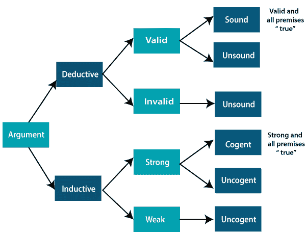

# 归纳推理和演绎推理的区别

> 原文：<https://www.javatpoint.com/difference-between-inductive-and-deductive-reasoning>

人工智能中的推理有两种重要形式，归纳推理和演绎推理。两种推理形式都有前提和结论，但两种推理又相互矛盾。下面是归纳推理和演绎推理的对比列表:

*   演绎推理使用可用的事实、信息或知识来推导出有效的结论，而归纳推理涉及从具体的事实和观察中进行概括。
*   演绎推理使用自上而下的方法，而归纳推理使用自下而上的方法。
*   演绎推理从概括的陈述走向有效的结论，而归纳推理从具体的观察走向概括。
*   在演绎推理中，结论是确定的，而在归纳推理中，结论是概率性的。
*   演绎论证可以是有效的，也可以是无效的，这意味着如果前提是真的，结论必须是真的，而归纳论证可以是强的，也可以是弱的，这意味着即使前提是真的，结论也可能是假的。

归纳和演绎之间的差异可以根据论据用下图来解释:

**对比图:**

| 比较的基础 | 演绎推论 | 归纳推理 |
| **定义** | 演绎推理是有效推理的形式，从已知的相关事实和信息中推导出新的信息或结论。 | 归纳推理通过使用具体事实或数据的概括过程得出结论。 |
| **接近** | 演绎推理遵循自上而下的方法。 | 归纳推理遵循自下而上的方法。 |
| **从**开始 | 演绎推理从前提开始。 | 归纳推理从结论开始。 |
| **有效性** | 在演绎推理中，如果前提为真，结论必须为真。 | 在归纳推理中，前提的真不保证结论的真。 |
| 用法 | 使用演绎推理是困难的，因为我们需要事实必须是真实的。 | 使用归纳推理既快又容易，因为我们需要证据而不是真实的事实。我们经常在日常生活中使用它。 |
| **流程** | 理论→假设→模式→证实。 | 观察-→模式→假设→理论。 |
| **参数** | 在演绎推理中，论点可能有效，也可能无效。 | 在归纳推理中，论点可能很弱，也可能很强。 |
| **结构** | 演绎推理从一般事实延伸到具体事实。 | 归纳推理从具体事实延伸到一般事实。 |

* * *