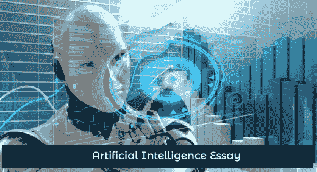
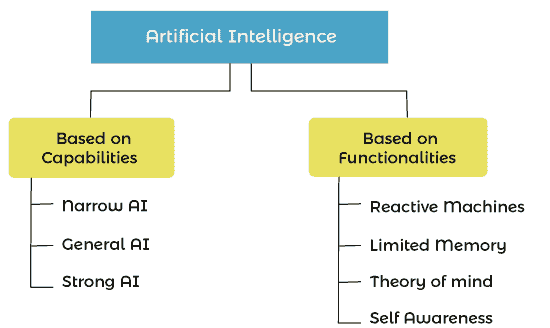

# 人工智能的例子

> 原文：<https://www.javatpoint.com/artificial-intelligence-essay>

在这个主题中，我们将提供一篇关于人工智能的文章。这篇关于人工智能的长文将涵盖 1000 多字，包括人工智能的介绍、人工智能的历史、优缺点、人工智能的类型、人工智能的应用、人工智能面临的挑战和结论。这篇长文将对学生和有竞争意识的应试者有所帮助。

## 人工智能随笔

*   **简介:什么是人工智能？**

人工智能是人工和智能两个词的组合，指的是人工智能。因此，当机器配备了人工智能来执行类似人类的智能任务时，就被称为人工智能。这一切都是为了开发能够模拟人脑并像人类一样工作和行为的智能机器。

我们可以把 AI 定义为，“ ***人工智能是计算机科学的一个分支，研究开发能像人一样行动、像人一样思考、有能力自己做决定的智能机器*** ”

有了人工智能，机器可以拥有基于人类的技能，如学习、推理和解决逻辑问题。

人工智能是发展最快的技术之一，它通过为复杂的问题提供解决方案，使人类生活变得更加容易。它也为每个人带来了不同的机会，因此它是市场上要求非常高的技术。

*   **人工智能历史**

人工智能被认为是一项新技术，但在现实中，它并不新鲜。人工智能领域的研究人员要老得多。据说智能机器的概念是在希腊神话中发现的。以下是人工智能发展的一些重点:

*   1943 年，沃伦·麦卡洛克和 T2 提出了一个人工神经元模型。
*   1950 年，艾伦·图灵发表了一篇名为《计算机机械与智能》的论文，他在论文中介绍了一种被称为“T2”图灵测试的测试。该测试通过检查机器是否具有思考能力来确定机器的智能。
*   1956 年，人工智能一词首次由美国计算机科学家约翰·麦卡锡在达特茅斯会议上提出。约翰·麦卡锡也被称为人工智能之父**。**
*   1972 年，第一个全尺寸智能人形机器人**、WABOT1、**在日本诞生。
*   1980 年，随着专家系统的发展，人工智能应运而生。这些系统是计算机程序，旨在解决复杂的问题。
*   1997 年，IBM 深蓝击败国际象棋世界冠军加里·卡斯帕罗夫，成为第一个击败国际象棋世界冠军的计算机。
*   在 **2006** 年，AI 走进了商业世界。脸书、推特和网飞等世界顶级公司也开始在其应用程序中使用人工智能。

*   **AI 的优势&劣势**

### 优点:

*   人工智能最大的成就之一就是可以减少人为错误。
*   在人类无法到达或难以生存的危险情况下，人工智能非常有帮助。比如探索海洋的最深处。
*   借助人工智能，可以使用聊天机器人为客户提供 24*7 支持。
*   重复的动作对人类来说可能很无聊，但是有了支持人工智能的机器，它们可以以最高的效率执行。
*   它在日常活动中非常有帮助，比如谷歌助手 Alexa 等虚拟助手技术都在帮助我们的生活变得更加轻松。

### 缺点:

*   人工智能系统的开发和维护非常昂贵。
*   人类对这些技术的依赖使人类变得懒惰。
*   人工智能总是有一种恐惧，如果它变得先进，可能会对人类有害。
*   如果输入没有正确地输入到人工智能系统，那么它可能会导致有害的结果。

*   **人工智能类型**

*   **在能力的基础上，AI 主要分为三种类型**:

**1。窄 AI 或弱 AI:** 窄 AI 或弱 AI 是人工智能的一种基本类型，能够用智能完成专门的任务。目前版本的 AI 是狭义的 AI。

狭义的人工智能只能执行特定的任务，不能超出其限制，因为它们只接受一项任务的训练。它被编程来完成特定的任务，如下棋、查看天气等。

**2。通用 AI:**

人工通用智能或“强”人工智能定义了可以显示人类智能的机器。我们可以说，拥有 AGI 的机器可以成功地完成人类能够完成的任何智力任务。这就是我们在电影《她》或其他科幻电影中看到的那种人工智能，在这些电影中，人类与有意识、有感知、受情感和自我意识驱动的机器和操作系统进行交互。

目前，这种类型的智能不存在于现实世界中，只存在于研究和电影中。然而，世界各地的研究人员正在努力开发这样的机器，这仍然是一项非常困难的任务。

**3。超级 AI**

超级 AI 指的是自我感知的 AI，认知能力超越人类。这是一个水平，在这个水平上，机器能够利用认知特性完成人类能够完成的任何任务。然而，超级人工智能仍然是一个假设的概念，开发这种支持人工智能的机器是一项具有挑战性的任务。

*   **基于功能:**

**1。反应机器**

反应机器是人工智能的基本类型，它们不会为自己的行为存储记忆或过去的经历。这些类型的人工智能机器只关注当前的场景，并按照要求以最好的可能行动工作。IBM 的深蓝就是一个反应机器的例子。

**2。有限内存**

有限的内存可以在有限的时间内存储一些记忆或过去的经历。内存有限的一些例子是自动驾驶汽车。

**3。心学**

心理理论是人工智能的一种，能够理解人类的情感，并以他们的方式与人类互动。然而，这种人工智能机器还没有开发出来，开发人员和研究人员正在努力创造这种支持人工智能的机器。

**4。自我意识**

自我意识人工智能是人工智能的未来，它将有自己的意识、情感和意识。这个 AI 只是一个假设性的概念，要创造这样的 AI 需要漫长的旅程和挑战。

*   **人工智能的应用**

**1。游戏玩法:**

人工智能在游戏中被广泛使用。不同的战略游戏，如象棋，机器需要逻辑思维，视频游戏提供实时体验，使用人工智能。

**2。机器人:**

人工智能是机器人领域常用来开发智能机器人的技术。人工智能实现的机器人使用实时更新来感知路径中的任何障碍物，并可以立即改变路径。AI 机器人可以用于医院和工业中搬运货物，也可以用于其他不同的用途。

**3。医疗保健:**

在医疗保健领域，人工智能有多种用途。在这个领域，人工智能可以用来检测疾病和癌细胞。它还有助于利用历史数据和医学情报寻找新药。

**4。计算机视觉:**

计算机视觉使计算机系统能够在人工智能的帮助下，从数字图像、视频和其他视觉输入中理解和导出有意义的信息。

**5。农业:**

人工智能现在广泛应用于农业；例如，在人工智能的帮助下，我们可以很容易地识别土壤中的缺陷和养分缺乏。为了识别这些缺陷，可以利用人工智能机器人。人工智能机器人也可以以比人类工人更高的速度用于作物收割。

**6。电子商务**

人工智能是电子商务行业中应用最广泛、要求最高的技术之一**。**有了 AI，电商通过根据用户需求推荐产品，获得更多利润，业务增长。

**7。社交媒体**

脸书、Instagram、推特等不同的社交媒体网站。，通过提供不同的功能，使用 AI 让用户体验更好。例如，推特使用人工智能根据用户兴趣和搜索历史推荐推文。

*   **人工智能的先决条件**

作为初学者，以下是一些有助于开始使用人工智能技术的先决条件。

*   较强的数学知识，主要是微积分、线性代数、统计和概率。
*   良好的编程语言体验，如 Java、Python、r。
*   对算法有很强的理解。
*   良好的数据分析技能背景。

*   **与 AI 的挑战**
    *   **缺少数据或数据质量差**

人工智能面临的最大挑战之一是，我们没有足够的数据与人工智能系统一起工作，或者我们拥有的数据质量差或没有结构化。人工智能依赖数据工作，需要大量数据才能获得良好的结果，但在现实世界中，数据要么是原始形式，要么是非结构化形式，其中包含大量杂质和无法处理或分析的缺失值。因此，对组织来说，处理这样的数据是一项艰巨的任务，需要付出大量的努力，并且是一个耗时的过程。

*   **IT 基础设施不足**

信息技术基础设施仍然缺乏，主要是在初创企业，这是人工智能研究和开发中的一个大问题。

*   **缺乏 AI 天赋**

人工智能正以飞快的速度日益持续增长，越来越多的人正在接受人工智能的成熟理念。人工智能的增长速度也需要人工智能技术的开发者。然而，具有开发高级人工智能实现的全面技能的专业人员仍然缺乏，这也是人工智能面临的巨大挑战之一。

*   **计算能力**

计算能力一直是 IT 行业的大问题，但这个问题一天天地得到了解决。但是随着 AI 的发展，这个问题又出现了。深度学习和神经网络处理是人工智能的一部分，需要高水平的计算能力，是科技行业的一大挑战。主要是对于初创企业来说，收钱和如此高的计算能力来处理数据是一件大事。

*   **法律问题**

人工智能面临的最新挑战之一是，现在组织需要警惕人工智能。法律问题引起了关注，如果人工智能收集敏感数据，这可能违反联邦法律。

尽管这并不违法，但各行业需要小心任何可能对其组织产生负面影响的假定影响。

*   **结论**

人工智能无疑是一种趋势性的新兴技术。它一天比一天增长得快，它使机器能够模仿人脑。由于它的高性能，也因为它让人类的生活变得更容易，它正在成为各行各业高度需求的技术。然而，人工智能也存在一些挑战和问题。世界上很多人仍然认为它是一项有风险的技术，因为他们觉得如果它超过人类，对人类来说将是危险的，正如各种科幻电影中所展示的那样。然而，AI 的日常发展正在使其成为一项舒适的技术，人们与它的联系越来越多。因此，我们可以得出结论，它是一项伟大的技术，但每项技术都必须以有限的方式使用，才能有效使用，而不会造成任何伤害。

* * *