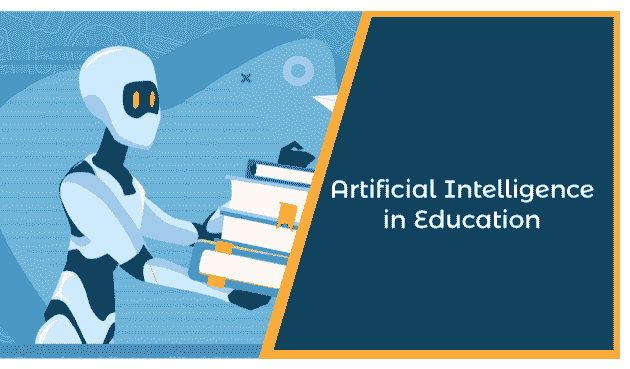
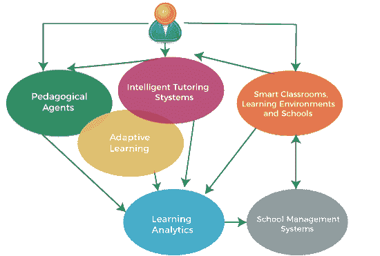
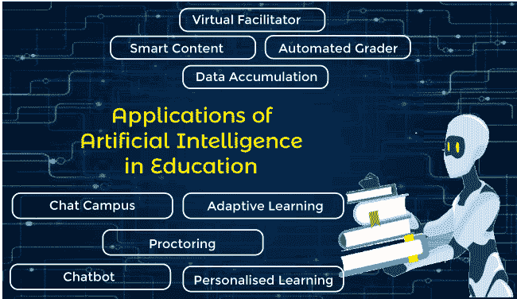

# 教育中的人工智能

> 原文：<https://www.javatpoint.com/artificial-intelligence-in-education>

教育是每个人生活的重要组成部分，良好的教育对拥有成功的生活起着至关重要的作用。为了改善学生的教育体系，世界各地总是发生很多变化，从教学方式到课程类型。人工智能是一项蓬勃发展的技术，几乎应用于每个领域，正在改变世界。人工智能即将创造的一个地方

教育正在(在某些情况下已经)发生巨大变化

教育中的人工智能正在为不同情况下的教学开发新的解决方案。如今，不同国家的不同学校和学院都在使用人工智能。教育领域的人工智能给了教师、学生、家长，当然还有教育机构一个全新的视角来看待教育。 ***教育中的 AI 不是以人形机器人作为老师来代替人类老师，而是利用计算机智能来帮助老师和学生，让教育系统变得更好、更有效。*** 未来，教育系统会有很多 AI 工具，塑造未来的教育体验。在这个话题中，我们将讨论人工智能对教育的影响和应用。为了更好地理解这个话题，我们先来了解一下什么是 AIED？

## AIED 概况(教育中的人工智能)

人工智能是将人类智能模拟成计算机机器，使其能够像人类一样思考和行动。这是一种帮助计算机像人一样思考的技术。人工智能旨在模仿人类行为。人工智能在包括教育在内的不同领域有各种用途和应用。

在 20 世纪 70 年代，AIED 已经成为一个涵盖新技术教学的专业领域，特别是高等教育领域。AIED 的主要目标是为学习者提供灵活、个性化和参与式的学习以及基本的自动化任务。AIED 的一些流行趋势包括智能辅导系统、智能教室技术、自适应学习和教学代理。下图显示了所有这些趋势之间的关系:

## 人工智能在教育中的应用/作用

1.  **用 AI**
    自动完成教育中的基本活动在教育系统中，有各种耗费教师大量时间的活动，如等级考试和家庭作业。这些任务需要大量的时间和精力，而这些时间可以用来与学生互动，让他们知道自己的错误，教授新事物，等等。
    为了节省这个时间，可以使用人工智能。有了人工智能工具，几乎所有类型的 MCQ(选择题)和填空题的评分系统都可以实现自动化，它们非常接近能够对书面回答进行评分。然而，人工智能仍然不可能真正取代人类的评分，但它正在一天天改进。通过使用人工智能，教师将获得更多的时间来填补课堂空白，而不是将时间投入到这些繁琐的任务中。
2.  **对有 AI 导师的学生的额外支持**
    很明显，老师不可能在学生学习的时候一直陪着他们，因为大学里的老师有固定的时间安排。但是每个学生都不够聪明，不能一次掌握所有的东西，他们需要别人的额外支持来帮助他们理解学习材料。这种额外的支持可以由人工智能导师提供。
    目前有各种 AI 驱动的辅导项目，可以帮助学生学习数学、写作等学科的基础知识。
    有了这些 AI 程序，学生可以学习基础知识，但仍然不适合学习任何学科的高级概念。为了学习如此复杂的概念，学生仍然需要教授。然而，在未来，人工智能有可能帮助学生解决同样需要分析思考和推理的复杂问题。
3.  **用 AI 驱动的程序给学生和老师提供有用的反馈**
    AI 不仅帮助学生按照他们的要求学习定制课程，还可以给老师和学生提供关于课程成功程度的反馈。一些在线课程提供商目前正在使用这种基于反馈的人工智能系统来分析学生的进度，并提醒教授学生的关键表现问题。
    这些类型的人工智能驱动系统使学生能够获得适当的支持，教授可以确定需要改进的教学领域。对学生的即时反馈有助于他们了解自己哪里出错了，以及如何做得更好。
4.  **用 AI**
    在课程中寻找需要改进的地方在教育系统中，很难找出学习上的差距。老师在课堂上的教学时间有限，他们可能并不总是知道学生缺少什么，什么概念让学生困惑。为了解决这个问题，人工智能驱动的程序可以帮助教育系统。
    Coursera 等一些学习平台已经在实践中使用 AI 驱动的程序。例如，当发现大量学生提交了作业的错误答案时，系统会提醒老师，并给未来的学生一条定制的消息，提示正确答案。这种类型的课程有助于填补学习过程中可能出现的空白，并确保每个学生成功理解这些概念。有了人工智能，学生不用等待教授的反馈，而是立即得到系统生成的响应，这有助于他们理解一个概念并记住他们的错误，以及下次如何正确地做这件事。
5.  **AI 可以改变老师的角色。**
    教师在教育系统中一直扮演着至关重要的角色，但这一角色及其要求可能会随着新技术而改变。正如以上几点，我们已经讨论过人工智能可以自动化不同的任务，如评分、报告、帮助学生学习，在某些情况下也可能是现实世界导师的一个选项。AI 可以包含在教学的不同方面。人工智能系统可以被编程为向学生提供专业知识，学生可以在这里询问他们的疑问，并可以代替老师教授基础课程材料。在这种情况下，人工智能可以改变教师作为促进者的角色。
6.  **用 AI 个性化教育**
    人工智能在教育中的主要目的不是完全取代教师。相反，它的目标是作为教师和学生的帮手。
    可以对 AI 系统进行编程，为学生提供个性化学习。通过个性化学习，每个学生都可以根据自己的理解水平和需求有自己的学习方式。通过了解每个学生的需求，老师可以为每个学生量身定制学习计划。随着人工智能的日益发展，机器有可能在学习学生发现学习困难时能够识别他们能够理解的概念时的面部表情，并据此改变教学方式。然而，目前，这样的事情是不可能的，但在不久的将来，通过人工智能驱动的机器和软件，它们可能是可能的。
7.  **利用 AI 生成智能内容**
    利用 AI，可以通过三种方式生成智能内容:
    1.  **数字化课程:**如今，一切都在数字化，教育也是如此。在人工智能的帮助下，有定制选项、电子书、学习指南、小型课程和许多其他东西的大学更喜欢数字学习。
    2.  **信息可视化:**把事情可视化比听要高效得多，能更好地理解，并长期记在心里。借助人工智能，学习信息可以通过可视化、仿真、基于网络的学习环境等新方式被感知。
    3.  **学习内容更新:**此外，AI 还有助于备课内容，使信息保持最新，并根据不同的学习曲线进行适应性调整。
8.  **确保有特殊需求的学生接受教育**
    对于那些有一些学习障碍的学生来说，生活充满了挑战，比如聋人或重听人、视障人等。这样的学生在学习和学习的时候可能会面临各种各样的困难。而且，他们还需要额外的照顾&时间。随着创新的人工智能技术的采用，将会出现与这类学生互动的新方式。人工智能支持的工具可以成功地培训，以帮助一群有特殊需求的学生。
9.  **普及**
    人工智能数字学习在教育中的一大用途就是普及学习资料。每个学生都有自己的抓握能力，使用通用访问，他们可以随时随地学习。学生可以随时探索他们想学的东西，而不用等导师。此外，学生只需在自己的地方就能获得来自世界各地的高质量课程和材料，而无需离开自己的家园。

## 人工智能对学生的好处

*   **24*7 访问学习**
    借助 AI 驱动的数字化学习，学生可以随时随地学习。每个学习者都可以自由地计划他们的时间表，而不是只被链接到一个特定的地方。每个人都可以根据自己最有效率的时间，让自己的学习变得更容易、更有效。
*   **更好的参与**
    通过个性化学习、定制任务和数字可视化，研究变得更具互动性和参与性。个性化的学习和人工智能驱动程序的良好体验让学生感到更加自信和聪明，因为他们可以毫不犹豫或害怕地探索教学大纲之外的许多事情。所有这些东西和新的人工智能技术正在增加学生对学习的兴趣。
*   **压力更小**
    有了 AI 驱动的程序和个性化的学习，学生感受到的学习压力更小。支持人工智能的虚拟助手在学生提问时提供帮助，并给出完整的解释。在传统的学习方法中，一个学生需要在课堂上当着所有人的面提问，这可能会让一些学生犹豫不决，而这些问题可以在虚拟助手的帮助下解决。然而，这些虚拟助手并不能正确回答所有的问题。但是对于基本的查询，它们会有很大的帮助，可以增强每个学习者的信心，减轻压力。

## 人工智能在教育中的未来

根据研究，在不久的将来，教育领域的人工智能将主要以三种方式发展，即:

1.  **性能个性化**
    随着 AI 技术和计算能力的日复一日的发展，将有可能通过收集和概括信息来创建个性化的课程。各种新的人工智能解决方案，如“Brightspace insights”，有助于教师跟踪、测量和监控学习者的进度，也有助于他们的学习之旅。它提供了学习者在整个平台上学习旅程的完整画面。
2.  **违规偏见**
    人性偏见一直是教育系统中的障碍，也是 AI 工具中的一个问题。未来，教育领域的人工智能将找到新的解决方案，可以使用既定的标准来评估工作和测试考试，以消除偏见。
3.  **联合援助**
    大学里的教授/教师通常拥有各自领域的硕士学位，并拥有特定发展领域的学位。但管理工作往往是与学生和解的令人沮丧的尝试。教育中的人工智能可以在未来解决这个问题，智能教室有人工智能的帮助，可以为老师提供必要的帮助，让他们尽最大努力。

## 结论

人工智能及其在我们生活中的应用在许多领域日益增长。在教育领域，人工智能已经开始显示其影响力，并作为学生和教师的帮助工具，支持学习过程。但是，人工智能在教育中的应用并不是所有的大学都完全适应的，要做到这一点还需要很长的路要走。然而，研究表明，在不久的将来，人工智能将对教育部门产生良好的影响。它目前正在改变教育行业，但尚未展示其在教育领域的真正潜力。此外，从计算机系统中学习可能会有很大帮助，但它不太可能完全取代中小学和大学的人工教学。

* * *