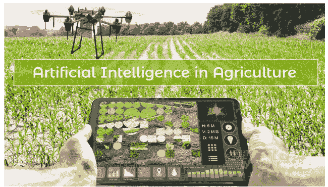
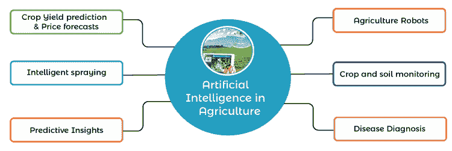

# 农业中的人工智能

> 原文：<https://www.javatpoint.com/artificial-intelligence-in-agriculture>

农业在每个国家的经济部门都发挥着至关重要的作用。世界各地的人口日益增加，对食物的需求也日益增加。农民使用的传统方法不足以满足现阶段的需要。因此，引入了一些新的自动化方法来满足这些要求，并为该行业的许多人提供了大量的工作机会。人工智能已经成为教育、银行、机器人、农业等各个领域最重要的技术之一。在农业部门，它正在发挥非常关键的作用，并且正在改变农业产业。 ***AI 将农业部门从气候变化、人口增长、该领域的就业问题和食品安全等不同因素中拯救出来。*** 今天的农业体系由于 AI 已经达到了不同的水平。人工智能改善了作物生产以及实时监测、收获、加工和营销。不同的高科技计算机系统被设计用来确定各种重要的参数，如杂草检测、产量检测、作物质量等。

在这个主题中，我们将讨论人工智能对农业的影响和应用，以及采用人工智能面临的挑战。

## 农业使用传统方法面临的挑战

在了解人工智能在农业中的影响和应用之前，我们必须了解使用传统方法在农业中面临的挑战，如下所示:

*   在农业中，不同的天气因素如降雨量、温度和湿度起着重要的作用。由于污染，有时气候会突然变化，因此农民很难对收获、播种和整地做出正确的决定。
*   为了获得更好的作物，土壤必须是多产的，并具有所需的营养，如氮、磷和钾。如果这些养分没有在土壤中有效地存在，那么它可能会导致劣质作物。但是很难用传统的方法来鉴别这些土壤质量。
*   在农业生命周期中，我们需要从杂草中拯救我们的作物。否则可能会增加生产成本，还会从土壤中吸收养分。但是，通过传统的方法，识别和防止作物杂草是没有效率的。

## 人工智能在农业中的应用

与传统的农业方法一样，农民将面临许多挑战。为了解决这些挑战，人工智能正在这一领域得到广泛应用。对于农业来说，人工智能已经成为一项革命性的技术。它通过生产更健康的作物、控制害虫、土壤监测等多种方式帮助农民。以下是人工智能在农业领域的一些关键应用:

**1。天气&价格预测:**正如我们在《挑战》中讨论的那样，由于气候变化，农民很难对收获、播种和土壤准备做出正确的决定。但是在人工智能天气预报的帮助下，农民可以获得天气分析的信息，因此，他们可以计划作物的生长类型、播种和收获。通过价格预测，农民可以更好地了解未来几周的农作物价格，这可以帮助他们获得最大利润。

**2。农作物健康监测:**

作物的质量在很大程度上取决于土壤的类型和土壤的营养。但随着毁林速度的不断加快，土壤质量日益退化，难以判定。

为了解决这个问题，人工智能提出了一个名为 **Plantix** 的新应用。它是由**泥炭**开发的，用于识别土壤中的缺陷，包括植物病虫害。在这种应用的帮助下，农民可以获得使用更好的肥料来提高收获质量的想法。在这个应用程序中，使用了人工智能的图像识别技术，农民可以捕捉植物的图像并获得质量信息。

**3。农业机器人:**

机器人技术正被广泛应用于不同的行业，主要是制造业，以完成复杂的任务。如今，不同的人工智能公司正在开发用于农业领域的机器人。这些人工智能机器人是以这样的方式开发的，它们可以在农业中执行多种任务。

人工智能机器人还接受过检查作物质量、检测和控制杂草以及以比人类更快的速度收割作物的训练。

**4。智能喷涂**

有了人工智能传感器，杂草可以很容易地被检测到，它还可以检测到杂草影响的区域。一旦发现这样的区域，可以精确喷洒除草剂，以减少除草剂的使用，并节省时间和作物。有不同的人工智能公司正在用人工智能和计算机视觉制造机器人，它们可以精确地喷洒在杂草上。人工智能喷雾器的使用可以广泛减少田间使用的化学品数量，从而提高作物的质量，并节省资金。

**5。疾病诊断**

有了人工智能预测，农民可以很容易地获得疾病知识。有了这一点，他们可以很容易地诊断疾病与适当的策略和时间。它可以拯救植物的生命和农民的时间。为此，首先，利用计算机视觉技术对植物图像进行预处理。这确保了植物图像被正确地分为患病和非患病部分。检测后，患病部位被切除并送往实验室进行进一步诊断。这项技术还有助于检测害虫、营养缺乏等。

**6。精准农业**

精准农业就是“天时地利人和”。精准农业技术是一种更加精确和可控的方式，可以取代农业劳动密集型部分来执行重复性任务。精准农业的一个例子是识别植物的压力水平。这可以通过使用高分辨率图像和植物的不同传感器数据来获得。从传感器获得的数据然后被馈送到机器学习模型，作为压力识别的输入。

## 农业领域的人工智能初创企业

以下是农业领域受欢迎的初创企业名单:

**1。普洛斯彼拉:**成立于 2014 年的以色列初创公司。该公司为高效农业创造智能解决方案。它开发了基于云的解决方案，从土壤/水、航空图像等领域收集所有数据。并将该数据与现场设备相结合。这种设备被称为普洛斯彼拉设备，它从这些数据中获得见解。该设备由各种传感器和技术供电，如计算机视觉。

**2。蓝河科技:**

蓝河科技是一家总部位于加州的初创公司，成立于 2011 年。它利用人工智能、计算机视觉和机器人技术开发下一代农业设备。该设备使用计算机视觉识别单个植物，人工智能决定行动，通过机器人执行行动。这有助于农民节省农业成本和化学品。

**3。农场机器人:T1**

Farmbot 是一个开源的数控精耕细作机和软件包，是为任何人在自己的地方种植农作物而开发的。完整的产品“农场机器人”售价为 4000 美元，它使任何人都可以在物理机器人和开源软件系统的帮助下独立完成从种子种植到杂草检测的完整耕作。它还提供了一个 webapp，可以在任何智能手机或计算机系统上下载，并允许我们随时随地管理农业。

**4。Fasal:** 在世界各地，人工智能在农业行业的使用日益增加。然而，与富裕地区相比，贫困地区每个农民的农业拥有量较少，这有利于自动监测，因为它需要较少数量的低带宽和低尺寸的设备来获取完整的农业数据。在这一领域，印度初创公司法萨尔正在努力。它使用负担得起的传感器和人工智能向农民提供实时数据和见解。这样，农民可以从与农场日常运营相关的实时、可操作的信息中受益。该公司的设备易于在小地方实施。他们正在开发支持人工智能的机器，让每个农民都能进行精准农业。

**5。OneSoil:** Onesoil 是一个应用程序，旨在帮助农民做出更好的决定。这个应用程序使用机器学习算法和计算机视觉进行精准农业。它远程监控作物，识别田地中的问题，查看天气预报，并计算氮、磷和钾肥用量等。

## 人工智能在农业中的优势和挑战

### 优势

*   **AI 实现更好的决策**

预测分析对农业来说确实是一个福音。它帮助农民解决农业的关键挑战，如分析市场需求、价格预测以及寻找播种和收获作物的最佳时间。此外，人工智能驱动的机器还可以确定土壤和作物健康状况，提供肥料建议，监测天气，还可以确定作物质量。人工智能在农业中的所有这些好处使农民能够做出更好的决策，并进行高效的耕作。

*   **AI 带来成本节约。**

使用人工智能设备的精准农业帮助农民用更少的资源和成本种植更多的作物。人工智能为农民提供实时见解，使他们能够在耕作的每个阶段做出正确的决定。有了这个正确的决定，产品和化学品的损失就更少了，时间和金钱的使用也更有效率了。此外，它还允许农民确定需要灌溉、施肥和农药处理的特定区域，从而节省作物上化学物质的过度使用。所有这些综合起来，导致除草剂的使用减少，作物质量提高，资源更少，利润更高。

*   **AI 减少劳动力短缺。**

农业中一直存在劳动力短缺的问题。人工智能可以通过农业自动化解决这个问题。有了人工智能和自动化，农民可以在没有更多人的情况下完成工作，一些例子是无人驾驶拖拉机、智能灌溉和施肥系统、智能喷洒、垂直耕作软件和基于人工智能的收割机器人。与人类农场工人相比，人工智能驱动的机器和设备要快得多，也准确得多。

## 农业采用人工智能的挑战

通过看到人工智能对可持续农业的优势，实施这项技术对每个农民来说似乎是合乎逻辑的一步。但是，仍然存在一些大家都知道的严峻挑战，具体如下:

*   **不熟悉 AI 机器**

虽然在农业中使用人工智能有很多好处，但人们不熟悉在世界上大多数地方使用人工智能解决方案和设备。为了解决这些问题，人工智能公司应该向农民提供基本设备，一旦他们熟悉了这些设备，就为他们提供先进的机器。

*   **缺乏新兴技术经验**

发展中国家在农业中采用人工智能和新兴技术可能是一项具有挑战性的任务。在没有使用这种农业技术的地区销售这种技术将非常困难。在这样的地区，要使用这些技术，农民需要有人的帮助。

*   **隐私和安全问题**

由于使用人工智能仍然没有明确的法规和政策，这可能会引起各种法律问题。此外，由于软件和互联网的使用，还可能存在一些隐私和安全问题，如网络攻击和数据泄露。所有这些问题都会给农场所有者或农民带来很大的问题。

## 结论:

人工智能在农业中的未来很大程度上取决于人工智能解决方案的采用。虽然一些大规模的研究正在进行中，一些应用已经进入市场，但农业中的工业服务不足。此外，创建预测性解决方案以解决农民在农业中面临的真正挑战仍处于早期阶段。

* * *