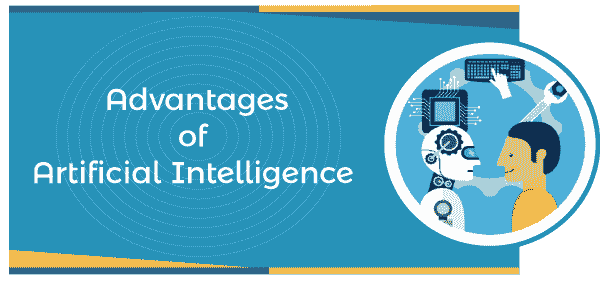
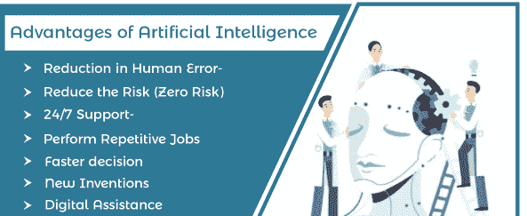
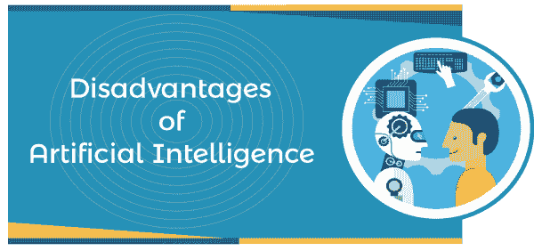
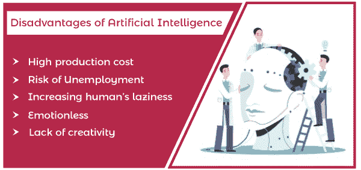

# 人工智能的优缺点

> 原文：<https://www.javatpoint.com/advantages-and-disadvantages-of-artificial-intelligence>

如今，人工智能是计算机世界中发展迅速的技术之一。这项技术帮助机器像人类一样思考。人工智能(AI)是将人类智能模拟成计算机机器，像人一样思考和行动。人工智能一词最早是在 1950 年初发明的，人工智能的概念最初是由伟大的计算机科学家**约翰·麦卡锡**在 1943 年至 1956 年间提出的。

总的来说，我们可以说“*任何东西都可以被称为**人工智能**，如果它涉及编程或编码来做和思考类似于人类*人工智能既有很多优点，也有很多缺点，如减少人为错误、24/7 聊天机器人辅助、医疗应用、准确正确的决策、高成本等。

在**【人工智能的优缺点】**的本教程中，我们将简要讨论[人工智能](https://www.javatpoint.com/artificial-intelligence-tutorial)的优缺点。所以，我们先从人工智能的优势说起。

## 人工智能的优势

人工智能有如下大量优势:

### 减少人为错误

人工智能最大的成就之一就是可以减少人为错误。与人类不同，如果编程正确，计算机不会出错，而人类会时不时出错。因此，人工智能通过收集以前存储的数据来使用一些算法，从而减少出错的机会，并提高任何任务的准确性和精度。因此，人工智能有助于解决需要困难计算的复杂问题，并且可以毫无错误地完成。

### 降低风险(零风险)

这也是人工智能最大的优势之一。开发 AI Robots 的技术可以克服人类的许多风险限制，为我们做一些有风险的事情，比如*拆弹、石油和煤炭开采以及探索海洋最深处、*等。因此，它在任何最糟糕的情况下都有帮助，无论是人类还是自然灾害。人工智能机器人可以用于干预可能是危险的情况。

### 全天候支持

与人类不同，计算机不需要休息和刷新。正常人可以持续工作到 8-9 个小时，包括休息和刷新，而计算机可以全天候工作，没有任何休息，甚至不会感到无聊，不像人类。聊天机器人和帮助热线中心可以被视为各种网站 24/7 支持的最佳例子，这些网站持续参与接收客户查询并由人工智能自动解决。

### 执行重复性作业

我们在日常生活中会执行很多重复性的工作，比如自动回复邮件、发送生日和周年纪念报价以及验证文档等。因此，人工智能通过执行这些重复的工作来帮助实现业务自动化。

### 更快的决策

与人类不同，机器有助于比人类更快地做出决定，更快地采取行动。在做出决定时，人类分析许多因素，而机器则按照程序工作，并更快地交付结果。更快决策的最好例子可以在第三级的在线象棋游戏中看到。打败一台计算机是不可能的，因为根据计算机背后使用的算法，它在很短的时间内迈出了最好的一步。

### 新发明

对于新发明，人工智能几乎在每个领域都在帮助人类，它可以是医疗保健、医疗、教育、体育、技术、娱乐或研究行业等。使用先进的基于人工智能的技术，医生可以在很早的阶段预测各种危险的疾病，如癌症。

### 日常应用

现在，我们的日常生活完全依赖于手机和互联网。我们使用了几个应用，像**谷歌地图、Alexa、苹果的 Siri、Window 的 Cortana、OK 谷歌、自拍**、打**电话、回复邮件**等。此外，我们还可以借助各种基于人工智能的方法来预测今天和未来几天的天气。

### 数字助理

数字辅助是最强大的方法之一，可以帮助各种高度先进的组织在没有人力资源参与的情况下与用户进行交互。数字协助通过收集以前用户的查询并提供用户想要的解决方案来帮助用户。数字援助的最佳例子可以在各种网站上以聊天机器人支持的形式看到。用户询问一些事情，计算机提供相关信息，如银行、教育、旅游和订票网站。有些聊天机器人被设计成很难确定我们是在和聊天机器人聊天还是和人类聊天。

### 风险情况下的人工智能

人的安全永远是机器最关心的事情。每当我们需要探索海洋的最深处或研究太空时，科学家们都会在人类生存变得困难的危险情况下使用支持人工智能的机器。AI 可以到达人类无法到达的每一个地方。

如果事物有光明的一面，那么平行来说，它也有黑暗的一面。同样，人工智能也有如下几个缺点:

## 人工智能的缺点

尽管人工智能是全球最具趋势和要求的技术之一，但它仍有一些缺点。人工智能的一些常见缺点如下:

### 生产成本高

我们生活在一个技术世界里，我们必须根据社会来操纵自己。同样，计算机也需要时间来安排软件和硬件更新，以满足最新的要求。因此，人工智能也需要维修和维护，这需要大量的成本。

### 失业风险

机器人是人工智能的实现之一，它正在取代工作，并导致失业(在某些情况下)。因此，据一些人说，由于机器人和聊天机器人而不是人类，总有失业的风险。例如，在日本等一些更注重技术的国家，机器人被广泛应用于制造业，以取代人力资源。然而，这并不总是事实，因为随着它取代人类来提高效率，它也为人类创造了更多的就业机会。

### 增加人类的懒惰

人工智能的新发明使人类更加懒惰，导致人类完全依赖机器和机器人。如果这种情况在未来几年继续下去，那么我们的下一代将完全依赖机器，导致进一步的失业和健康问题。

### 没有情感的

我们从小就一直知道，电脑或者机器是没有情绪的。人类像团队一样工作，团队管理是完成目标的关键因素。然而，毫无疑问，机器在高效工作时要好得多，但同样真实的是，它们从未取代组成团队的人类联系。

### 缺乏创造力

人工智能最大的缺点是缺乏创造力。人工智能是一种完全基于预加载数据的技术。然而，人工智能可以通过这些预先输入的数据和过去的经验随着时间的推移而学习，但它不能像人类一样有创造力。

### 没有道德

伦理和道德是人类最重要的两个特征，但是要将这两个特征结合到人工智能中并不容易。人工智能在每个领域都在不受控制地快速增长，所以如果这种情况持续几十年，它最终可能会毁灭人类。

### 没有改善

人工智能是一项完全基于预加载数据和经验的技术，因此无法像人类一样进行改进。它可以重复执行相同的任务，但是如果您想要一些改进和更改，您必须为相同的任务更改命令。然而，它可以存储人类无法存储的无限数据，但也不能像人类智能一样访问和使用。

* * *