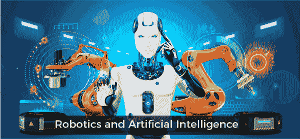
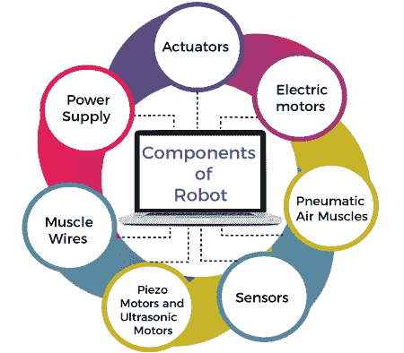

# 机器人和人工智能

> 原文：<https://www.javatpoint.com/robotics-and-artificial-intelligence>

机器人学是人工智能中的一个独立实体，帮助研究智能机器人或机器的创造。机器人学结合了电气工程、机械工程和计算机科学与工程，因为它们有机械结构、电气元件和编程语言。虽然，机器人和人工智能都有不同的目标和应用，但大多数人都把机器人作为人工智能的一个子集。机器人看起来与人类非常相似，而且，如果启用人工智能，它们可以像人类一样工作。

在早期，机器人应用非常有限，但现在通过与人工智能相结合，它们变得更加智能和高效。通过在生产力和质量方面取代人类，人工智能在工业领域发挥了至关重要的作用。本文中， ***[机器人与人工智能](https://www.javatpoint.com/artificial-intelligence-in-robotics)*** ，我们将讨论 Robots &人工智能及其各种应用、优势、差异等。先说[人工智能(AI)](https://www.javatpoint.com/artificial-intelligence-tutorial) 和[机器人](https://www.javatpoint.com/what-is-robotics)的定义。

## 什么是人工智能？

人工智能被定义为计算机科学与工程的一个分支，它处理的是创造像人类一样工作的智能机器。人工智能有助于使机器能够像人类一样感知、理解、行动和学习活动。人工智能主要有 4 种类型:**反应机器、有限记忆、心智理论、自我意识。**

## 什么是机器人？

***机器人是一种看起来像人的机器，能够通过使用编程*** 给它的命令来执行开箱动作并自动复制某些人类动作。例如:药物配制机器人、汽车工业机器人、订单拣选机器人、工业地板擦洗器和 Sage 自动化龙门机器人等。

### 机器人的部件

几个组件构成一个机器人，这些组件如下:

*   **执行器:**执行器是负责移动和控制系统或机器的装置。它通过转换电能、水能和空气等能量来帮助实现身体运动。执行器可以产生线性和旋转运动。
*   **电源:**是向用电负荷供给电力的电气设备。电源的主要功能是转换电流为负载供电。
*   **电动机:**这些是将电能转化为机械能的装置，是机器旋转运动所需要的。
*   **气动气动肌肉:**气动肌肉是最适合机器人的软气动装置。它们可以收缩和伸展，并通过充气气囊中的压缩空气进行操作。每当引入空气时，它可以收缩高达 40%。
*   **肌肉丝:**这些是由镍钛合金制成的，叫做镍钛诺，形状非常细。当一定量的热量和电流进入它时，它也能伸展和收缩。此外，当它处于马氏体形态时，可以形成和弯曲成不同的形状。当电流通过时，它们可以收缩 5%。
*   **压电马达和超声波马达:**压电马达或压电马达是接收电信号并向相对的陶瓷板施加方向力的电气设备。它帮助机器人向期望的方向移动。这些是最适合工业机器人的电动机。
*   **传感器:**它们像人类一样提供视觉、听觉、触觉和运动等能力。*传感器是帮助检测环境中的事件或变化并将数据发送给计算机处理器的设备或机器。这些设备通常配有其他电子设备*。与人体器官类似，电传感器在人工智能&机器人技术中也发挥着至关重要的作用。人工智能算法通过感知环境来控制机器人，并向计算机处理器提供实时信息。

### 机器人技术的应用

机器人有不同的应用领域。机器人技术的一些重要应用领域如下:

*   **国防部门的机器人:**国防部门无疑是任何国家的主要部分之一。每个国家都希望自己的国防系统强大。战争期间，机器人帮助接近无法到达的危险区域。DRDO 研发了一款名为 ***Daksh*** 的机器人，用于安全摧毁威胁生命的物体。他们帮助士兵保持安全，并由军队在战斗场景中部署。除了战斗支援，机器人还被部署在 ***反潜作战、火力支援、战损管理、打击任务和铺轨机中。***
*   **医疗领域的机器人:**机器人还在各种医疗领域提供帮助，如腹腔镜检查、神经外科手术、骨科手术、消毒室、配药和各种其他医疗领域。
*   **工业领域的机器人:**机器人用于各种工业制造行业，如印刷电路板的切割、焊接、组装、拆卸、拾取和放置、包装&标签、码垛、产品检验&测试、彩色涂层、钻孔、抛光和处理材料。
    此外，机器人技术提高了生产率和盈利能力，减少了人力，降低了体力消耗和伤害。工业机器人有一些重要的优点，如下:
    *   准确
    *   灵活性
    *   降低人工费用
    *   低噪声运行
    *   更少的生产损失
    *   生产率提高。
*   **娱乐领域的机器人技术:**在过去的十年中，机器人在娱乐领域的使用不断增加。机器人被用于娱乐领域，如电影、动画、游戏和卡通。机器人在需要重复动作的地方非常有用。一个手持相机的机器人可以根据需要多次拍摄电影场景，而不会感到疲倦和沮丧。大名鼎鼎的 T2 迪士尼公司为电影业推出了数百个机器人。
*   **采矿行业的机器人:**机器人对于各种采矿应用非常有帮助，例如机器人推土、挖掘和运输、机器人测绘&测量、机器人钻孔和炸药搬运等。一个采矿机器人可以独自导航淹没的通道，并使用相机和其他传感器来探测有价值的矿物。此外，机器人还帮助挖掘，以检测气体和其他材料，并保护人类免受伤害和伤害。机器人攀岩者用于太空探索，水下无人机用于海洋探索。

### 人工智能技术在机器人领域的应用

### 计算机视觉

机器人也能看见东西，这是由一种流行的人工智能技术——计算机视觉实现的。 ***计算机视觉*** 在健康、娱乐、医疗、军事、矿业等所有行业都发挥着至关重要的作用。

计算机视觉是人工智能的一个重要领域，有助于从图像、视频和视觉输入中提取有意义的信息并采取相应的行动。

### 自然语言处理

自然语言处理可以用来给人工智能机器人发出语音命令。它创造了强大的人机交互。自然语言处理是人工智能的一个特定领域，能够实现人类和机器人之间的通信。通过自然语言处理技术，机器人可以理解和再现人类语言。有些机器人配备了 NLP，所以我们无法区分人类和机器人。

同样，在医疗保健领域，由自然语言处理系统驱动的机器人可以帮助医生观察死亡细节并自动填写 EHR。除了识别人类语言，它还可以学习常用语，比如学习口音，预测人类如何说话。

### 边缘计算

机器人中的边缘计算被定义为机器人集成、测试、设计和仿真的服务提供商。机器人技术中的边缘计算提供了更好的数据管理、更低的连接成本、更好的安全实践、更可靠和不间断的连接。

### 复杂事件过程

复杂事件处理(CEP)是一个帮助我们实时理解多个事件处理的概念。事件被描述为状态变化，一个或多个事件组合在一起定义一个复杂事件。复杂事件过程是医疗保健、金融、安全、营销等行业中使用最广泛的术语。它主要用于信用卡欺诈检测和股票营销领域。

例如，汽车中安全气囊的展开是一个复杂的事件，基于来自多个传感器的实时数据。这一思想被用于机器人学，例如，自主机器人编程中的事件处理。

### 迁移学习与人工智能

这是一种借助已经解决的另一个问题来解决问题的技术。在迁移学习技术中，解决一个问题所获得的知识可以用来解决相关的问题。我们可以用一个例子来理解它，比如用来识别圆形的模型也可以用来识别方形。

迁移学习针对一个相关问题重用预先训练好的模型，只训练模型的最后一层，相对来说耗时更少，成本更低。在机器人学中，转移学习可以用来在其他机器的帮助下训练一台机器。

### 强化学习

强化学习是机器学习中一种基于反馈的学习方法，它使人工智能代理能够学习和探索环境，执行动作，并从每个动作的经验或反馈中自动学习。此外，它还具有在与环境交互时，通过撞击-拖曳动作自主学习最佳行为的特性。它主要用于在不确定和潜在的复杂环境中制定决策顺序和实现目标。在机器人学中，机器人探索环境，并通过撞击和试验来了解环境。每一个动作，他都会得到奖励(正面或负面)。强化学习为机器人学提供了一个设计和模拟复杂且难以设计的行为的框架。

### 情感计算

情感计算是一个研究领域，涉及开发能够识别、解释、处理和模拟人类情感的系统。情感计算旨在赋予机器人情感智能，希望机器人能够被赋予类似人类的观察、解释和情感表达能力。

### 混合现实

混合现实也是一个新兴领域。主要用于演示编程(PbD)领域。PbD 使用物理和虚拟对象的组合为算法创建原型机制。

## 什么是人工智能机器人？

人工智能机器人将 AI 与机器人技术连接起来。AI 机器人由 AI 程序控制，使用不同的 AI 技术，如机器学习、计算机视觉、RL 学习等。通常，大多数机器人不是 AI 机器人，这些机器人被编程来执行重复的一系列动作，它们不需要任何 AI 来执行任务。然而，这些机器人的功能有限。

当你想让机器人执行更复杂的任务时，人工智能算法是必要的。

仓储机器人可能会使用寻路算法在仓库中导航。当电池即将耗尽时，无人机可能会使用自主导航回家。自动驾驶汽车可能使用人工智能算法的组合来检测和避免道路上的潜在危险。这些都是人工智能机器人的例子。

### 人工智能融入机器人有什么优势？

*   人工智能机器人的主要优势是社会关怀。他们可以用聊天机器人般的社交技能和先进的处理器来指导人们，尤其是帮助老年人。
*   机器人技术也帮助农业产业发展基于人工智能的机器人。这些机器人减轻了农民的工作量。
*   在军事工业中，军事机器人可以通过语音和视觉检测器进行侦察，并通过替换步兵来拯救生命
*   机器人技术也应用于火山、深海、极寒地区，甚至是人类通常无法生存的太空。
*   机器人也用于医疗和保健行业，因为它还可以进行复杂的手术，这些手术被人类误操作的风险更高，但带有一组预设的指令和额外的智能。人工智能集成机器人可以大大减少伤亡人数。

## 机器人系统和人工智能程序的区别

以下是人工智能和机器人的区别:

### 1.人工智能程序

通常，我们在计算机模拟的世界里操作它们。

通常，输入以符号和规则的形式给出。

为了操作这个，我们需要通用/专用计算机。

### 2.机器人

一般来说，我们使用机器人在真实的物理世界中操作。

输入以模拟信号或语音波形的形式给出。

此外，要操作它，需要带有传感器和效应器的特殊硬件。

* * *