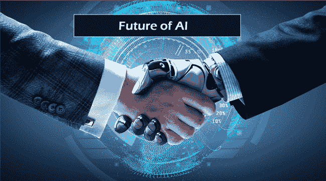
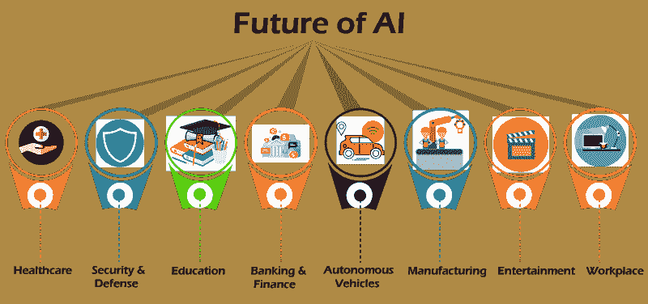

# 人工智能的未来

> 原文：<https://www.javatpoint.com/future-of-artificial-intelligence>

毫无疑问，人工智能是计算机科学的一个革命性领域，准备成为**大数据、机器人、IoT** 等各种新兴技术的主要组成部分。未来几年，它将继续扮演技术创新者的角色。短短几年，AI 从幻想变成了现实。帮助人类获得智能的机器不仅出现在科幻电影中，也出现在现实世界中。此时，我们生活在一个人工智能的世界里，尽管几年来这只是一个故事。

我们在日常生活中不知不觉或有意地使用人工智能技术，在某个地方，它已经成为我们生活的一部分。从 Alexa/Siri 到 Chatbots，每个人在日常生活中都携带着 AI。这项技术的发展和演变正以飞快的速度进行着。然而，事情并不像我们想象的那么顺利和容易。在这个阶段进行人工智能已经花费了几年的时间和许多人的辛勤工作和贡献。作为如此革命性的技术，人工智能也处理了许多关于其未来和对人类影响的争议。这可能很危险，但也是一个很好的机会。人工智能将被部署来加强防御和进攻网络行动。此外，将发明新的网络攻击手段来利用人工智能技术的特殊漏洞。

本专题将讨论 AI 的**未来及其对人类生活的影响，即它是一项伟大的技术还是对人类的威胁。**

## 当前的人工智能

在未来深入钻研 AI 之前，首先让我们了解一下什么是[人工智能](https://www.javatpoint.com/artificial-intelligence-tutorial)，目前处于什么阶段。我们可以将人工智能定义为，“**它是机器或计算机控制的机器人执行与智能相关的任务的能力。**“所以，AI 是计算机科学，旨在开发能够模仿人类行为的智能机器。

基于能力，人工智能可以分为三种类型，即:

*   **狭义 AI** :能够以智能完成专用任务。**目前人工智能的阶段是狭义人工智能。**
*   **通用 AI** :人工通用智能或 AGI 定义了可以展现人类智能的机器。
*   **超级 AI** :超级 AI 是指认知能力超越人类的自我感知 AI。这是一个水平，在这个水平上，机器可以用认知特性完成人类能完成的任何任务。

**现阶段 AI 被称为狭义 AI 或弱 AI，只能执行专用任务**。例如，**自动驾驶汽车，语音识别等。**

## 关于高级人工智能的神话

### 1.到 2100 年实现超级智能是不可能的。

关于超智能可能性的现实是，目前，我们无法确定它。它可能会在几十年或几个世纪内发生，也可能永远不会发生，但没有任何事情得到证实。有几项调查询问人工智能研究人员，他们认为多少年后我们将拥有人类规模的人工智能，至少有 50%的可能性。所有这些调查都有相同的结论:世界领先的专家不同意，所以我们不知道。例如，在 2015 年**波多黎各 AI 大会**上对 AI 研究人员的这样一项调查中，(平均)答案是到 2045 年，但一些研究人员估计是几百年甚至更久。

### 2.我将取代所有人类的工作。

毫无疑问，人工智能和自动化的出现有可能严重扰乱劳动力市场——在许多情况下，它已经在这么做了。然而，把这看作是劳动力从人类到机器的直接转移是一种极大的过度简化。

随着人工智能的发展，各个行业都发生了一场革命，人们害怕随着人工智能的发展而失去工作。但事实上，人工智能已经为每个行业的人们带来了更多的工作和机会。每台机器都需要一个人来操作。然而，人工智能已经接管了一些角色，但它回归到为人们创造更多的工作岗位。

### 3.在做任何我们能做的事情方面，超级智能计算机将变得比人类更好

如上所述，AI 可以分为三种类型，**弱 AI** ，可以执行特定的任务，比如天气预报。**AI 将军；**能够完成人类所能完成的任务，**超 A**I；人工智能能够比人类更好地执行任何任务。

目前，我们正在使用执行特定任务并提高其性能的弱人工智能。另一方面，通用人工智能和超级人工智能还没有发展起来，研究还在进行。他们将能够完成类似于人类智力的不同任务。然而，这种 AI 的发展还很遥远，创建这样的 AI 应用需要几年甚至几个世纪的时间。而且，这种 AI 的效率，是否会比人类更好，在现阶段是不可预测的。

### 4.AI 不需要人为干预。

人们还有一个误区，认为 AI 不需要任何人为干预。但事实是，人工智能还没有发展到可以自己做决定。需要机器学习工程师/专家来预处理数据、准备模型、准备训练数据集、识别偏差和方差并消除它们等。每个 AI 模型仍然依赖于人。然而，一旦模型准备好了，它就可以根据经验自行提高性能。

## 人工智能怎么可能有风险？

大多数研究人员都认为，超级人工智能不能表现人类的情感，如爱、恨或善良。此外，我们不应该期望人工智能变得故意慷慨或怀有恶意。此外，如果我们说人工智能有风险，可能主要有两种情况，它们是:

### 1.人工智能被编程来做一些破坏性的事情:

自主武器是人工智能系统，被编程为杀人。如果落入坏人之手，这些武器很容易造成大规模伤亡。此外，人工智能军备竞赛可能会无意中导致人工智能战争，导致大规模伤亡。为了避免对敌人不满，这些武器将被设计成极难“关闭”，因此人类很可能会失去对这种情况的控制。这种风险即使在狭窄的人工智能中也存在，但随着人工智能智能水平和自主性的提高而增加。

### 2.我们的目标与机器不一致:

人工智能作为一种有风险的技术的第二种可能性是，如果智能人工智能被设计成做一些有益的事情，它就会产生破坏性的结果。例如，假设我们要求自动驾驶汽车“尽快带我们到达目的地。”这台机器会立即按照我们的指示运转。在我们明确规定交通规则也应该遵守，我们重视人的生命之前，它可能对人的生命是危险的。它可能会违反交通规则或遇到事故，这不是我们真正想要的，但它做到了我们对它的要求。**所以，超智能机器如果要求完成一个不符合我们要求的目标，就可能是破坏性的。**

## 人工智能对不同行业的未来影响

### 医疗保健:

人工智能将在医疗保健领域发挥重要作用，以更快、更准确地诊断疾病。在人工智能的帮助下，新药发现将更快、更具成本效益。它还将提高患者对其护理的参与度，并使**更容易安排预约、支付账单**，错误更少。然而，除了这些有益的用途，人工智能在医疗保健中的一个巨大挑战是确保其在日常临床实践中的采用。

### 网络安全:

毫无疑问，网络安全是每个组织确保数据安全的首要任务。有一些预测称，采用人工智能的网络安全将有以下变化:

*   借助人工智能工具，安全事件将受到监控。
*   用自然语言处理识别网络攻击的来源。
*   在 RPA 机器人的帮助下，基于规则的任务和流程的自动化。

然而，作为一项伟大的技术，它也可能被攻击者用作威胁。他们可以通过使用可能难以防御的自动攻击，以非道德的方式使用人工智能。

### 交通:

全自动汽车还没有在交通领域开发出来，但是研究人员正在这个领域取得进展。人工智能和机器学习正在驾驶舱中应用，以帮助减少工作量，处理飞行员的压力和疲劳，并提高准时性能。在交通领域采用人工智能有几个挑战，尤其是在公共交通领域。过度依赖自动和自主系统的风险很大。

### 电子商务:

人工智能不久将在电子商务领域发挥重要作用。它将对电子商务领域的各个方面产生积极影响，从用户体验到产品的营销和分销。我们可以期待电子商务的自动化仓库和库存，购物者个性化，以及聊天机器人的使用在未来。

### 就业:

如今，由于人工智能的使用，就业对求职者来说变得容易，对雇主来说变得简单。人工智能已经被用于求职市场，它有严格的规则和算法，如果员工的简历不符合公司的要求，就会自动拒绝。它希望就业过程将由大多数支持人工智能的应用程序驱动，从笔试到未来的电话面试。

对于求职者来说，各种人工智能应用程序正在帮助建立令人敬畏的简历，并根据你的技能找到最好的工作，如**热子、求职者、**等。

除上述领域外，人工智能在制造业、金融银行、娱乐业等领域也有很大的发展前景。

* * *