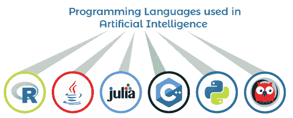
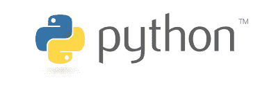
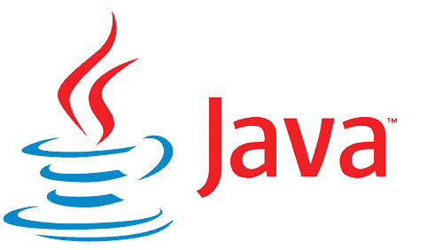
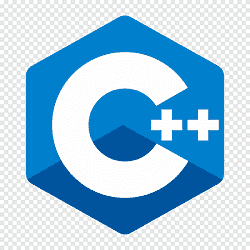

# 人工智能中使用的语言

> 原文：<https://www.javatpoint.com/languages-used-in-artificial-intelligence>

人工智能已经成为人类生活的重要组成部分，因为我们现在高度依赖机器。**人工智能是开发和构建新的计算机程序和系统的一项非常重要的技术，可以用来模拟学习、推理等各种智能过程。**

*   **蟒蛇**
*   **R**
*   lisp
*   **Java**
*   **C++**
*   **Julia**
*   **序言**

## 1.计算机编程语言

[Python](https://www.javatpoint.com/python-tutorial) 是任何人都可以开始学习的最强大、最简单的编程语言之一。Python 最初是在 1991 年初开发的。大多数开发人员和程序员选择 Python 作为他们最喜欢的编程语言来开发[人工智能](https://www.javatpoint.com/artificial-intelligence-tutorial)解决方案。Python 在世界范围内受到所有开发人员和专家的欢迎，因为它比任何其他编程语言都有更多的职业机会。

Python 还附带了一些默认的标准库集，并为其用户提供了更好的社区支持。此外，Python 是一种独立于平台的语言，也为深度学习、机器学习和人工智能提供了广泛的框架。

Python 也是一种可移植的语言，因为它用于各种平台，如 **Linux、Windows、Mac OS 和 UNIX。**

### Python 的特性

*   它比任何其他编程语言都容易学。
*   它也是一种动态类型的语言。
*   Python 是一种面向对象的语言。
*   它为 ML 和 DL 提供了广泛的社区支持和框架。
*   开源的。
*   大型标准图书馆。
*   解释语言。

Python 是一种理想的编程语言，用于机器语言、自然处理语言和神经网络等。由于 Python 的灵活性，它可以用于人工智能开发。它包含各种预先存在的库，如 **Pandas、SciPy 和 nltk** 等。此外，Python 还包含简单的语法和容易的编码，这使得 Python 成为 AI 开发人员和程序员的首选。

**Python 中有一些用于人工智能的标准库如下:**

1.  **TensorFlow Python**
2.  **硬蟒蛇**
3.  **Theano Python**
4.  **Scikit-学习 Python**
5.  **PyTorch Python**
6.  num py python
7.  **蟒蛇Pandas**
8.  **海生蟒蛇**

## 2.爪哇

[Java](https://www.javatpoint.com/java-tutorial) 也是所有开发人员和程序员开发机器学习解决方案和企业开发最广泛使用的编程语言。与 Python 类似，Java 也是一种独立于平台的语言，因为它也可以在各种平台上轻松实现。此外，Java 是一种面向对象和可扩展的编程语言。Java 允许虚拟机技术帮助创建应用程序的单一版本，并为您的业务提供支持。Java 最好的一点是，一旦它在一个平台上被编写和编译，那么你就不需要一次又一次地编译它。这就是众所周知的 WORA 原理。

### Java 的特性

Java 有如此多的特性，使得 Java 在工业和开发人工智能应用程序方面表现最佳:

*   轻便
*   跨平台。
*   易于学习和使用。
*   易于编码的算法。
*   内置垃圾收集器。
*   Swing 和标准小部件工具包。
*   大型项目的简化工作。
*   更好的用户交互。
*   易于调试。

## 3.序言

[Prolog](https://www.javatpoint.com/prolog) 是用于人工智能解决方案的最古老的编程语言之一。Prolog 代表“逻辑中的**编程”**，由法国科学家阿兰·科尔梅劳于 1970 年开发。

对于 Prolog 中的 AI 编程，开发人员需要定义规则、事实和最终目标。在定义了这三者之后，序言试图发现它们之间的联系。用 Prolog 在 AI 中编程是不同的，有几个优点和缺点。

对于那些来自 C++背景的程序员来说，学习这种语言似乎是一种奇怪的事情。

Prolog 可能不是一种构建大型事物的优秀编程语言，但它是一种以更符合逻辑的方式而不是过程化的方式来研究和思考问题的优秀语言。

**序言的特点**

*   支持基本机制，例如
*   模式匹配，
*   基于树的数据结构，以及
*   自动回溯。
*   Prolog 是一种声明性语言，而不是命令式语言。

## 4.咬舌

Lisp 已经存在了很长时间，并被广泛用于自然语言、定理证明和解决人工智能问题等领域的科学研究。Lisp 最初是作为程序的实用数学符号而创建的，但最终成为人工智能领域开发人员的首选。

尽管 Lisp 编程语言是仅次于 Fortran 的第二古老的语言，但由于其关键的特性，它仍然被使用。LISP 编程的发明者是**约翰·麦卡锡**，他创造了人工智能这个术语。

LISP 是解决特定问题最有效的编程语言之一。目前主要用于机器学习和归纳逻辑问题。它也影响了人工智能其他编程语言的创建，一些值得一提的例子是 **R** 和 **Julia。**

然而，尽管如此灵活，它也有各种不足，例如缺少知名的库，不太人性化的语法等。由于这个原因，程序员不喜欢它。

### LISP 的特点

*   该程序可以很容易地修改，类似于数据。
*   对控制结构使用递归，而不是迭代。
*   垃圾收集是必要的。
*   我们可以很容易地将数据结构作为程序来执行。
*   对象可以动态创建。

## 5.稀有

[R](https://www.javatpoint.com/r-tutorial) 是编程中统计处理的伟大语言之一。然而，出于数据分析的目的，R 支持免费的开源编程语言。它可能不是人工智能的完美语言，但它在处理大量数据时提供了出色的性能。

一些内置的特性，如**内置的函数式编程、面向对象的特性和矢量计算**使其成为值得人工智能使用的编程语言。

r 包含几个专门为人工智能设计的包，它们是:

*   **gmodels** -该软件包为模型拟合任务提供了不同的工具。
*   **TM** -这是一个很棒的框架，用于文本挖掘应用。
*   **RODBC** -是一个 ODBC 接口。
*   **OneR** -该包用于实现一规则机器学习分类算法。

### R 程序设计的特点

*   r 是一种开源编程语言，它是免费的，你也可以为其他功能添加包。
*   r 为用户提供强大的交互式图形功能。
*   它使您能够执行复杂的统计计算。
*   由于其高性能的能力，它被广泛应用于机器学习和人工智能中。

## 6.朱莉娅

Julia 是列表中较新的语言之一，它的创建是为了专注于科学和技术领域的性能计算。Julia 包括几个直接应用于 AI 编程的特性。

Julia 是一种相对较新的语言，主要适用于数值分析和计算科学。它包含了几个对人工智能编程非常有帮助的特性。

### 朱莉娅的特点

*   常见的数字数据类型。
*   任意精度值。
*   稳健的数学函数。
*   元组、字典和代码自省。
*   内置包管理器。
*   动态类型系统。
*   能够同时为并行和分布式计算工作。
*   宏和元编程能力。
*   支持多次派单。
*   对 C 函数的支持。

## 7.C++

[C++语言](https://www.javatpoint.com/cpp-tutorial)已经出现了这么久，但仍然是开发人员中最热门的编程语言。它在开发时为人工智能模型提供了更好的处理。

虽然 C++可能不是开发人员进行 AI 编程的首选，但各种机器学习和深度学习库都是用 C++语言编写的。

### C++的特性

*   C++是最快的语言之一，它可以用于统计技术。
*   它可以与 ML 算法一起使用，以实现快速执行。
*   大多数可用于机器学习和人工智能的库和包都是用 C++编写的。
*   这是一种用户友好且简单的语言。

* * *