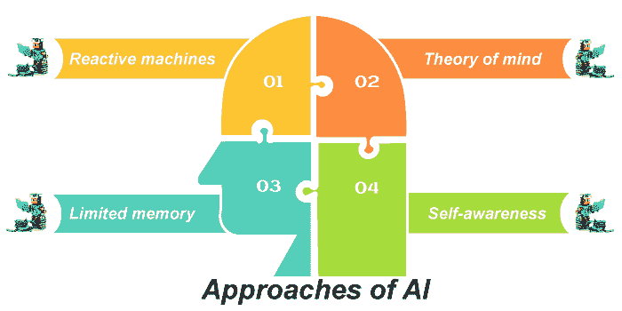

# 人工智能学习方法

> 原文：<https://www.javatpoint.com/approaches-to-ai-learning>

算法是一种容器，它提供了一个存储解决特定类型问题的方法的盒子。算法通过一系列明确定义的状态来处理数据。状态不需要是确定性的，但是状态仍然被定义。目标是创建解决问题的输出。在某些情况下，算法接收有助于定义输出的输入，但焦点总是在输出上。

算法必须使用计算机能够理解的定义明确的正式语言来表达状态之间的转换。在处理数据和解决问题时，算法定义、细化和执行一个函数。该函数总是特定于算法要解决的问题类型。

五个部落中的每一个都有不同的技术和策略来解决这些问题，从而产生独特的算法。这些算法的组合最终应该会导致主算法，它会解决任何问题。下面的讨论提供了五种主要算法技术的概述。

### 1:符号逻辑

一个古老的部落，象征主义者，认为知识可以通过研究符号(代表某种意义或事件的符号)并从中提取规则来获得。

### 2:符号推理

最早的部落之一，象征主义者，认为知识可以通过对符号(代表某种意义或事件的符号)进行操作并从中得出规则来获得。

通过组合复杂的规则系统，你可以获得你想知道的结果的逻辑演绎；因此，符号主义者塑造了他们的算法来从数据中产生规则。在符号逻辑中，*推演*扩大了人类知识的范围，*归纳*则增加了人类知识的层次。归纳通常会开辟新的探索领域，而演绎则探索那些领域。

### 3:连接基于大脑的神经元。

联结主义者可能是五个部落中最著名的。这个部落试图用硅代替神经元来复制大脑功能。本质上，每个神经元(构建为模拟现实世界对应对象的算法)解决了一小部分问题，并行使用多个神经元解决了整个问题。

目标是不断改变权重和偏差，直到实际输出与目标输出相匹配。人工神经元激发并将其解决方案传送给下一个神经元。仅由一个神经元产生的解是整个解的一部分。每个神经元向下一个神经元发送信息，直到神经元组成最终输出。事实证明，这种方法在识别物体、理解书面和口头语言以及与人类互动等类似人类的任务中最为有效。

### 4:测试变异的进化算法

革命者依靠进化原理来解决问题。换句话说，这种策略是基于适者生存(去除任何与期望输出不匹配的解决方案)。适应度函数决定了每个函数在解决问题时的可行性。使用树形结构，求解方法根据函数输出找到最佳解。每一级发展的赢家必须为下一级创造任务。

这个想法是，下一个层次会更接近解决问题，但可能不会完全解决问题，这意味着需要另一个层次。这个特殊的部落严重依赖递归和强烈支持递归的语言来解决问题。这个策略的一个有趣的结果是进化的算法:一代算法产生下一代。

### 5:贝叶斯近似

一组贝叶斯科学家认识到不确定性是这一观点的主要方面。学习是不确定的，而是随着先前假设的不断更新而变得更加准确。这个概念启发了贝叶斯主义者采用统计方法，特别是从贝叶斯定理推导出来的方法，它可以帮助你计算特定情况下的概率(例如，通过查看某个*种子的牌，*伪随机序列的起始值，在同一种子的另外三张牌从一副牌中抽出之后)。

### 6:通过类比学习的系统

分析师使用内核机器来识别数据中的模式。通过识别一组输入的模式，并将其与已知的输出进行比较，您可以创建一个问题解决方案。目标是使用等式来确定问题的最佳解决方案。正是这种推理决定了一个特定的解决方案是否在之前的特定情况下使用过。将该解决方案用于类似情况也应该有效。

这个部落最知名的产品之一是推荐系统。例如，当你在亚马逊上购买一个产品时，推荐系统会出现你可能想购买的其他相关产品。

机器学习的最终目标是将五个部落采用的技术和策略结合起来，形成一个可以学习任何东西的单一主算法。当然，实现这个目标还有很长的路要走，然而像佩德罗·多明戈斯这样的科学家目前正在朝着这个目标努力。

## 有哪些不同类型的人工智能方法？

虽然对非专业人士来说，一切似乎都是绿色和阳光的，但构建人工智能系统有很多技术。有四种基于机器行为的人工智能方法——反应机器、有限记忆、思维理论和自我意识。

### 1.反应机器

这些机器是 [AI 应用](https://www.javatpoint.com/application-of-ai)最基本的形式。反应机器的例子有**深蓝，IBM 的**下棋超级计算机，以及打败当时世界大师的同一台计算机。

[AI](https://www.javatpoint.com/artificial-intelligence-tutorial) 团队不使用训练集来给机器喂食或存储后续数据以供将来参考。根据对手的移动，机器决定/预测下一步。

### 2.有限的内存

这些机器属于 **AI 应用**的 **II** 类，自动驾驶汽车就是最好的例子。随着时间的推移，这些机器被输入数据，并根据其他**汽车的速度和方向、车道标线、交通灯、道路曲线**和其他重要因素进行训练。

### 3.心理理论

这就是我们努力让这个概念发挥作用的地方。然而，我们还没有到那一步。心理理论是机器人理解人类情绪和思想并做出反应的概念。

如果人工智能驱动的机器总是和我们在一起，一起移动，那么理解人类的行为就势在必行。然后，有必要对这种行为做出相应的反应。

### 4.自我意识

这些机器是第三类人工智能的延伸，是理解人类情感的一个进步。这是人工智能团队构建带有自我意识因素的机器的阶段。

当有人从后面按喇叭时，机器必须感受到这种情绪，只有这样，它们才能理解从后面按喇叭的感觉。

* * *