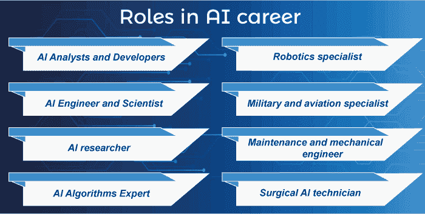
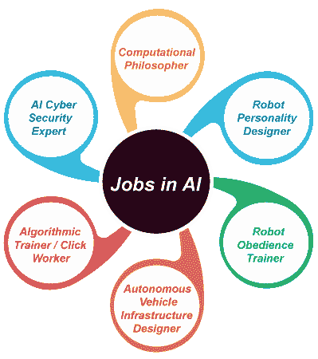
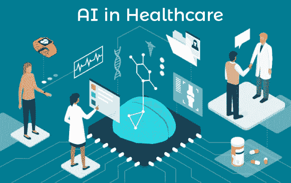
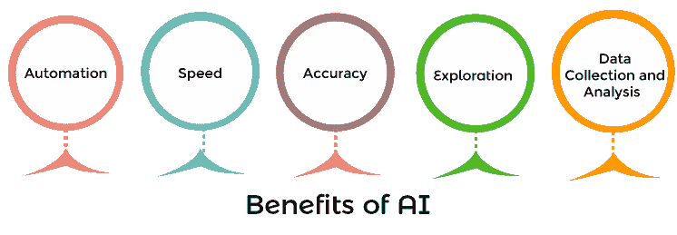

# 人工智能的范围(人工智能职业)

> 原文：<https://www.javatpoint.com/scope-of-ai>

新生应该分析自己的能力和技能，选择一个更好的人工智能角色，有向上流动的潜力。由于人工智能领域的新工作角色和进步，人工智能的未来范围继续扩大。人工智能职业中的各种角色如下:

*   人工智能分析师和开发人员
*   人工智能工程师和科学家
*   人工智能研究员
*   人工智能算法专家
*   机器人专家
*   军事和航空专家
*   维护和机械工程师
*   外科人工智能技术员

### 人工智能的未来

[人工智能](https://www.javatpoint.com/artificial-intelligence-tutorial)的未来在印度是光明的，许多组织选择了 AI 自动化。了解人工智能的最新发展对于根据你的能力找到合适的工作角色至关重要。

人工智能的范围仅限于家庭和商业用途，因为医疗和航空部门也在使用人工智能来改善其服务。如果人工智能的表现超过了人类的努力，那么从长远来看，选择人工智能自动化将降低企业的成本。

运营车辆的自动化在物流行业引起了轰动，因为预计自动化**卡车/车辆**可能很快就会使用。

由于人工智能未来的光明范围，未来几年人工智能初创企业的数量预计会增加。印度人工智能初创企业的数量显著增加，这表明了机遇。

此外，印度专业人工智能开发人员的人才缺口巨大，企业比以往任何时候都更需要人工智能专家。企业不想错过任何可以彻底改变其业务流程的技术。

### 人工智能领域的工作

人工智能字段中的名称可能不同。AI **(印度- 2021** )的一些顶级岗位如下:

*   **计算哲学家** -一位关心在 AI 算法中教授人类伦理和价值观的计算哲学家。例如，如果一个机器人正在被开发用于家务劳动，它应该被设计成倾听和服从雇主的命令。
*   **机器人个性设计师** -专门的机器人个性设计师设计机器/机器人的数字个性。
*   **机器人服从训练器** -机器人服从训练器教机器/机器人遵循指令，服从障碍物。随着越来越多的机器人被引入家庭、军事战略等。，人工智能的未来是光明的。
*   **自动驾驶汽车基础设施设计师** -自动驾驶汽车设计师开发数字接口，帮助他们独立工作。光明的人工智能未来的范围可以推动各行业自动驾驶汽车的发展。
*   **算法训练师/点击工作者** -他们与 AI 算法合作，训练它们识别指令、情绪、情绪、图像、语音等。他们训练人工智能算法与周围环境互动，并自主采取适当的行动。
*   **AI 网络安全专家** -一名 AI 网络安全专家开发了算法，可以识别与系统相关的盗窃/风险，并采取行动自主消除。随着新类型的网络攻击每天都在发展，人工智能正被用于网络安全来检测它们。人工智能的未来( **AI 网络安全**)在亚太地区也是一片光明。

### 印度人工智能的未来范围

印度采用人工智能是有希望的。然而，它目前处于早期阶段。而一些行业，如 IT、制造业、汽车等。，都在利用 AI 的威力，但仍有许多领域其潜力尚未被发掘。

人工智能中存在的巨大潜力可以通过人工智能保护伞下的各种其他技术来理解。这些技术的例子包括自我改进算法、机器学习、模式识别、大数据和许多其他技术。

据预测，在接下来的几年里，几乎没有任何行业会不受这一强大工具的影响。这就是为什么人工智能在印度有如此大的发展潜力。

在这篇综合博客中，我们讨论了人工智能正在使用的一些领域:

### 人工智能工作机会

根据福布斯发布的一份报告，人工智能工作机会每年以 74%的速度持续增加。今天，人工智能是最受欢迎的技术之一，几乎在每个领域都有影响，这是显而易见的。因此，对人工智能专业人员的需求持续增长。随着工作机会的增多，是你探索 AI 职业生涯的最佳时机。

下面，我们列出了人工智能被使用或具有巨大发展潜力的不同领域。

### 1:银行业

得益于人工智能和机器学习技术的发展趋势，银行业并不新鲜。该行业已迅速采用技术来跟上当前的市场趋势。它使用这项技术来记录客户数据，这在以前是一项单调的手动任务。

随着当今银行部门生成和存储的数据量的快速增长，人工智能和 ML 允许专业人员准确高效地做到这一点。

人工智能如何在银行业产生重大影响包括更好的**客户支持、增强的数据质量、欺诈防范、数字助理**等等。

当今世界上最进步的行业之一是医疗保健。在下一节中，你将阅读人工智能如何影响这个领域，以及它将如何继续这样做。

### 2:保健和医药

根据福布斯进行的一项研究，人工智能领域可以增加生命的价值，这一点多年来已经被观察到了。医疗保健部门以多种方式利用这项技术，并不断创新。

人工智能用例是由英特尔和骑士职业学院开发的协作癌症云。Cloud 收集癌症患者和其他类似疾病患者的过去数据，帮助医生根据他们表现出的症状早期诊断癌症，并将其与以前可用的数据进行比较。治疗这种致命疾病的最好方法是防止它发展到晚期。

此外，由阿伯里斯特威斯、曼彻斯特和剑桥顶尖大学的科学家团队制造的基于人工智能的机器人 Eve 发现了一种经常在牙膏中发现的可以治疗疟疾的元素。这证明了人工智能将在未来的医学领域发挥重要作用。

AAI 还用于医疗保健和其他类似领域的医学，如药物测试、合成生物学等。你也可以肯定，人工智能将加速科学研究和开发的进程，这很可能有助于这一领域。

## 人工智能的优势

人工智能在现代场景中有多种用途。各行各业都在使用 AI 来实现流程自动化，每天都在开发更好的 AI 算法来加速各种行业流程/任务。

*   **自动化** - AI 让机器有道理去解读情况，采取必要的行动。有些任务可能很乏味，比如检查论文、提交表格等。，这些任务可以在人工智能的帮助下自动化，只需最少的人工干预。组织/行业中的员工可以专注于他们的核心职责，而人工智能可以自动化困难的任务。
*   **速度** -与人类相比，AI 可以做到很多事情都不停顿。除了自动化，AI 让我们在截止日期前完成工作，工作可以在工作时间之外完成，这不仅减少了人力，还提供了极大的速度和效率。
*   **准确性** -与人类相比，AI 降低了出错的几率。错误更少，因为机器在每个场景中总是按照固定的 AI 算法行动。人工智能帮助我们以更少的风险定义准确性和精确性的新边界。
*   **探索** -人工智能已经帮助我们发现了许多未被探索的地方，如火山遗址、海底等。人类无法访问这些易受攻击的地点，因为它们无法在这些景观中生存，而人工智能机器可以访问这些敏感的地方并收集信息。
*   **数据收集和分析** -数据分析已经是现代商业世界的一项趋势技术。行业和企业都知道分析大量数据并从中提取有用信息的重要性。

AI 的各种好处导致了市场上不同的用例和工作角色，这对于深度技术爱好者或者刚开始在 AI 行业追求事业的人来说都是有益的。在印度，人工智能的范围是光明的，因为公司需要能够从大量数据中提取有意义信息的专家员工。

### 与 AI 相关的风险有哪些？

你是否意识到与人工智能相关的风险以及如何管理这些风险？初学者应该意识到与人工智能过程相关的潜在风险以及如何应对这些风险。与人工智能相关的一些常见风险如下:

*   **高实施成本** -你想为你的公司/企业安装 chatbot 软件吗？与建立云技术、数据库等其他技术相比，人工智能的实现成本较高。人工智能、机器学习和深度学习的子集也有很高的实现成本。尽管实施成本很高，为什么公司仍然选择人工智能？
*   这是因为几乎每个企业都已经意识到人工智能的未来范围。虽然它的实施成本很高，但从长远来看，人工智能设置可以帮助您，并且通过减少对组织中人力的依赖，它肯定会为您节省资金和资源。
*   **人类复制** -这一切都始于 **1950 年**，当时艾伦·图灵进行了“图灵测试”来定义机器的思考能力。从那以后，利用人工智能复制人类智能的问题一直备受争议。人工智能的光明领域也伴随着必须由人工智能专家处理的风险。

### AI 有哪些应用？

人工智能在每个可以想象的领域都有应用，最近的进展只会增加人工智能在人类活动几乎每个领域的应用和相关性。作为一个初学者，你可能会认为人工智能是一种新开发的技术，人工智能开发的时间比你想象的要长。人工智能的一些顶级用例如下:

*   **语音识别** - AI 已经帮助我们将口语单词转换为数字文本。语音识别有许多用途，例如启用语音的消息传递、内容编写、语音控制的遥控器和设备。语音识别也用于授权和验证。
    **例如**，如果办公室只有授权的人才能进入，语音识别可能会匹配他们的声音和权限。如果任何未经授权的人试图进入办公室，他们将被阻止，因为他们的声音样本不匹配。
*   **自然语言处理** -自然语言处理(NLP)使系统或机器能够理解人类文本。你一定听说过一些主要的虚拟助手，比如 Siri、谷歌助手等。虚拟助手和聊天机器人的工作原理是自然语言处理，了解用户的情绪和心情。
*   **图像识别** -最近，一个名为‘my heritage’的平台允许其用户对老照片进行动画处理。它使用人工智能和深度神经网络来制作静态照片中的人脸动画，人工智能可以理解视频片段或静态图像中的动作。图像识别有很多应用，如面部识别、指纹识别、自动驾驶汽车等。图像识别也大量应用于数字营销领域。
*   人工智能可以感知股市波动，比人类更准确地预测高回报股票。随着加密货币交易的增长，人工智能在金融领域的未来范围也在扩大。
*   **机器人** -听说过新一代‘索菲亚’机器人吗？它被认为是世界上最智能的机器人之一。除了开发高度智能的机器人，人工智能还帮助创造了机器人，可以帮助人类完成日常任务，如**清洁、园艺、维修**等。

这些只是当前场景中人工智能的顶级用例。AI 还有很多其他的使用案例，比如**车辆中的自动驾驶技术、预约乘车服务、网络安全**等。

## 结论

最近，企业在探索其在各个领域的应用可能性时，看到了大量的**人工智能**和**人工智能**现象。例如，研究人员开始使用机器学习来洞察最近导致世界陷入停滞的全球疫情。

当我们谈论人工智能和机器学习在印度的结合范围时，有必要认识到它在医疗领域的应用，以跟踪病毒传播、接触追踪，甚至分析治疗。专家预测，随着经济放缓的恶性循环开始，印度对 AI 和 ML 专业人才的需求将会增加。这是印度机器学习和人工智能范围的积极指标。许多 **IT** 专业人士渴望在 AI 和 ML 技术领域追求事业，并寻找成为 AI 和 ML 专家的途径。

尽管该国出现了大量失业，但机器学习和人工智能工作受到的影响最小。企业已经在着手创建更强大的虚拟工作环境，这增加了对人工智能和人工智能专业人员的需求。

技术的进步也推动了人工智能在印度人工智能子集的未来范围，如**深度学习、机器学习**等。

你可以选择一个知名来源的**人工智能**课程，了解更多关于人工智能在印度的进展。

从 **NLP** 到 **CNN(并发神经网络)** AI 课程可以让你全面了解 AI 的最新进展。Aara Academy 的 AI 认证课程可以帮助你更好地了解印度 AI 的范围。

此外，基于个人能力在人工智能中选择合适的工作角色对求职者/新生来说也很重要。开始在印度建立成功的人工智能事业。

* * *