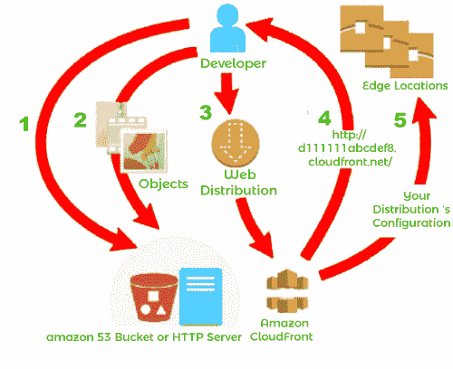

# 亚马逊云前线

> 原文：<https://www.javatpoint.com/amazon-cloudfront>

Amazon CloudFront 是一种快速内容交付网络(CDN)服务，它以低延迟、高传输速度向全球客户安全地交付数据、视频、应用程序和 API，所有这些都在一个开发人员友好的环境中进行。云锋中国在北京、上海、中卫和深圳设有 Edge 分支机构。

这四个边缘位置通过专用网络直接连接到由新网运营的亚马逊网络服务中国(北京)区域和由 NWCD 运营的亚马逊网络服务中国(宁夏)区域，以快速向中国观众提供内容。CloudFront 与服务无缝协作，包括用于减少 DDoS 的 Amazon Shield Standard、Amazon S3、弹性负载平衡或 Amazon EC2 作为您的应用程序的起源。

您可以在几分钟内开始使用内容交付网络，使用您已经熟悉的亚马逊网络服务工具:应用编程接口、亚马逊网络服务管理控制台、命令行界面和软件开发工具包。亚马逊的 CDN 提供了一个简单的、现收现付的定价模式，不需要前期费用或所需的长期合同，对 CDN 的支持包含在您现有的亚马逊支持订阅中。

### 利益

**快速全局**

亚马逊云前端内容交付网络(CDN)规模庞大，分布在全球。云前沿网络在 33 个国家的 73 个城市拥有 191 个持久性有机污染物(180 个边缘位置和 11 个区域边缘缓存)。它利用高度弹性的专用主干网为您的最终用户提供卓越的性能和可用性。

**边缘安全**

亚马逊云前端是一个高度安全的 CDN，提供网络和应用级保护。您的流量和应用程序通过各种内置保护(如亚马逊防护标准)受益，无需额外成本。

**与亚马逊网络服务深度融合**

亚马逊云前线中国与亚马逊网络服务服务集成，如亚马逊 S3、亚马逊 EC2 和弹性负载平衡。它们都可以通过同一个控制台访问，并且 CDN 中的所有功能都可以通过使用 SDK 或亚马逊网络服务管理控制台以编程方式进行配置。最后，如果您使用亚马逊网络服务，如亚马逊 S3、亚马逊 EC2 或弹性负载平衡，您不需要为这些服务和云前端之间传输的任何数据付费。

### 亚马逊云前沿位置

2018 年 10 月，亚马逊 CloudFront 由分布在 29 个国家 63 个城市的 138 个接入点(127 个边缘位置和 11 个区域边缘缓存)组成。【4】

### 北美洲

边缘位置:弗吉尼亚州阿什伯恩(3)；佐治亚州亚特兰大(3)；马萨诸塞州波士顿；伊利诺伊州芝加哥(2)；德克萨斯州达拉斯/沃斯堡(5)；科罗拉多州丹佛(2)；加州海沃德；佛罗里达州杰克逊维尔；加利福尼亚州洛杉矶(4)；佛罗里达州迈阿密(3)；明尼苏达州明尼阿波利斯；QC 蒙特利尔；纽约，纽约(3)；新泽西州纽瓦克(3)；加利福尼亚州帕洛阿尔托；宾夕法尼亚州费城；亚利桑那州凤凰城；加利福尼亚州圣何塞(2)；华盛顿州西雅图(3)；南弯，IN；密苏里州圣路易斯；多伦多，开

区域边缘缓存:弗吉尼亚；俄亥俄州；俄勒冈州

### 欧洲

边缘位置:荷兰阿姆斯特丹(2)；德国柏林；丹麦哥本哈根；爱尔兰都柏林；德国法兰克福(8)；芬兰赫尔辛基；英国伦敦(7)；西班牙马德里(2)；英国曼彻斯特；法国马赛；意大利米兰；德国慕尼黑；挪威奥斯陆；意大利巴勒莫；法国巴黎(4)；捷克共和国布拉格；瑞典斯德哥尔摩(3)；奥地利维也纳；波兰华沙；瑞士苏黎世

区域边缘缓存:德国法兰克福；英国伦敦

### 亚洲

边缘位置:印度班加罗尔；印度钦奈(3)；泰国曼谷(2)；中国香港(3)；马来西亚吉隆坡；印度孟买(2)；菲律宾马尼拉；印度新德里(2)；日本大阪；韩国首尔(4)；新加坡(3)；台湾台北(3)；日本东京(9)

区域边缘缓存:印度孟买；新加坡；韩国首尔；日本东京

### 澳大利亚

边缘位置:墨尔本；珀斯；悉尼

区域边缘缓存:悉尼

### 南美。参见 AMERICA

边缘位置:巴西圣保罗(2)；巴西里约热内卢(2)

区域边缘缓存:巴西圣保罗

### 中东

边缘位置:阿联酋迪拜；阿拉伯联合酋长国富查伊拉；以色列特拉维夫

### 非洲

边缘位置:肯尼亚内罗毕；南非约翰内斯堡；南非开普敦

### 如何设置 CloudFront 来交付内容？

您创建了一个 CloudFront 分发版，告诉 CloudFront 您希望将内容交付到哪里，以及如何跟踪和管理内容交付的详细信息。CloudFront 然后使用计算机边缘服务器——更靠近您的受众——在有人想要查看或使用内容时快速交付该内容。

### 您如何配置云前端来交付您的内容

1.您指定*原始服务器*，例如亚马逊 S3 桶或您的 HTTP 服务器，CloudFront 从该服务器获取您的文件，然后这些文件将从世界各地的 CloudFront 边缘位置分发。

原始服务器存储项目的原始固定版本。如果您通过 HTTP 提供内容，那么您的原始服务器要么是亚马逊 S3 桶，要么是 HTTP 服务器，例如网络服务器。您的 HTTP 服务器可能运行在亚马逊弹性计算云(亚马逊 EC2)实例或您管理的服务器上；这些服务器也被称为*定制源。*

2.你上传你的文件到你的原始服务器。您的文件，也称为*对象*，通常包括网页、图像和媒体文件，但也可以是任何可以通过 HTTP 提供的内容。

如果您使用亚马逊 S3 桶作为原始服务器，您可以使桶中的对象公开可读，这样任何知道您的项目的云前端网址的人都可以访问它们。您还可以保持对象的私密性，并控制谁有权访问它们。

您创建了一个 CloudFront *分发版*，当用户通过您的网站或应用程序请求文件时，它会告诉 CloudFront 从哪个源服务器获取您的文件。同时，您可以指定是否希望 CloudFront 记录所有请求，以及是否希望在构建分发后立即启用它。

3.CloudFront 为您的新发行版指定一个域名，您可以在 CloudFront 控制台中查看该域名，或者响应编程请求(如 API 请求)返回该域名。如果您愿意，您可以添加一个备用域名来代替。

4.CloudFront 会将您的分发配置(但不是您的内容)发送到其所有*边缘位置*或*存在点*(POPs)——地理位置分散的数据中心的服务器集合，CloudFront 会在这些服务器上缓存您的文件副本。

在开发网站或应用程序时，您可以使用 CloudFront 的域名作为您的网址。例如，如果 CloudFront 返回 d111111abcdef8.cloudfront.net 作为您分发的域名，那么您的 Amazon S3 存储桶(或 HTTP 服务器上的根目录)中 logo.jpg 的 URL 是 http://d111111abcdef8。是 CloudFront。net/logo.jpg。

或者，您可以设置 CloudFront 在您的发行版中使用您的域名。在这种情况下，网址可能是 http://www.example.com/logo.jpg.

### CloudFront 用例

使用 CloudFront 可以帮助您实现各种目标。这一部分只列出了几个，并提供了更多信息的链接，让您了解各种可能性。

### 加速静态网站内容交付

CloudFront 可以加速您的静态内容(**例如图像、样式表、JavaScript 等等**)向全球受众的传递。使用云前端，您可以利用 AWS 骨干网络和云前端边缘服务器，为访问您网站的访问者提供快速、安全的“T2”和可靠的“T4”体验。

存储和分发静态内容的一个简单方法是使用**亚马逊 S3 桶**。将 S3 与**云锋**配合使用有很多好处，包括可以选择使用 Origin Access Identity (OAI)来轻松限制对您的 S3 内容的访问。

* * *