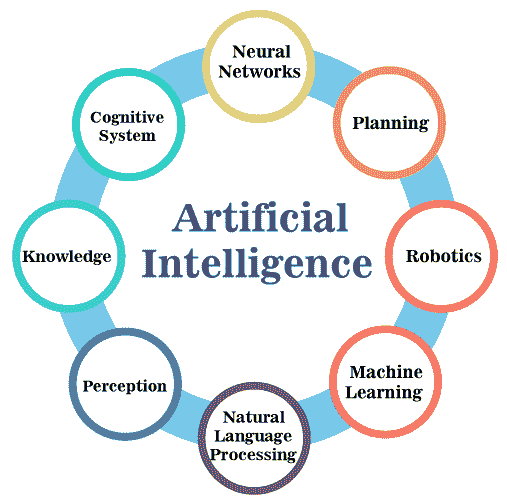

# 人工智能的目标

> 原文：<https://www.javatpoint.com/goals-of-artificial-intelligence>

人工智能可以通过读取人类的行为并利用结果开发智能系统来实现。例如，他们在某些情况下学习、决策和行动。观察人类，同时解决简单任务中的问题，并利用其结果开发智能系统。

人工智能的总体研究目标是创造允许计算机和机器智能工作的技术。模拟(或创造)智能的一般问题被分解为子问题。

以下描述的症状最受关注。这些包括研究人员期望智能系统展现的特殊特征或能力。埃里克·桑维尔强调与给定情况相关且适用的规划和学习。

*   **逻辑，解决问题**:早期研究人员开发了算法，可以模拟人类在解谜或进行逻辑推理时的逐步推理。到 20 世纪 80 年代末和 90 年代，人工智能研究已经发展了处理不确定或不完整信息的方法，采用了概率和经济学的概念。对于困难的问题，算法可能需要巨大的计算资源——大多数人都会经历一次“**组合爆炸**”:一定规模的问题所需要的内存或计算机时间量变成了天文数字。寻找更有效的问题解决算法是一个高度优先事项。
*   **知识表示**:知识表示和知识工程是 AI 研究的核心。人们期望机器解决的许多问题将需要广泛的世界知识。AI 需要表现的东西是对象、属性、类别以及对象之间的关系；情况、事件、状态和时间；因果关系；关于知识的知识(别人知道的关于我们知道的)；和许多其他研究较少的领域。
    对“存在”的一种表述是本体:机器知道的一组**对象、关系**、概念等等。最一般的是上层本体论，它试图为所有其他知识提供基础。
*   **规划**:智能代理必须能够设定目标并实现目标。他们需要一种方式来展望未来——一种对世界现状的描述，并预测他们的行为将如何改变它——并能够做出选择，最大化可用选项的效用(或“**价值**”)。
    在经典规划问题中，代理人可以假设它是世界上唯一起作用的系统，允许代理人确定其行为的后果。
    但是，如果代理人不是唯一的行为人，则要求代理人在不确定性下推理。它要求代理评估其环境，做出预测，评估其预测，并根据其评估进行调整。
*   **学习**:机器学习，这个领域创立以来 AI 研究的一个基本概念，就是研究通过经验自动改进的计算机算法。无监督学习是在输入流中找到模式的能力。监督学习包括分类和数值回归。在从几个类别中看到几个事物的例子后，分类被用来确定事物属于哪个类别。回归试图构建一个描述输入和输出之间关系的函数，并预测随着输入的变化，输出应该如何变化。
*   **社会智能**:有效计算是对能够检测、解释、处理和模拟人类的系统的研究和开发，是一个横跨计算机科学、心理学和认知科学的跨学科领域。虽然该领域的起源可以追溯到早期对情感的哲学探索，但更现代的计算机科学分支起源于罗莎琳德·皮卡德(Rosalind Picard)**1995 年**关于“**有效计算**”的论文。
*   **创造力**:人工智能的一个子领域从理论上(哲学、心理学角度)和实践上(产生新颖和有用输出的系统的具体实现)处理创造力。计算研究的一些相关领域包括人工直觉和人工思维。
*   **通用智能**:很多研究人员认为，他们的工作最终会产生一台具有人工通用智能的机器，将上述所有技能结合起来，并在这些领域的大部分或全部领域超过人类的能力。一些人认为，这样的项目可能需要拟人化的特征，如人工意识或人工大脑。

### 人工智能方法

在定义了人工智能之后，让我们了解位于其核心的哲学方法。每一项关于人工智能的研究都属于以下两类之一:

*   **符号法:**也称“自上而下”法，符号法模拟智力，不考虑人脑的生物结构。顾名思义，这种方法通过处理符号来分析人脑的思维过程。
*   **连接主义方法:**另一方面，连接主义方法通过模仿人脑的生物结构来构建神经网络。也被称为“自下而上”的方法，这种方法调动更基本的脑细胞。

这两种方法都在竞争开发人工智能系统和算法的方法。虽然它们看起来相似，但它们的原理不同。而“**自上而下**”的方法侧重于符号细节，“自下而上”的方法考虑大脑内部的神经活动。我们可以用一个例子来突出这两种方法的区别。考虑一个通过图像处理识别数字的机器人。

符号方法是根据每个数字的几何图形编写一个算法。该程序将比较和匹配存储在其内存中的不同数字的数字模式。

机器人将通过反复调整人工神经网络来训练它，以连接主义的方式识别数字。在某种程度上，联结主义方法比符号方法更接近模拟人类的思维和思维过程。

研究人员在开发算法时使用这两种人工智能实现方法。虽然符号方法因简单的问题而闻名，但研究人员更喜欢用连接主义方法来解决复杂的现实问题。尽管显示出巨大的潜力，这两种方法都产生了有限的结果。

除了这两个主要分类，研究人员还创造了几种实现人工智能的方法。

*   **基于逻辑的 AI** 使用形式逻辑来表示人类头脑中的知识、计划和学习。这种方法不是模仿人类思维，而是专注于确定逻辑推理和抽象思维的基础。
*   **反逻辑 AI:** 一些研究人员认为，使用简单的通用逻辑不可能捕捉到人类行为的方方面面。反逻辑方法不是使用简单的逻辑，而是处理机器学习和视觉处理的特殊解决方案。
*   **基于知识的 AI:** 随着重要记忆电脑在 20 世纪 70 年代左右变得可用，人们开始添加 AI 应用。因此，系统架构结合了事实和规则来描述系统中的算法。
*   **统计学习:**近年来，世界范围内的研究人员结合了信息论、决策论等先进的数学和统计模型。，来开发 AI 算法。这种方法提高了数据挖掘的准确性和可重复性。

### 人工智能的应用领域

现代基于人工智能的技术与任何智能任务都相关，其应用列表持续大幅增长。让我们快速看一下其中的一些。

*   **医疗保健:**人工智能已经被证明是医疗保健领域的救命稻草。例如，智能手表中的人工智能算法监控一个人的重要活动，以检测心脏问题，甚至提醒紧急服务。此外，人工智能有助于提高药物的速度和准确性。
*   **金融服务:**过去三十年，金融服务受益于 AI。人工智能对于簿记管理、股票预测甚至银行业的欺诈防范都很有用。大型企业使用 AI 在严格合规的情况下处理和审计交易。
*   **零售领域:在**零售业务中，AI 算法可以通过管理库存来解决供应链问题。除了预测服装业务的未来趋势，人工智能还可以通过实时数据分析来帮助预测需求和提升客户体验。
*   **汽车行业:**使用 AI 的一个重要例子是汽车行业。自动驾驶汽车是最新的研究领域，每个汽车制造商都在大力投资。几家汽车制造商已经使用了人工智能功能，如语音控制、车道切换、碰撞检测和提高驾驶员安全性。

### 人工智能作为一种有益的职业可能性

我们希望这篇博客中对人工智能的简要介绍能让你尝到它的技术和能力，因为你现在一定已经明白人工智能为你的职业生涯开辟了一片机会的海洋。通过访问**印度职业门户网站**，你可以了解各种课程和工作机会，从而在 AI 领域取得成功的职业生涯。

### 人工智能的好处

*   人工智能对初学者来说很难，但它为开发能够颠覆计算机科学的智能机器提供了巨大的机会。
*   使用智能系统减少人为错误并以更高的效率执行各种任务。
*   智能系统可以执行人类无法完成的挑战性任务。外币；探索海洋，轻松完成各种困难、艰苦的任务。
*   使用人工智能已经开发了许多应用程序。iPhones、Siri 和微软 Cortana 都是在人工智能现象的基础上进化而来的。这些是交互式机器人，可以帮助你访问智能手机。
*   借助人工智能技术，可以开发出数字助理，减少了员工数量。这些助手能以惊人的效率完成这项工作。
*   放射外科已经在医学领域中用于使用人工智能开发的肿瘤治疗。
*   使用人工智能，提高产品的生产率、效率和准确性。

### 人工智能的缺点

人工智能看起来很有前途，而且很有未来感。它正在许多地区逐步实施。人工智能有许多缺点，包括:

人工智能正在慢慢进入实时应用。AI 提供了很多可能性，但是真的很贵。较小的组织负担不起实施人工智能所需的高端机器、软件和资源。

就生产力而言，人工智能系统可以代替人类执行任务，但它们不能做出决策。机器人不能决定什么是对的，什么是错的。

有了智能系统，你就不会在日常体验中发挥创造力。人类用日常经验展示创意。

用智能系统取代人类会增加失业率，导致国内生产总值下降。

* * *