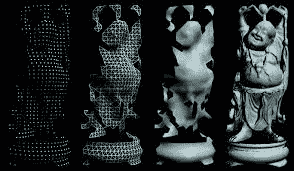

# 数字图像和信号之间的关系

> 原文：<https://www.javatpoint.com/relationship-between-digital-image-and-signal>

图像是二维阵列，其中颜色信息沿 x 和 y 空间轴排列。所以，要想了解图像是如何形成的，首先要了解信号是如何形成的？

## 信号

信号是将我们与物理世界联系起来的一种数学和统计方法。它可以通过空间上的维度和时间来测量。信号用于将信息从一个来源传递到另一个来源。

信号可以在一维或二维阵列或更高维信号上测量。常见的例子是声音、图像和传感器输出信号。

这里，一维信号在时间上在空间上测量，二维信号在一些其他物理量上测量，例如数字图像。

## 关系

信号是在物质世界中传达我们周围信息的东西，它可以是任何声音、图像等。无论我们说什么，它首先转换成信号或波，然后在适当的时间内传递给其他人。在数码相机中捕捉图像时，信号从一个系统传输到另一个系统。

## 数字图像是如何形成的？

数字图像是由存储在计算机中的小数据比特(即像素)形成的。当我们在有光的情况下用数码相机拍摄图像时，这个相机就像一个数字传感器一样工作，并将它转换成数字信号。

这里，采样和量化是将数据转换为数字形式所需的两个过程。

因此，通常我们想知道这个数字图像存储在哪里。*在我们的计算机内存中，像素以光栅图像或光栅图的形式存储，它们是小整数的 2D 阵列*。因此，这些整数值通常以压缩形式存储。

* * *

## 重叠字段

### 1.机器视觉还是计算机视觉

机器视觉和计算机视觉几乎一样，还有一些其他的特点。它涉及开发一个系统，其中输入是图像，输出是一些信息。

**例如:**在冰淇淋行业中，视觉系统可以用于在将冰淇淋包装在杯子中的过程中识别许多东西。它可以验证空杯子没有损坏。它可以验证填充冰淇淋的正确水平。它可以检查标签是否正确放置。它可以验证杯子是否密封正确。

根据软件的编码，系统可以进行验证和操作。

### 2.电脑图形图像

计算机图形学是由对象模型形成的一系列图像。图像不是从设备中捕获的，而是使用对象模型生成的。计算机生成的图像用于制作视频游戏、电影、广告等。

(系统执行图像渲染)

### 人工智能

人工智能是计算机科学中创造机器的一个领域？像人类一样工作和反应。计算机场景在图像被处理以获得特征之后被使用。人工智能在图像处理中有许多应用。

**例如:** X 光、核磁共振、CT 扫描等。以图像的形式帮助医生进行治疗。

### 信号处理

信号处理包括提取、处理和存储具有复杂信号和图像的信息。信号在图像处理中有许多应用。

**例如:**在医学领域，既有脑电、超声信号等一维信号，也有多维信号。以及二维和三维图像，例如超声图像、全息图像等。

* * *