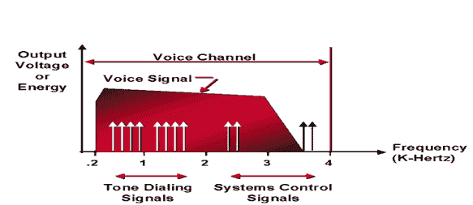

# 信号和系统介绍

> 原文：<https://www.javatpoint.com/dip-signal-and-system-introduction>

## 模拟信号

模拟图像处理应用于模拟信号，它只处理二维信号。模拟信号是时变信号，因此在模拟图像处理下形成的图像会发生变化。它通常是连续的，不会分解成微小的成分。

模拟信号的主要特征是频率、幅度和相位。模拟信号比数字声音更好地记录声波。

### 模拟信号中的频率

在给定的时间内，通过固定位置的波数在模拟系统中称为频率。

### 模拟信号的幅度

它描述了信号在水平轴上的高度，振幅总是等于波形上给定的点。

### 模拟信号中的相位

在同一个频率上，当一个波出现在另一个波后面时，或者我们可以说一个时间点(瞬间)在一个波形周期上的位置。

## 人声

模拟信号的最好例子是我们的声音。无论我们说什么都会产生声波，并且这种声音通过声波传播。

人声将模拟信号的所有特征表现为连续平滑的时变频率或幅度。

**(声波)**

## 数字信号

数字信号非常容易分析，它具有时变的量和每个采样点的离散点。数字信号由数字调制产生。

与模拟信号相比，数字信号的精度较低，但它最大的优点是易于存储和轻松访问。

无论是在电脑、数字笔、数字电话等方面，它现在都被广泛使用。

## 电脑键盘

计算机键盘属于输入设备的范畴。计算机键盘用于向任何信息设备(即计算机)发送控制信号。

当你按下键盘上的任何一个键时，在键的下面，有一个传送信号的电路网格。按键下方有一个开关，按下该开关可以让电流流过。如果我们讨论它的工作原理，那么就有一个**金属板**、**电路板**、**处理器**，负责向电脑发送信号。

* * *