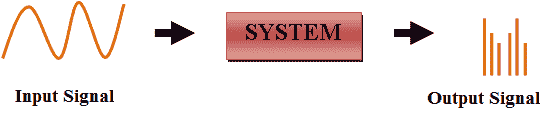
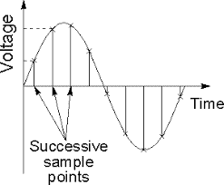
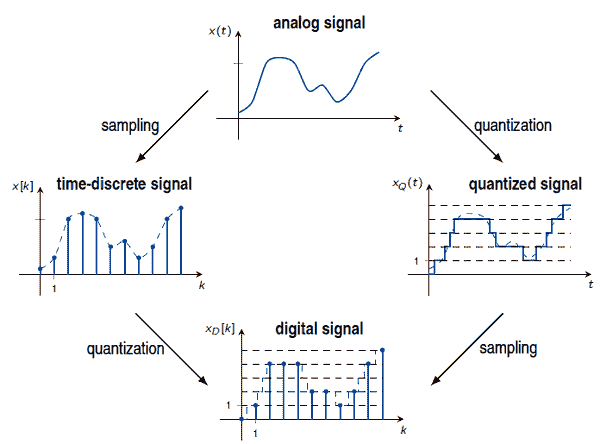

# 模拟信号和数字信号的区别

> 原文：<https://www.javatpoint.com/difference-between-analog-signals-and-digital-signals>

| 模拟信号 | 数字信号 |
| 模拟信号一开始很难分析。 | 数字信号易于分析。 |
| 模拟信号比数字信号更准确。 | 数字信号不太准确。 |
| 模拟信号需要时间存储。它有无限的记忆。 | 数字信号很容易存储。 |
| 为了记录模拟信号，所使用的技术保留了原始信号。 | 在记录数字信号时，采样信号被采集和保存。 |
| 模拟信号中有连续的信号表示。 | 数字信号中有一种不连续的信号表示。 |
| 模拟信号产生太多噪声。 | 数字信号不会产生噪声。 |
| 模拟信号的例子有人声、温度计、模拟电话等。 | 数字信号的例子有计算机、数字电话、数字笔等。 |

* * *

## 模拟信号到数字信号的转换

大多数图像传感器都在模拟信号中，不能对其进行数字处理，因为它需要无限的内存来存储，因为信号具有无限的价值，这就是为什么我们不能存储它。

为了创建数字图像，我们可以将数据转换成数字形式。

转换有两个步骤:

1.  [采样](dip-concept-of-sampling)
2.  量化

为了将模拟信号转换成数字信号，它的两个轴(x，y)都被转换成数字格式。

正如我们所看到的，图像在其坐标(x-y)上是连续的。因此采样处理坐标的数字化，量化处理振幅的数字化。

### 抽样

在模拟信号中，有随时间变化的连续电信号。在子系统的帮助下，采样器提取连续信号用于信号采样。

**(信号采样)**

采样是沿着信号的 x 轴进行的，信号随时间不断变化。它分为两类，一类是采样，另一类是下采样。

在下采样中，x 轴上的值范围总是较小。

### 量化

它是一种图像处理过程，其中模拟信号的连续和时变值被分成分配给每个子范围的不重叠的离散和唯一值。

采样和量化是相反的。采样沿 x 轴进行，但量化沿 y 轴进行。

在图像处理中，采样图像被视为数字值。当图像函数值的时变值和它的数字等价物之间存在状态转换时，表示量化。

**(模拟信号到数字信号的转换)。**

图像中的主要问题是连续出现虚假轮廓，这些轮廓随后可以在亮度水平不足的情况下量化。图像的精细阴影取决于量化级别。

* * *