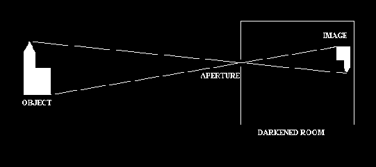
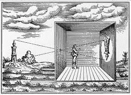

# 摄影史

> 原文：<https://www.javatpoint.com/history-of-photography>

摄影的第一个过程叫做**日影**，它是由**尼塞佛尔·涅普塞**在 **1824** 年发明的。在这个过程中，图像是几天后通过银盘上的朱迪亚沥青获得的。

1829 年，尼埃普塞在他的研究中提到了路易·雅克·曼迪·达盖尔。

## 相机的起源

有几项科学发明是为了人类的进步而发生的。最好的成就之一是发明了能捕捉人类活动的照相机。摄影技术经过几代人的改变。

它从暗箱开始，然后随着新技术的引入而扩展，包括**Calo type、干版、银版照相术和今天的数码相机**。数码相机彻底改变了摄影的历史，因为它能产生最好质量的图像。

## 暗室

在拉丁语中，暗室的意思是一个黑暗的房间，用来从相机的另一边拍照。这个概念是从中国的概念发展而来的，图像被投射在周围的墙上。

**(暗箱示例)**

## 暗箱工作

这是一种古老的光学设备，用来捕捉图像。这是相机最基本的形式，非常简单。在一个黑暗的房间里，对面的墙上有一个小洞，这样不管外面是什么，都会出现在墙上，但是拍摄的图像是颠倒的。

**(暗箱生成的图像)**

在捕捉图像时，暗室中存在的洞的大小起了非常重要的作用。如果洞的大小很小，那么墙上就会出现一个清晰且聚焦良好的图像，如果洞的大小更大，那么就会产生一个明亮的图像，但聚焦非常差。

由于光的直线传播，光以直线传播。后来，维米尔和卡纳莱托两位艺术家致力于图像的亮度和清晰度。

* * *