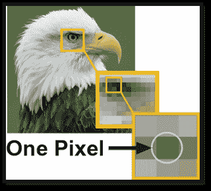
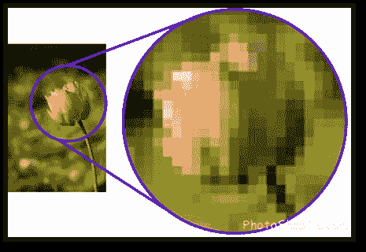
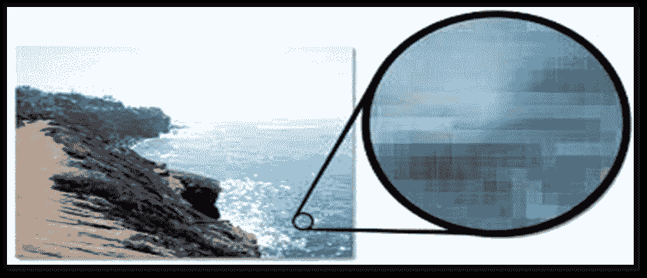
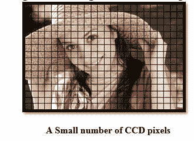
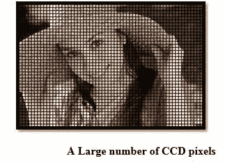
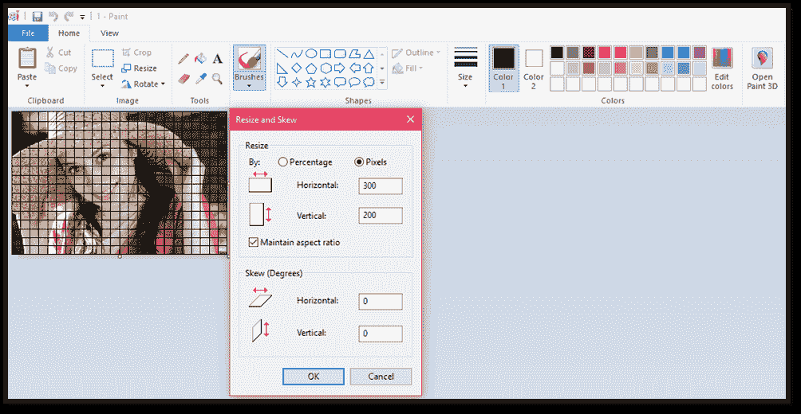
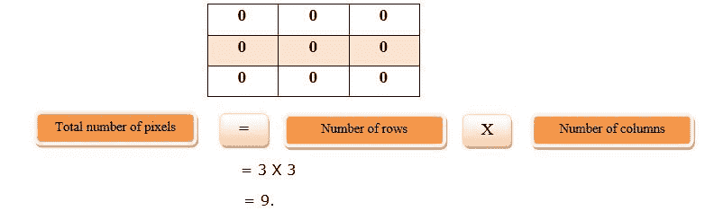
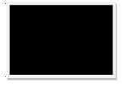

# 像素的概念

> 原文：<https://www.javatpoint.com/concept-of-pixel>

## 像素

像素的完整形式是“像素”它也被称为“PEL”无论是液晶显示器还是阴极射线管显示器，像素都是计算机显示器上图像的最小元素。屏幕是由数千或数百万像素组成的矩阵组成的。一个像素在计算机屏幕上用一个点或一个正方形来表示。

好的一点是，一个像素不能被看到，因为它们非常小，这导致一个平滑和清晰的图像，而不是“像素化”每个像素都有一个值，或者我们可以说是一个唯一的逻辑地址。它一次只能有一种颜色。像素的颜色是由用来表示它的位数决定的。计算机屏幕的分辨率取决于显卡和显示器，像素的数量、大小和颜色组合。

 

正如我们所知，图像是由成千上万的像素组成的。在上面的图像中，如果我们放大图像，我们将能够看到一些像素。

## 与 CCD 阵列的关系

当图像放大后，电荷耦合器件的表面看起来像填充的点。这些点是称为光电二极管的光接收器。

使用 200 万像素(百万像素)和 400 万像素(百万像素)这样的术语来描述电荷耦合器件的尺寸。像素数量越多，生成的图像越详细。为了获得清晰平滑的图像，增加了电荷耦合器件和图像尺寸。

 

### 像素总数的计算

下面是计算图像中像素总数的公式。

**例如:**让行数=300 &列数=200
总像素数= 300×200
= 500

## 灰度

最小灰度值为 0。灰度取决于图像的深度。

**例如:**在 8 位图像中，灰度为 255。对于二进制图像，像素只能取值 0 或 255。在彩色图像中，它可以选择 0 到 255 之间的值。

计算彩色图像灰度的公式如下所示:

## 像素值(0)

正如我们所知，每个像素都有唯一的值。0 是唯一的值，表示没有光。这意味着 0 被用来表示黑暗。

**例如:**

我们有一个 3X3 的图像矩阵，每个像素的值如下所示:

这意味着形成的图像由 9 个黑色像素组成。

图像如下所示:

* * *