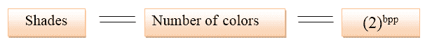

# 每像素位数的概念

> 原文：<https://www.javatpoint.com/dip-concept-of-bits-per-pixel>

BPP 或每像素位数用于表示每像素位数，该数字取决于颜色或 BPP 的深度。

## 位

一位也称为二进制数字，是计算机中最小的数据单位。一位有 0 或 1。

**公式:**

**以下是不同颜色的数量:**

| 每像素位数 | 颜色数量 |
| 1 个基点 | 2 种颜色 |
| 2 个基点 | 4 种颜色 |
| 3 个基点 | 8 种颜色 |
| 4 个基点 | 16 种颜色 |
| 5 个基点 | 32 种颜色 |
| 6 个基点 | 64 种颜色 |
| 7 个基点 | 128 种颜色 |
| 8 个基点 | 256 种颜色 |
| 10 个基点 | 1024 种颜色 |
| 16 个基点 | 65536 色 |
| 24 个基点 | 16777216 色(1670 万色) |
| 32 个基点 | 4294967296 色(4294 万色) |

## 墨镜

人眼可以分辨数百种色调及其强度。有 100 种灰色；因此，图像包含额外的颜色信息，该信息用于图像分析。

**例如:**物体的识别和基于颜色的提取。

## 图像存储要求

### 图像尺寸

图像的大小取决于以下三个因素:

*   行数
*   列数
*   每像素位数

**计算图像大小的公式:**

**示例:**

假设行是 3000，列是 1687，它有 256 个 bpp 阴影。
图像大小=行*列* bps
= 3000 * 1687 * 8
= 40488000 位

因为它不是标准答案，所以我们可以通过以下方式进行转换:

将其转换为字节= 8388608 / 8 = 5061000 字节。
转换为千字节= 5061000 / 1024 = 4942kb。
转换为兆字节= 4942 / 1024 = 4 Mb。

* * *