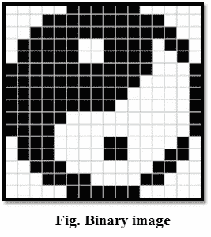
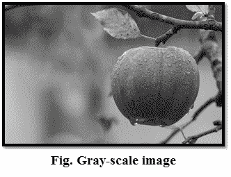
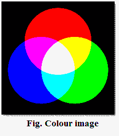
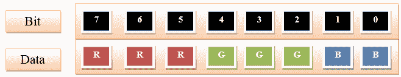
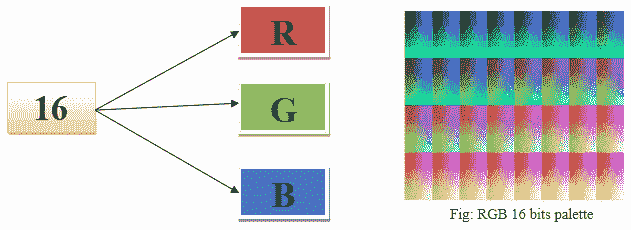
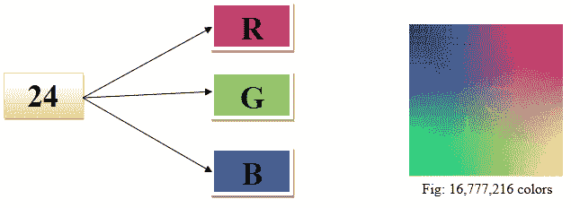

# 图像类型

> 原文：<https://www.javatpoint.com/dip-types-of-images>

有三种类型的图像。它们如下:

## 1.二值图像

这是最简单的图像类型。它只接受两个值，即黑白或 0 和 1。二进制图像由一个 1 位图像组成，它只需要 1 个二进制数字来表示一个像素。二值图像主要用于一般形状或轮廓。

**例如:**光学字符识别(OCR)。

使用阈值操作生成二值图像。当像素高于阈值时，则变成白色(“1”)，低于阈值时，则变成黑色(“0”)

## 2.灰度图像

灰度图像是单色图像，意味着它们只有一种颜色。灰度图像不包含任何关于颜色的信息。每个像素决定了可用的不同灰度级。

正常灰度图像包含 8 位/像素数据，有 256 种不同的灰度级。在医学图像和天文学中，使用 12 或 16 位/像素的图像。

## 3.彩色图像

彩色图像是三波段单色图像，其中每个波段包含不同的颜色，实际信息存储在数字图像中。彩色图像包含每个光谱带的灰度信息。

图像表示为红色、绿色和蓝色(RGB 图像)。并且每个彩色图像具有 24 位/像素，意味着三个色带(RGB)中的每一个都有 8 位。

* * *

## 8 位颜色格式

8 位颜色用于在计算机内存或图像文件中存储图像信息。在这种格式中，每个像素代表一个 8 位字节。它有 0-255 个颜色范围，其中 0 表示黑色，255 表示白色，127 表示灰色。8 位彩色格式也称为灰度图像。最初，它被 UNIX 操作系统使用。

## 16 位颜色格式

16 位颜色格式也称为高颜色格式。它有 65，536 种不同的色调。它用于微软开发的系统中。16 位颜色格式进一步分为三种格式，即红色、绿色和蓝色，也称为 RGB 格式。

在 RGB 格式中，R 有 5 位，G 有 6 位，b 有 5 位。在绿色中增加了一位，因为在所有 3 种颜色中，绿色对眼睛来说是舒缓的。

## 24 位颜色格式

24 位颜色格式也称为真彩色格式。24 位颜色格式也以红色、绿色和蓝色分布。因为 24 可以在 8 上等分，所以它平均分布在 3 种不同的颜色之间，比如 8 位代表 R，8 位代表 G，8 位代表 b。

* * *