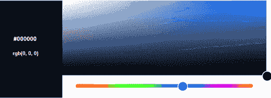
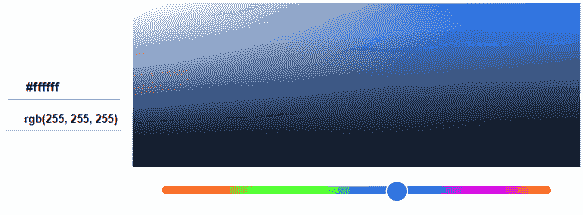
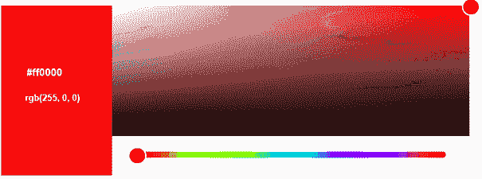
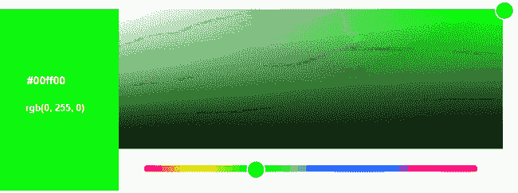
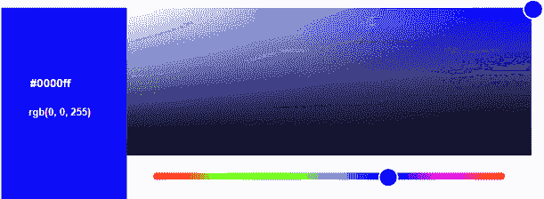
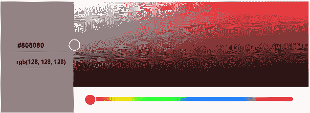
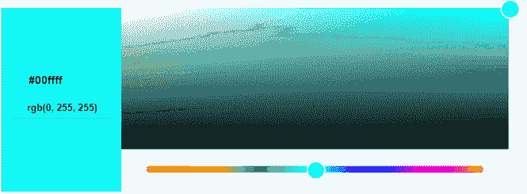
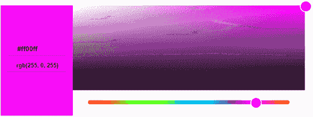
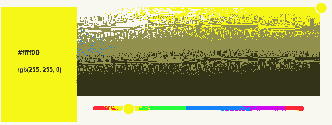

# 颜色代码转换

> 原文：<https://www.javatpoint.com/dip-color-codes-conversion>

## 不同的颜色代码

正如我们所知，这里的颜色是 24 位格式，这意味着 8 位红色，8 位绿色，8 位蓝色。通过改变 3 份的数量，你可以做出不同的颜色。

## 二进制颜色格式

**颜色:**黑色

**图像:**

**十进制编码:** RGB(0，0，0)

**说明:**

对于纯黑色，R、G、B 三部分都是 0

**颜色:**白色

**影像:** 

**十进制 ：** RGB（255， 255， 255）

**说明:**

对于纯白色，R、G、B 三个部分都是 255

## RGB 颜色模型

**颜色:**红色

**图像:**

**十进制代码:** RGB(255，0，0)

**说明:**

对于红色，绿色和蓝色应该设置为 0，对于红色部分，我们必须给出它的最大值，即 255。

**颜色:**绿色

**图像:**

**十进制代码:** RGB(0，255，0)

**说明:**

对于绿色，红色和蓝色应该设置为 0，对于绿色部分，我们必须给出它的最大值，即 255。

**颜色:**蓝色

**图像:**

**十进制代码:** RGB(0，0，255)

**说明:**

对于蓝色，红色和绿色应该设置为 0，对于蓝色部分，我们必须给出它的最大值，即 255。

## 灰色

**颜色:**灰色

**图像:**

**十进制编码:** RGB(128，128，128)

**说明:**

对于灰色，所有值应为 128。

## CMYK 颜色模型

CMYK 型号用于打印机，其中使用了两个墨盒，一个用于 CMY 色，另一个用于黑色。CMY 可以改为 RGB。

在 CMYK 颜色模型中，C 代表青色，M 代表洋红色，Y 代表黄色，K 代表黑色。

颜色:青色

**图像:**

**十进制代码:** RGB(0，255，255)

**说明:**

对于青色，红色应该设置为 0，对于绿色和蓝色部分，我们必须给出它的最大值，即 255。

**颜色：** 洋红色

**图像:**

**十进制代码:** RGB(255，0，255)

**说明:**

对于洋红色，绿色应该设置为 0，对于红色和蓝色部分，我们必须给出它的最大值，即 255。

**颜色:**黄色

**图像:**

**十进制代码:** RGB(255，255，0)

**说明:**

对于洋红色，蓝色应该设置为 0，对于红色和绿色部分，我们必须给出它的最大值，即 255。

**颜色:**黑色

**图像:**

**十进制编码:** RGB(0，0，0)

**说明:**

对于纯黑色，R、G、B 三部分都是 0

* * *

## 转换

### RGB 到十六进制代码

例如，如果我们想将白色代码(255，255，255)转换为十六进制代码。

**以下是 RGB 到十六进制代码转换的步骤:**

1.  取 1s 部分，即红色(R) 255 的值。
2.  除以 16。我们将得到 15 作为一个因素，以及剩余部分，这是 FF。
3.  对另外两部分重复步骤 1 和 2。
4.  将所有三个十六进制代码合并成一个，我们将得到#FFFFFF

### 十六进制转 RGB 代码

例如，如果我们想要转换白色代码#FFFFFF

以下是将十六进制代码转换为 RGB 十进制格式的步骤:

1.  把数字分成 3 等份:FF FF FF
2.  取第一部分并分离:F F
3.  现在将每个部分分别转换为二进制:(1111) (1111)
4.  将两个二进制值合并成一个:11111111
5.  现在把二进制数转换成十进制数:255
6.  现在，对另外两部分重复步骤 1 至 5。
7.  将这三个十六进制代码组合成一个，我们将得到(255，255，255)

**以下是一些颜色及其十六进制代码**

| 颜色 | 十六进制代码 |
| 黑色 | #000000 |
| 白色的 | #FFFFFF |
| 灰色的 | #808080 |
| 红色 | #FF0000 |
| 格林（姓氏）；绿色的 | #00FF00 |
| 蓝色 | #0000FF |
| 蓝绿色 | #00FFFF |
| 品红 | #FF00FF |
| 黄色 | #FFFF00 |

* * *