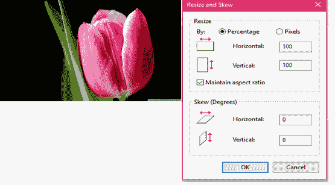
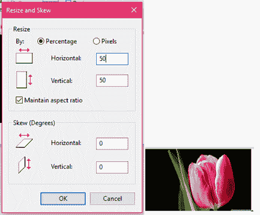
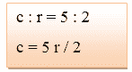
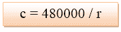
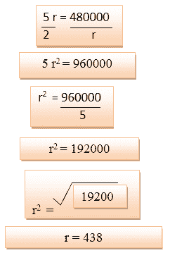
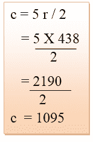
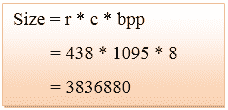
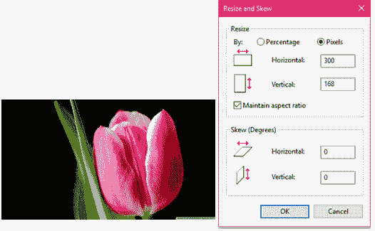
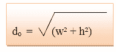

# 每英寸像素、点和线

> 原文：<https://www.javatpoint.com/dip-pixels-dots-and-lines-per-inch>

## 百万像素

数码相机使用像素元素(也称为像素)来捕捉图像。像素越多，图像的分辨率就越高。

**计算相机百万像素的公式:**

### 示例:

让我们来看看图像的尺寸:2500 X 3192

所以，根据公式

(2500 * 3192)/100 万= 790 万= 800 万像素(约)。

## 纵横比

纵横比是图像的高度和宽度之间的比率。冒号用来分隔两个数字。不同屏幕上的不同图像具有不同的比例。

**常见长宽比如下:**

1.33:1、1.37:1、1.43:1、1.50:1、1.56:1、1.66:1、1.75:1、1.78:1、1.85:1、2.00:1、e.t.c

### 优势

1.  它保持图像外观的平衡(水平和垂直像素之间的比率)。
2.  当纵横比增加时，图像不会变形。

**例如:**

上图有 100 行 100 列。如果我们调整图像的大小，图像质量将保持不变。

现在改变行和列的值，我们得到平衡分辨率的图像。

**例如**

这是一张长宽比为 5:2 的灰度图像，图像的分辨率为 480000 像素。

**计算以下内容:**

1.  图像的尺寸。
2.  图像的大小。

**给定**

宽高比:c:r = 5:2
像素分辨率:c * r = 480000
每像素位数:灰度图像= 8bpp

**解决方案 1:**

等式 1 -

等式 2 -

比较等式 1 和等式 2

将 r 的值放入等式 1

所以，行= 438，列= 1095

**溶液 2:**

## 像素分辨率

在像素分辨率中，术语分辨率是指数字图像中的像素总数。如果图像有 M 行和 N 列，那么分辨率被定义为 M×N。图像的质量取决于像素分辨率。

正如我们所看到的，上面图像的像素分辨率是 300×168。

## 每英寸像素

每英寸像素用于测量电子设备(如计算机监视器)或图像数字化设备(如照相机)的像素密度。

水平和垂直密度通常相同，因为大多数设备都有方形像素，或者非方形像素取决于设备。

要首先计算 PPI，我们必须计算对角线上的像素数量:

哪里，

w =水平线上的像素数

h =垂直线上的像素数。

现在，计算生产者价格指数作为比率

哪里，

dI=对角线屏幕尺寸，单位为英寸。

### 示例:

**计算智能手机的 PPI。**

让智能手机的对角线尺寸为 6 英寸。并且垂直和水平像素计数是 650 和 450 像素。

d 或=【w+h【2】)=【1440【2】+25602= 2937

PPI = do/dI= 2937/6 = 489

## 每英寸点数

DPI 的定义与 PPI 相同。DPI 用于测量相当于 1 英寸的点数。

在喷墨打印机中，使用 DPI 设置代替 PPI。因为在打印机中，每英寸的点数意味着每英寸的墨点数。根据打印机的特性，DPI 可以更高或更低。

**计算 DPI 的公式**

### 例子

设 PPI 为 489
DPI = 1 / 489 = 0.0020 mm

## 每英寸行数

每英寸行数用于测量以半色调打印的图像的分辨率(以一系列点打印图像)。LPI 数越高，网点越密集，分辨率也就越高。

报纸以每英寸 85 行的分辨率印刷，而杂志以每英寸 133 行的分辨率印刷。

下表显示了打印机每英寸容量的行数:

| 打印机 | 每英寸行数(lines per inch) |
| 丝网印刷 | 45-65 lpi |
| 激光打印机(300 dpi) | 65 lpi |
| 激光打印机(600 dpi) | 85-105 lpi |
| 胶印机(新闻纸) | 85 lpi |
| 胶印机(铜版纸) | 85-185 lpi |

* * *