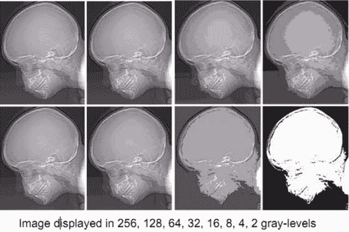

# 解决

> 原文：<https://www.javatpoint.com/dip-resolution>

## 灰度分辨率

灰度分辨率是指在准备显示图像时使用的灰度数量。

在灰度级分辨率中，灰度级的数量是 2 的整数次幂，最常见的值是 8 位。它可能因应用而异。

数字图像具有更高的灰度分辨率，这是由大量灰度组成的。在较高的灰度级分辨率中，图像显示的位深度大于较低灰度级分辨率的图像。

## 每图点位元数

BPP 或每像素位数用于表示每像素位数，该数字取决于颜色或 BPP 的深度。

**位**

一位也称为二进制数字，是计算机中最小的数据单位。一位有 0 或 1。

公式:

以下是不同颜色的数字:

| 每像素位数 | 颜色数量 |
| 1 个基点 | 2 种颜色 |
| 2 个基点 | 4 种颜色 |
| 3 个基点 | 8 种颜色 |
| 4 个基点 | 16 种颜色 |
| 5 个基点 | 32 种颜色 |
| 6 个基点 | 64 种颜色 |
| 7 个基点 | 128 种颜色 |
| 8 个基点 | 256 种颜色 |
| 10 个基点 | 1024 种颜色 |
| 16 个基点 | 65536 色 |
| 24 个基点 | 16777216 色(1670 万色) |
| 32 个基点 | 4294967296 色(4294 万色) |

## 灰度分辨率和量化

在上一个教程中，我们研究了模拟信号的数字化是一个两步过程:

1.  抽样
2.  量化

采样在 X 轴进行，而量化在 Y 轴进行。

这意味着图像灰度分辨率的数字化是通过量化完成的。

* * *