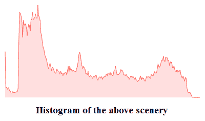
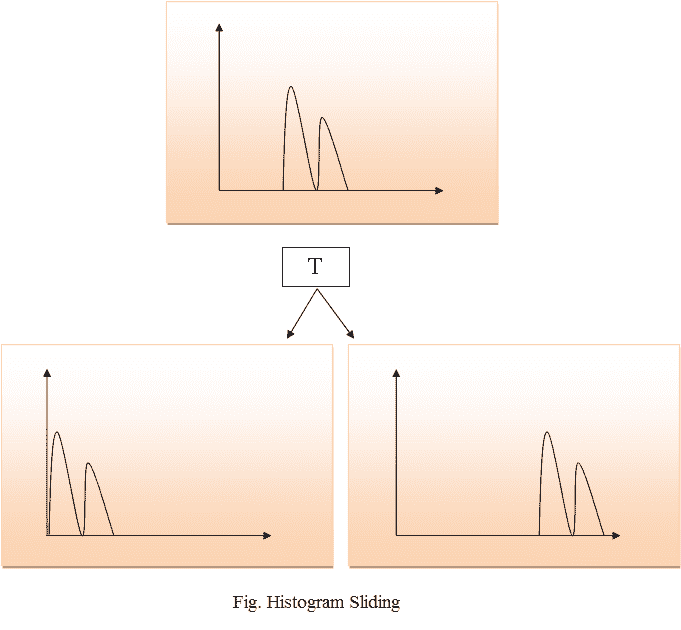
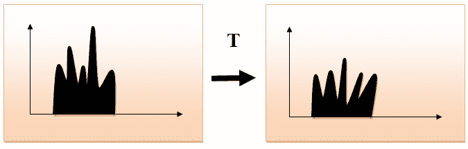
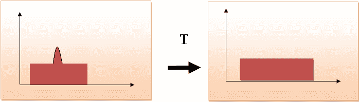

# 直方图简介

> 原文：<https://www.javatpoint.com/dip-histograms>

在数字图像处理中，直方图用于数字图像的图形表示。图表是由每个色调值的像素数绘制的图。如今，图像直方图出现在数码相机中。摄影师用它们来观察拍摄到的色调分布。

在图表中，图表的水平轴用于表示色调变化，而垂直轴用于表示特定像素中的像素数。横轴左侧表示黑色和深色区域，中间表示中灰色，纵轴表示区域大小。

## 直方图的应用

1.  在数字图像处理中，直方图用于软件中的简单计算。
2.  它用于分析图像。通过对直方图的详细研究，可以预测图像的特性。
3.  图像的亮度可以通过直方图的细节来调整。
4.  通过直方图的 x 轴细节，可以根据需要调整图像的对比度。
5.  它用于图像均衡。灰度级强度沿着 x 轴扩展，以产生高对比度图像。
6.  直方图用于阈值处理，因为它改善了图像的外观。
7.  如果我们有图像的输入和输出直方图，我们就可以确定在算法中应用哪种类型的变换。

## 直方图处理技术

### 直方图滑动

在直方图滑动中，整个直方图向右或向左移动。当直方图向右或向左移动时，可以看到图像亮度的明显变化。图像的亮度由特定光源发出的光的强度来定义。

### 直方图拉伸

在直方图拉伸中，图像的对比度增加。图像的对比度定义在像素强度的最大值和最小值之间。

如果我们想增加图像的对比度，该图像的直方图将被完全拉伸并覆盖直方图的动态范围。

从图像的直方图中，我们可以检查图像的对比度是低还是高。

### 直方图均衡

直方图均衡化用于均衡图像的所有像素值。变换是这样进行的，即产生均匀的扁平直方图。

直方图均衡化增加了像素值的动态范围，使每一级的像素数量相等，从而产生具有高对比度图像的平坦直方图。

拉伸直方图时，直方图的形状保持不变，而在直方图均衡化中，直方图的形状发生变化，它只生成一幅图像。

* * *