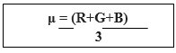
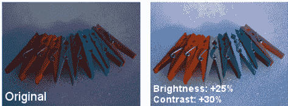
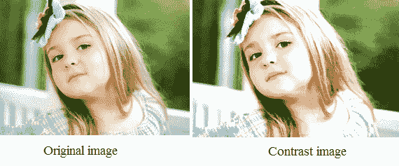
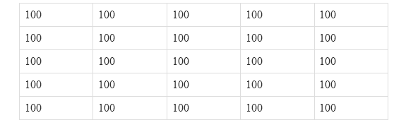

# 亮度和对比度

> 原文：<https://www.javatpoint.com/dip-brightness-and-contrast>

## 聪明

亮度是一种视觉感受，其中光源似乎在反射光线。亮度是被观察物体的主观属性。亮度是一个绝对的术语，不同于明度。

彩色屏幕使用三种颜色，即 RGB 方案(红色、绿色和蓝色)。屏幕的亮度取决于红色、绿色和蓝色像素的振幅之和，除以 3。



对亮度的感知取决于视错觉是看起来更亮还是更暗。

当亮度降低时，颜色显得暗淡，当亮度增加时，颜色更清晰。

在移动设备中，当亮度设置为高时，与低设置相比，设备电池消耗得更快。



## 对比

对比度是一种使物体可区分的颜色。我们可以说对比度是由物体的颜色和亮度决定的。

对比度是图像的最大和最小像素强度之差。



**公式:**

```

Contrast = maximum pixel intensity - minimum pixel intensity

```

**例如:**

让我们以原始图像为例



正如，我们可以看到像素的最大值和最小值是 100

根据公式

```

Contrast = 100 - 100 = 0

```

答案是 0，这意味着图像的对比度为零。

* * *