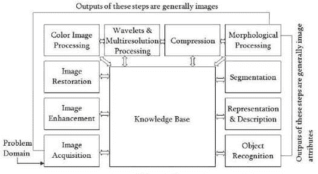
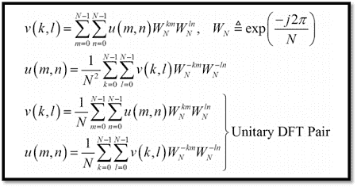
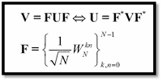
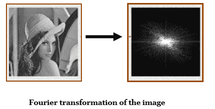
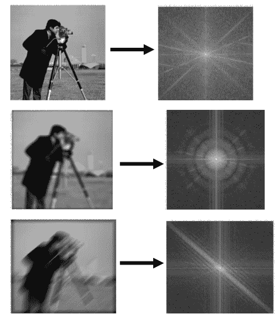
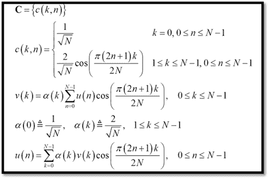
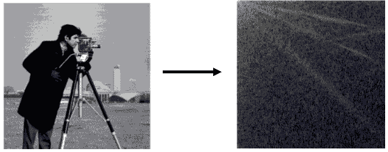

# 数字图像处理系统

> 原文：<https://www.javatpoint.com/dip-image-transformations>

在计算机科学中，数字图像处理使用算法对数字图像进行图像处理，以提取一些有用的信息。与模拟图像处理相比，数字图像处理有许多优点。多种算法可应用于输入数据，避免处理过程中的噪声和信号失真等问题。我们知道，图像是二维定义的，所以 DIP 可以在多维系统中建模。

## 图像处理的目的

DIP 的主要目的分为以下 5 组:

1.  **可视化:**不可见的物体，它们被观察到。
2.  **图像锐化与恢复:**用于更好的图像分辨率。
3.  **图像检索:**可以看到感兴趣的图像
4.  **图案的测量:**在一幅图像中，所有的物体都被测量。
5.  **图像识别:**可以区分图像中的每个对象。

**以下是数字图像处理的基本步骤:**

### 1.图象采集

图像采集是 DIP 基本步骤的第一步。在这个阶段，图像以数字形式给出。一般来说，在这个阶段，预处理，如缩放完成。

### 2.图像增强

图像增强是 DIP 最简单、最有吸引力的领域。在这个阶段，不为人知的细节，或者我们可以说，图像的有趣特征被突出。例如亮度、对比度等...

### 3.图像恢复

图像恢复是改善图像外观的阶段。

### 4.彩色图像处理

彩色图像处理是一个著名的领域，因为它增加了数字图像在互联网上的使用。这包括颜色建模、数字领域的处理等....

### 5.小波与多分辨率处理

在这个阶段，图像以不同的分辨率表示。图像被分成更小的区域用于数据压缩和金字塔表示。

### 6.压缩

压缩是一种用于降低存储图像要求的技术。这是一个非常重要的阶段，因为压缩数据以供互联网使用是非常必要的。

### 7.形态学处理

这个阶段处理用于提取图像成分的工具，这在形状的表示和描述中是有用的。

### 8.分割

在这个阶段，图像被分割成它的对象。分割是 DIP 中最困难的任务。这是一个需要花费大量时间才能成功解决成像问题的过程，需要对物体进行单独识别。

### 9.表示和描述

表示和描述跟随分段阶段的输出。输出是原始像素数据，包含区域本身的所有点。要转换原始数据，表示是唯一的解决方案。而描述用于提取信息，以区分一类对象和另一类对象。

### 10.物体识别

在这个阶段，标签被分配给基于描述符的对象。

### 11.知识库

知识是 DIP 的最后一个阶段。在这个阶段，图像的重要信息被定位，这限制了搜索过程。当图像数据库有高分辨率卫星时，知识库非常复杂。

* * *

## 图像变换

在空间坐标(x，y)或(x，y，z)中获得图像。如果将空间域图像转换成另一个域，则有许多优点。其中任何问题的解决方案都很容易找到。

**以下是两种类型的转换:**

### 1.傅里叶变换

傅里叶变换主要用于图像处理。在傅里叶变换中，图像的强度被变换成频率变化，然后变换到频域。它用于缓慢变化的强度图像，例如护照尺寸照片的背景可以表示为低频分量，边缘可以表示为高频分量。低频分量可以使用傅立叶变换域的滤波器去除。当在傅立叶变换域中过滤图像时，它只包含图像的边缘。如果我们将傅立叶变换域反变换到空间域，那么图像也只包含边缘。傅里叶变换是最简单的技术，在这种技术中，图像的边缘可以被细化。

**二维傅里叶变换**

**矩阵符号:**

**傅里叶变换的性质如下:**

*   对称酉
*   周期性扩展
*   采样傅里叶
*   快的
*   共轭对称
*   圆周卷积

**示例:**

**模糊图像及其傅里叶变换示例**

### 离散余弦变换

在离散余弦变换中，系数携带图像像素的信息。此外，使用很少的系数包含很多信息，剩余的系数包含最少的信息。这些系数可以在不丢失信息的情况下移除。通过这样做，文件大小在离散余弦变换域中减小了。DCT 用于有损压缩。

**一维离散余弦变换:**

**二维离散余弦变换:**

**离散余弦变换的性质如下:**

*   实数和正交:C=C* → C-1=CT
*   不是！离散傅立叶变换的实部
*   快速变换
*   出色的能量压缩(高度相关的数据)

**示例:**

**图像变换的应用如下:**

*   傅里叶变换用于边缘检测。
*   离散余弦变换用于图像压缩。

* * *