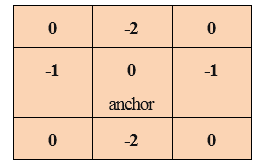

# 卷积的概念

> 原文：<https://www.javatpoint.com/dip-concept-of-convolution>

卷积用于许多事情，如计算导数，检测边缘，应用模糊等。而这一切都是使用“卷积核”来完成的。卷积核是一个非常小的矩阵，在这个矩阵中，每个单元都有一个数字和一个锚点。

锚点用于知道内核相对于图像的位置。它从图像的左上角开始，依次在每个像素上移动。内核在图像的每个位置重叠很少的像素。每个重叠的像素被相乘，然后相加。和被设置为当前位置的值。



卷积是将图像的每个元素添加到其本地邻居，然后由内核加权的过程。它与数学卷积的一种形式有关。

在卷积中，矩阵不执行传统的矩阵乘法，而是用*表示。

假设有两个 3x3 矩阵，一个是核，另一个是像片。在卷积中，内核的行和列被翻转，然后它们被相乘，然后求和。出现在矩阵中心，即图像的[2，2]中的元素将是图像矩阵的加权组合，权重将由核给出。同样，矩阵的所有其他元素将被加权，然后计算权重。

以下是描述卷积过程的伪代码:

```

For each image row in input image:
	For each pixel in image row:
		Set accumulator to zero
	For each kernel row in kernel:
		For each element in kernel row:
			If element position corresponding* to pixel position then
				Multiply element value corresponding*to pixelvalue
				Add result to accumulator
			Endif
Set output image pixel to accumulator

```

可以使用多个 for 循环来计算卷积。但是使用 for 循环会导致大量的重复计算，并且图像和内核的大小也会增加。利用离散傅里叶变换技术可以快速计算卷积。在这种技术中，整个卷积运算被转换成简单的乘法运算。

在卷积中，由于核是二维的，所以当核靠近边缘或角时会出现问题。

**要克服这些问题，可以做以下事情:**

1.  有些可以忽略
2.  可以在边缘附近创建额外的像素。

**可以通过以下方式创建额外像素:**

1.  重复的边缘像素。
2.  反射边缘
3.  像素可以从另一端复制。

* * *