# krisch compass 面具

> 原文：<https://www.javatpoint.com/dip-krisch-compass-mask>

基尔希罗盘遮罩用于寻找边缘。它几乎和罗宾逊指南针面具一样。它还有 8 个方向罗盘。Robinson 和 kirsch 指南针蒙版的主要区别在于，在 kirsch 中，我们可以根据需要更改蒙版。

以下是它的八个方向:

*   北
*   西北省
*   西
*   西南方
*   南方
*   东南
*   东方
*   东北

取标准尺寸，然后向各个方向旋转。

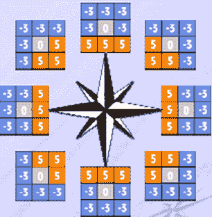

下面是一个在北向反应和旋转的面具:

**北**

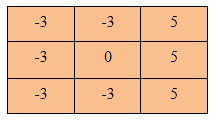

**西北**

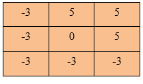

**西**

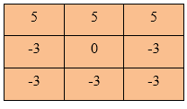

**西南**

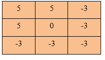

**南**

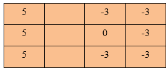

**东南**

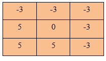

**东**

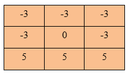

**东北**

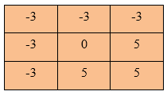

**应用于图像的基尔希罗盘遮罩示例**

原象

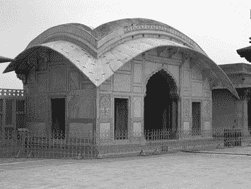

**8 个方向的最大坡度**

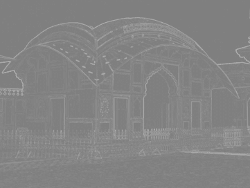

**北**

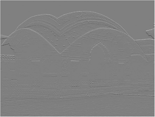

**西北**

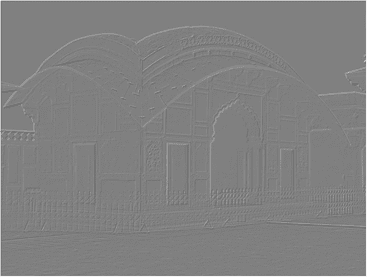

**西**

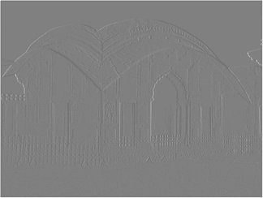

**西南**

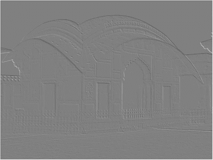

**南**

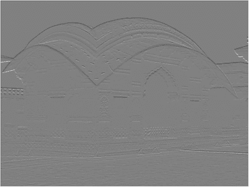

**东南**

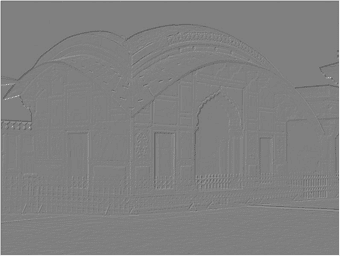

**东**

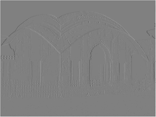

**东北**

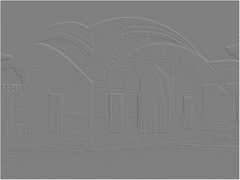

* * *