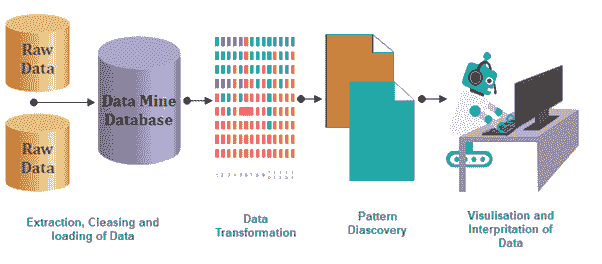

# 介绍

> 原文：<https://www.javatpoint.com/sas-introduction>

SAS(统计分析软件)是**数据分析**广泛使用的软件。它是一个软件套件，可以改变、挖掘、管理和检索来自不同来源的数据，并对其进行统计分析。它还用于数据管理、统计分析、报告编写、业务建模、应用程序开发和数据仓库。它为非技术用户提供了点击式图形用户界面，并通过 SAS 语言提供了更高级的选项。这是一个有用的工具，通过它你可以使用定性的技术和程序，让你提高员工的生产力和商业利润。

在 SAS 中，数据在表格中提取和分类，这有助于您识别和分析数据模式。这是一个软件套件，允许您管理高级分析、业务智能、预测分析和数据，以便在竞争和不断变化的业务环境中有效工作。此外，SAS 是一个独立于平台的软件，这意味着您可以在任何操作系统上运行 SAS，如 Linux、Windows、Mac、Ubuntu 等。

SAS 提供了广泛的支持，可以在与其他 BI 工具的拖放界面进行比较时，以编程方式转换和分析数据。它对数据操作和分析提供了非常精细的控制，这就是它的 USP。

## 最常见的定义:

### SAS 程序

SAS 程序包含检索和操作数据的数据阶段，以及分析数据的过程阶段。每个阶段都有一系列的陈述。数据阶段包含负责软件所采取的操作的可执行语句，以及提供读取数据集或更改数据格式的指令的声明性语句。

### 数据阶段

数据阶段有两个步骤:编译和执行。在编译阶段，识别语法错误，并处理声明性语句。随后，在执行阶段，每个可执行语句被顺序处理。数据集被组织成具有列和行的表。称为“变量”的列和称为“观察”的行此外，每一个数据集都有一个描述符和值。

### 过程

PROC 阶段包含称为命名过程的 PROC 语句。数据集的分析和报告由数据分析、统计和图形生成程序完成。有 300 多个过程，每个过程都有大量的编程和统计工作。PROC 语句可以对数据进行排序、显示结果以及执行其他操作。

### 宏指令

在 SAS 中，宏是被编码一次并被引用来执行重复任务的代码段或变量。SAS 的数据可以通过 2007 年首次推出的输出交付系统以 PDF、HTML、Excel 等格式发布。

**SAS 企业指南有一个 SAS 软件的点击界面。它生成用于操作或自动分析的代码，并且不需要使用 SAS 编程经验。**

SAS 软件套件包含 200 多个组件；下面给出了一些例子。

*   统计分析
*   特种作战部队/或作战部队-作战研究
*   基础-基本程序和数据管理
*   IML -交互式矩阵语言
*   SAS/INSIGHT -数据挖掘
*   质量控制
*   图形和演示
*   EBI -商业智能应用套件
*   企业矿工-数据挖掘
*   计量经济学和时间序列分析
*   应用设施
*   临床试验分析
*   基于企业指南图形用户界面的代码编辑器和项目经理
*   SAS 网格管理器——SAS 网格计算环境的管理器

## 概观

“什么是 SAS”是我们经常想到的问题。但是第一个问题应该是为什么会这样发展，答案是，需要一些统计工具来处理每天产生的大量数据。为了系统地处理这些数据，开发了 SAS。创建和分析数据是战略决策支持系统的主要任务。可以直接说，像 SAS 这样的数据分析工具开发背后的原因，是数据的过剩导致了数据分析的产生，而 SAS 有效地做到了。

SAS 编程语言被认为是一门数据驱动决策的科学。技术可以从原始数据中为我们带来结构化的可读数据；它还预测了一个问题的许多解决方案。但最终还是要由人类来做最后的决定。它使用对过去数据的重复和程序性探索来处理业务决策。

让我们用一个例子来考虑一下，你有没有想过为什么商场里会有一个账单点，它的边缘全是口香糖和糖果。这不是一个计划外的步骤，而是一个战略决定的决定。让我们看看，当父母和他们的孩子在账单柜台上时，他们等待轮到他们。口香糖和糖果会引诱孩子，他们会要求得到它们。为了防止在柜台制造事端，家长们不得不忍痛购买。

这导致糖果和口香糖的销量增加。这就是业务分析所做的，观察趋势和模式，并管理业务以赚取利润。

* * *