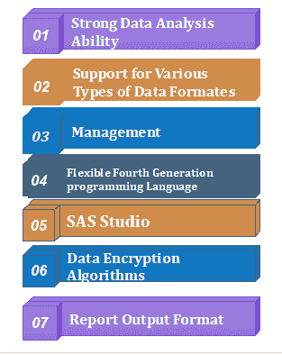

# SAS 的特点

> 原文：<https://www.javatpoint.com/features-of-sas>

由于其有益的特性，SAS 是数据分析领域的先驱。有几个关键特性使 SAS 在业务分析方面具有优势。

我们可以在各种计算环境中传输 SAS，除了一个交互窗口之外，它在所有平台上都完全一样。SAS 编程语言的主要特点如下:

### 1.强大的数据分析能力

强大的数据分析能力是 SAS 软件和编程语言的首要特征。SAS 就像一个完整的数据分析包。它的分析范围从简单的数字到高级水平。例如，它使用提供的数据绘制条形图，以计算复杂数据集之间的相关性。

SAS 软件最好的部分是内置库，因为它包含了分析和报告数据所需的所有必要包。

### 2.灵活的第四代编程语言(4GL)

SAS 是一种 4GL 编程语言，这是它的基本特征，因为 SAS 编程语言具有易于学习的语法。不仅如此，SAS 编程语言的代码就像语句，这些语句是对系统清晰简洁的指令。

内置的 SAS 库减少了常见应用程序的编码，为模块化我们的工作提供了机会。它对非编程用户也很友好。

SAS 是一种交互式语言。它的日志窗口就像一面镜子，不停地给用户下达指令。它提供注释并标记错误。还有 DS2，在数据处理方面有所帮助。复杂的数据可以在数据库中的适当位置进行操作。

### 3.SAS 工作室

SAS Studio 是 SAS 功能中的一个独特功能。我们可以通过任何设备和任何网络浏览器轻松访问 SAS Studio。不需要安装客户端。SAS 程序中需要的所有库和数据文件都可以通过任何网络浏览器访问。

很有教育意义。一旦有人开始键入，自动完成功能就会向我们显示各种过程。为了获得进一步的指导，将显示弹出语法和参数列表。

它还可以帮助您创建和添加个性化的代码片段，并将它们添加到代码片段库中。

我们可以点击界面；它在不同的层次上指导我们进行分析。

### 4.支持各种数据格式

支持不同的数据格式是 SAS 的另一个特性。SAS 能够从任何类型、任何格式的文件中读取数据，甚至从缺少数据的文件中读取数据。

SAS 为 SQL 提供支持。它有一个广泛的字符编码数据库；对最常用的语言有全面的支持。SAS 编程语言也保持了独特性，因此 SAS 可以用多种语言处理数据。

### 5.管理

SAS 管理是 SAS 软件的重要功能之一。它有 SAS 环境管理器，可以提醒、监控和管理分析环境。扩展的 Java 图形用户界面管理 SAS 管理控制台中的 SAS 功能。

我们也可以在重启模式下完全执行一个失败的程序。它从程序失败的同一个阶段重新开始。

XML 引擎有许多功能，如导入和导出 XML 文档以及创建 XML 映射。

应用程序响应测量接口查看各种应用程序，并检查事务的可用性。

### 6.报告输出格式

SAS 能够显示分析结果和报告选项的数量。Base SAS 9.4 拥有 ODS 统计图形、ODS 图形设计器和编辑器等优质图形。

我们可以保存和创建标准格式的报告，如 RTF、PowerPoint 和 pdf。我们也可以把它们保存为电子书和电子书；这给了我们视觉分析的奢侈。

我们可以根据客户需求的层次来定制输出。输出可以移植到不同的地方。

### 7.数据加密算法

SAS 确保安全性是我们提供访问的核心，为此，SAS 9.4 具有一个名为 SAS / SECURE 的安全功能。我们还可以通过各种算法对磁盘上的 SAS 数据进行加密。

所以，这都是关于 SAS 的特点。希望你喜欢我们的解释。

## 摘要

在这个 SAS 特性中，我们研究了 SAS 编程对于任何类型的统计工作都是一个完整的包。它还在除一个平台之外的所有平台上提供服务支持。SAS 中的库包括所有通常需要进行分析的库。它的加密功能使其对于各种设备来说既安全又便携。此外，如果您仍然对 SAS 属性有任何疑问，请在评论部分提问。

* * *