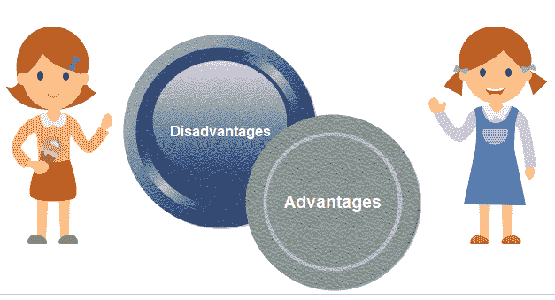
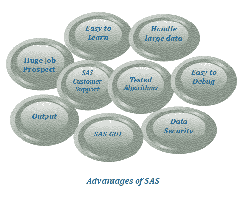
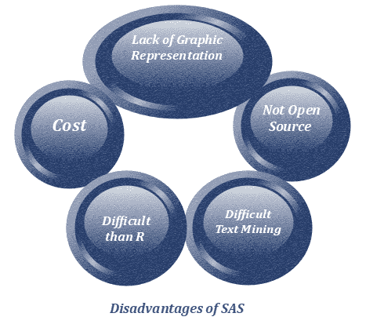

# SAS 编程语言的优点|缺点

> 原文：<https://www.javatpoint.com/advantages-and-disadvantages-of-sas>

在前面的教程中，我们已经讨论了 SAS 编程语言的特性。在本教程中，我们将讨论 SAS 编程语言的各种优缺点。

所以，让我们继续....

## SAS 的优势

SAS 编程语言有几个优点:

### 1.易于学习

SAS 非常容易学习语法。不需要任何编程技巧就可以轻松学会，这样任何人都可以学会。SAS 的编码采用简单语句的形式。这就像给机器下达指令做什么。

### 2.处理大型数据库的能力

SAS 非常容易处理大型数据库。

### 3.易于调试

SAS 是一种非常容易理解的语言。调试的过程非常容易。这很容易理解和纠正错误，因为日志窗口清楚地说明了这一点。

### 4.经过测试的算法

开发人员对 SAS 程序中实现的算法进行了充分的测试和分析。SAS 的每个版本在发布前都在受控环境中进行测试。测试是可能的，因为 SAS 是一种封闭的源语言。

### 5.SAS 客户支持

SAS 的组织保持适当的监控，因为它就像一个完整的组织来分析 SAS。它有直观的客户支持。SAS 客户支持处理各种问题。

### 6.数据安全

SAS 软件是许多大型公司的主要工具。公司的数据在这里是保密的，这就是为什么它是公司的亲密来源。

外用酊剂是不可能的。因为 SAS 是封闭源码工具，只能由 SAS 组织编辑。

在上述观点的扩展中，SAS 中的数据是完全安全的。在办公室使用的情况下，没有许可证，我们无法提取数据。由于数据安全，操纵是不可能的，这也是它在企业界受欢迎的原因。

与 R 语言和任何其他用于分析的语言相比，SAS 是首选。r 是开源的；因此，数据安全得不到保障。只有自由职业者使用 r。

### 7.SAS 图形用户界面

SAS 是一种让非编程用户更容易进行统计计算的语言。它有一个惊人的图形用户界面。它的用户界面有各种各样的工具，像图表，和高度通用的库。

### 8.输出

SAS 已经发展了很长一段时间。这就是为什么它提供了格式良好且绝对正确的输出，这很容易理解。

### 9.巨大的就业前景

由于 SAS 已经在行业中使用了很长时间，因此具有巨大的就业潜力。专业人士学习 SAS 作为一个条件，以便他们可以进入分析行业。指挥 SAS 的人很容易学会 R 和 Python。这是分析行业的市场领导者。

* * *

## SAS 的缺点

SAS 编程的一些主要缺点如下

### 1.费用

SAS 软件的成本是其主要缺点之一。没有许可证，我们不能使用它的所有功能，这非常昂贵。它是一个完整的软件，由于处于封闭的环境中，所以没有我们需要的任何单一功能的许可设施。所有这些先决条件使得它非常昂贵。

### 2.SAS 不是开源的

在实现与机器学习相关的算法方面，r 总是比 SAS 更快。这背后的原因是，R 是开源的，所以任何人都可以操作它，但这对 SAS 不利。SAS 是一个封闭的环境软件，不支持开源，所以 SAS 程序的算法不供公众使用。SAS 仅在许可版本中可用。算法不公开提供给公众研究。

### 3.缺乏图形表示

高级图形有更多的可用性。它的图形呈现比 SAS 生动和一致得多。它有更具描述性的图表。

### 4.困难文本挖掘

R 中的文本挖掘是免费的，但在 SAS 中，它使用的是 SAS Enterprise。文本挖掘是指从文本中提取信息。这是用来解密书面代码的。它告诉我们书面文本在决策方面可以决定什么。这是文本将数据转化为决策和分析的过程。

### 5.比 R 难

SAS 是比 r 更程序化的语言，SAS 中的代码行比 r 多

与 SAS 相比，我们可以在 R 中快速应用新的创新，如统计学习和机器学习。

许多免费的套餐都可以在 SAS 上收费。例如，文本挖掘、时间序列预测等。

* * *

## 摘要

因为 SAS 编程有各种各样的优缺点。但是在分析领域，SAS 在其他语言中有自己的受欢迎程度。它有一个广阔的就业市场，比任何其他语言都更安全，并且有一个接近的源语言。SAS 为开发人员测试算法提供了受保护的环境。它总是没有 bug，并且有非常有用的客户支持。

* * *