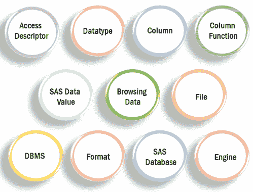
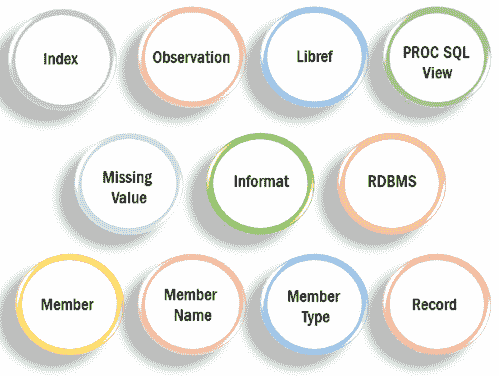

# SAS 术语

> 原文：<https://www.javatpoint.com/sas-terminology>

在本 SAS 术语教程中，我们将提供一个重要的 SAS 术语列表，您将在学习 SAS 的过程中了解到这些术语。在开始使用 SAS 术语之前，您可以先修改 SAS 编程语言的概念。

在这里，我们将讨论 SAS 术语，这些术语在数据科学中很有帮助，并在 SAS 编程中使用。SAS 用于高级分析、预测分析、数据管理、商业智能和多元分析。

## 不同的 SAS 术语



### 访问描述符

SAS 通过界面视图引擎与 IMS 数据库交互。接口视图引擎使用通过 ACCESS 过程创建的 SAS / ACCESS 描述符文件。描述符文件有两种类型:

*   **访问描述符**
*   **查看描述符**

#### 访问描述符

访问描述符包含要使用的信息管理系统数据库的信息。数据库信息包括 IMS 字段名称、数据库格式、数据库名称、节名和长度、关键字段和默认 SAS 格式。访问描述符由字段的唯一处理思想组成，它指示一个实体是否在数据库段中出现多次。SAS / ACCESS 文件描述了 SAS 软件的数据，这些数据存在于电脑文件中。

访问描述符作为主描述符文件工作，因为它包含数据库的完整描述，而 IMS 不存储关于数据库的描述性信息。

#### 视图描述符

视图描述符用于定义子集中的数据。它只定义访问描述符描述的数据的子集。在 SAS 程序中使用视图描述符，直接在 IMS 数据库中写入或读取数据。通过使用视图描述符，可以提取 IMS 数据并将其放入 SAS 数据文件中。

### 数据类型

在表中，每一列都有一个属性和数据类型，表示操作环境、物理存储容量和数据类型(如 int、Boolean、String 等)。)出现在列中。

SAS 中只使用两种数据类型:实数和固定长度的字符串。实数用于在内部存储日期和时间，因为数字和字符总是作为宏变量。应该引用字符的值来将它们与其他语言元素(如变量)分开。

### 圆柱

它是个人计算机文件的一个垂直组件，具有唯一的名称和特定的类型数据以及某些属性。一列对应于 SAS 术语中的一个变量。

### 列函数

列函数是计算列的每个值的操作。比如工资是一列的列函数，需要计算。

### 数据值

在 SAS 软件中，数据值是 SAS 数据集中呈现的字符或数字信息单位。数据值表示观察中的变量。

### 浏览数据

浏览数据是查看包含观察值的文件数据的过程。

### 文件

文件是以组织良好的方式相互关联的实体的集合。每个记录都被视为一个单元，并通过 SAS 软件进行控制。这些 SAS 文件被处理并存储在 SAS 数据库中。

### 数据库管理系统

数据库管理系统是一个用来创建和操作数据的集成软件包。数据在数据库中以关系表的形式表示。

### 格式

SAS 软件用来编写或显示每个变量值的指令被称为格式。有些格式是由 SAS 软件提供的，而另一些格式是由用户使用格式化程序在基本 SAS 软件中编写的。

### SAS 数据库

SAS 数据库是以有组织的表格形式收集的相关数据。在关系数据库管理系统中，数据库包含诸如索引、视图和表等对象，以便能够以系统的方式访问数据。

### 发动机

SAS 软件有很多部分，引擎就是其中之一。引擎的职责是从文件中读取数据并写入文件。

* * *

## 索引

SAS 索引的目标是优化“WHERE 子句”处理，并促进 BY 组处理。我们还使用这些指数来优化磨损条款处理和参与处理。



### 信息

INFORMA 语句用于将一个信息与一个变量相关联。我们可以指定由 SAS 软件提供的标准 SAS 信息或用户定义的信息，但两者都应该在前面的 PROC FORMAT 中定义。单个 INFORMA 语句可以将相同的信息与多个变量联系起来，也可以将不同的信息与多个变量联系起来。如果一个变量出现在几个 information 语句中，那么 SAS 使用最后分配的 information。

```
  INFORMAT variable-1 <...variable-n> ;
  **INFORMAT** <variable-1> <... variable-n=""> <default>;
  **INFORMAT** variable-1 <...variable-n> informat <default>;</default></default> 
```

informatic 语句定义了先前未定义的字符变量的长度，这样，如果 informatic 语句出现在 SET 语句之前，您就可以在数据步骤中缩短字符变量的值。

### lib ref(参考文件)

Libref 是临时链接到 SAS 数据库的名称。例如，在 SASUSERS 中。帐户名称，SASUSER 是一个 Libref。您可以使用 LIBNAME 语句或操作系统控制语言来分配 libref。

### 成员

SAS 数据库的 SAS 文件被称为成员。

### 成员名称

SAS 数据库的 SAS 文件的名称称为成员名称。

### 成员类型

成员类型标识 SAS 文件的信息类型。成员类型包括数据、访问、目录、视图和程序。

### 漏测值

SAS 软件中缺少值表示当前观察的变量中没有存储数据。默认情况下，SAS 软件用单个持续时间表示缺少的数值，空格表示缺少的字符值。

### 观察

观察是 SAS 数据文件的水平部分。观察数据是与单个实体(如客户)相关联的值的集合。每个观察值包含数据文件中每个变量的数据值。观察结果与电脑文件中的行一致。

### 进程 SQL 视图

PROC SQL 视图是由 PROC SQL 创建的 SAS 数据集。因为这是视图的一个子部分，所以在视图之下。PROC SQL 视图不包含任何数据。它仅用于存储从其基础文件中读取数据值的查询表达式。底层文件包括 SAS 数据文件、SAS / ACCESS 视图、数据步视图或其他 PROC-SQL 视图。在执行时，PROC SQL 视图的输出可以是一个或多个底层文件的超集或子集。

### 记录

记录与 SAS 观察一致。

### 关系数据库管理系统

关系数据库管理系统是根据数据实体之间的关系来组织和访问数据的数据库。

* * *

## SAS 行

该行是电脑文件的水平部分。每行对应于 SAS 观察。

## SAS 数据文件

SAS 数据文件是一种既有数据值又有描述符信息的 SAS 数据集。SAS 数据文件与数据相链接，例如变量的属性。

SAS 数据文件由两种类型组成:本机 SAS 数据文件和第二个接口 SAS 数据文件。

本机 SAS 数据文件

将数据值和描述符信息存储在由 SAS 格式化的文件中。

## 接口 SAS 数据文件

接口 SAS 数据文件用于将数据存储在由 SAS 软件以外的软件格式化的文件中。SAS 软件的引擎从其他软件(如 DB2、甲骨文、Sybase、ODBC、BMDP、OSIRIS 和 SPSS)格式化的文件中读取和写入数据。

这些格式化文件被视为接口 SAS 数据文件，当引擎访问它们的数据值时，SAS 会将它们识别为 SAS 数据集。

*   SAS 数据文件包含成员类型数据。
*   在 SAS 软件中，一个 PROC SQL 表被认为是 SAS 数据文件。
*   在以前版本的 SAS 软件中，所有的 SAS 数据集都是 SAS 数据文件。

“客户站点许可协议始终决定引擎访问不同类型接口数据文件的可用性。要查看引擎的可用性，请咨询您的系统管理员。

## SAS 数据库

SAS 数据库是 SAS 软件识别的一个或多个 SAS 文件的集合，可以作为一个单元进行引用和存储。每个文件都是库的重要组成部分，并被视为一个成员。

SAS 数据库帮助您组织工作。例如，如果一个 SAS 程序使用多个 SAS 文件，那么您可以将所有文件保存在一个库中。在库中组织文件使得在程序中查找和引用文件变得容易。

在大多数操作环境下，SAS 数据库与操作环境用来组织文件的组织级别高度匹配。例如，在基于目录的操作环境中，SAS 数据库是同一目录中的一组 SAS 文件。该目录可能包含其他文件，但只有 SAS 文件被视为 SAS 数据库的一部分。

*运行环境信息:*

在内容管理系统操作环境下，SAS 数据库是同一类型文件的集合。在 Z / OS 操作环境下，SAS 数据库是一个特殊格式的 z / OS 数据集。这样的数据集只能包含 SAS 文件。

## SAS 数据集

SAS 数据集是存储在 SAS 库中的一个 SAS 文件。它由 SAS 软件创建和处理。SAS 数据集包含以观察值(行)和变量(列)表的形式排列的数据值，可由 SAS 软件处理。SAS 数据集还包含描述性信息，如变量的数据类型和长度，以及用于创建数据的引擎。SAS 数据集可以是 SAS 数据和 SAS 视图之一。

## SAS 数据

SAS 数据包含描述符信息和数据。SAS 数据的成员类型是文件。

## SAS 数据视图

SAS 视图是一种从其他文件中检索数据值的 SAS 数据集。SAS 视图仅包含描述符信息，如变量(列)的数据类型和长度。它还包括从存储在其他 SAS 数据集或其他软件供应商文件格式中的文件获取数据值所需的附加信息。SAS 数据视图是视图类型之一。如果 SAS 视图包含 SAS 数据文件的属性，则可以使用它。

有两种类型的 SAS 视图:

### 本地视图

本机视图是一个 SAS 视图，它是用进程 SQL 或数据步骤创建的。

### 界面视图

接口视图是使用 SAS/ACCESS 软件创建的 SAS 视图。接口视图用于从数据库管理系统(如 Oracle 或 DB2)中读取数据或将数据写入其中。接口视图可以称为 SAS/ACCESS 视图。必须拥有 SAS/ACCESS 软件使用许可证。

## 结构化查询语言

SQL 是一种高级查询语言，用于创建和操作关系数据库管理系统的数据。SAS 软件使用 SQL 过程来实现数据库中的数据对象。

## 表格别名

表别名是在“从”部分中指定的表的临时替代名称。当我们连接表时，我们交替使用表别名来限定列名。

## 表格查找

表查找是一种处理技术，在这种技术中，信息是根据主源中的变量值从辅助源获得的。

## 可变的

变量是 SAS 数据集中的一列和一组描述所有观察中给出的属性的数据值。在 ACCESS 过程中，变量是从 PC 文件或字段的列中创建的。

## 目标变量

目标变量是一个函数或表达式的结果被赋值的变量。

* * *