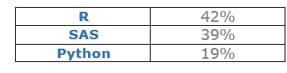
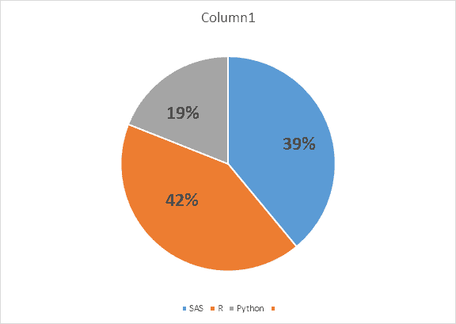
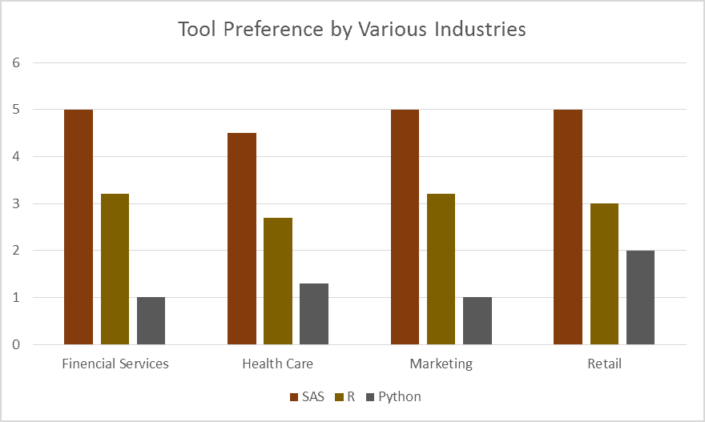
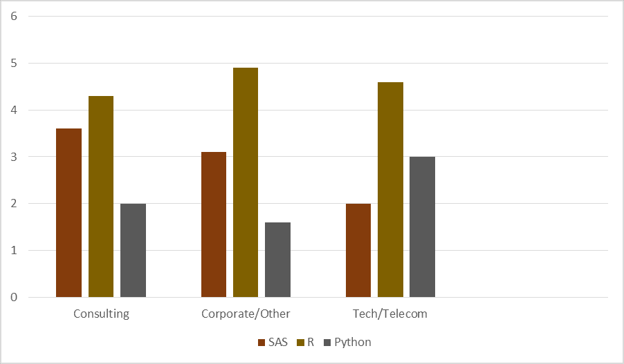

# SAS 对 R 对 Python

> 原文：<https://www.javatpoint.com/sas-vs-r-vs-python>

在本主题中，我们将从各个方面对所有三种语言进行比较，让您对这些语言的市场价值和能力有一个清晰的认识，这样您就可以选择您可以前进的语言。

众所周知，要学习数据分析，可以使用三种重要的语言，即 Python、R 和 SAS。

如果您是数据科学社区的新生，并且没有上述任何语言的经验，那么熟悉至少一种语言是至关重要的。

*首先，让我们快速介绍一下这三种语言。*

## 斯堪的纳维亚航空公司

说到企业分析领域，SAS 目前是无可争议的市场领导者。它提供了大量的统计功能；它提供了一个得到良好支持的技术支持团队。它还有一个很好的图形用户界面，让人们比其他人更快地拿起它。

## 稀有

r 是一种开源编程语言。我们可以免费访问它并执行所有数据分析任务。这是统计学的通用语。

目前，R 是应用最广泛的编程语言，也是数据科学家的首选。它得到了一群才华横溢、充满活力的贡献者的支持。r 也是大学教学大纲的一部分，这就是为什么在大学任教。它部署在关键业务应用程序上。

## 计算机编程语言

Python 是一种开源的多用途语言。如今，它在数据科学中变得非常流行。这背后的原因是其庞大的数据挖掘和充满活力的社区。

现在，我们将从各个方面进行比较:

* * *

## 特征

### SAS 的特点

*   强大的数据分析能力
*   灵活的第四代编程语言(4GL)
*   SAS 工作室
*   支持各种数据格式
*   多主机系统
*   管理
*   报告输出格式
*   数据加密和处理算法

### R 的特征

*   与许多数据库和数据类型的连接。
*   有效的存储和数据处理设施。
*   统计灵活性
*   出色的数据分析
*   编写脚本和与其他语言交互的能力
*   可用于预测的工具
*   统计灵活性

### Python 的特性

*   表达性语言
*   跨平台语言
*   免费开放源码
*   可扩展。
*   大型标准图书馆
*   图形用户界面编程支持
*   完整的

## 专业人士的视角

*让我们从专业人士的角度看一下用途。*

一家国际人力资源公司询问了大约 1000 名定性专业人员，他们更喜欢哪种语言——是 SAS、R 还是 Python。调查的一些结果如下:

**见下图:**

## 不同行业的偏好

*我们来看看各个行业的偏好。*

大公司大多更喜欢 SAS 来提供更好的客户服务，这也是 SAS 在营销公司和金融服务领域拥有优势的原因，在这些领域，不需要担心工具选择的预算。

另一方面，Python 和 R 用于初创公司和中型公司。科技和电信公司都需要大量的非结构化数据来进行分析，因此，这些领域的许多数据科学家使用机器学习技术，R 和 Python 更适合这些技术。

在图中，您可以看到金融服务、营销、医疗保健、零售等不同行业对工具的偏好。

## 费用

SAS 是一种用于商业目的的昂贵软件，主要由预算较大的大公司使用。不过 R 和 Python 都是免费的开源软件，我们既可以免费下载也可以免费学习。

## 学习的便利性

人们学习 SAS 在编程上没有先决条件，因为它有一个简单的图形用户界面，很容易使用。有一个解析 SQL 代码的条款，通过将它的原生包和宏结合在一起，它有助于那些有 SQL 基础知识的人学习 SAS。

在 Python 中，为了分析数据，我们需要像 Scipy、Pandas 和 Numpy 这样的数据挖掘库。在这种挤压下，我们无法用本地 Python 语言进行数据分析。

用 Python 库(Scipy、Pandas 和 Numpy)编写的代码有点类似于 R 库的代码。因此，对于已经了解数据科学中 R 的人来说，学习 Python 很容易。对于那些已经知道 R 的人来说，在开始学习 Python 数据挖掘生态系统之前，最好先学习 Python 编程语言的基础知识。

## 数据科学能力:

SAS 被认为是一种非常高效的语言，用于使用 SQL 进行顺序数据访问和数据库访问，并且集成良好。有了拖放界面，人们很容易更快地做出更好的统计模型。

当数据分析任务需要独立服务器时，首选 r。它是内存分析领域的佼佼者，也是探索数据的绝佳工具。

像 Numpy、Scipy、Pandas 和 Scikit 这样的 Python 库使它成为仅次于 r 的数据科学领域第二受欢迎的编程语言。您还可以使用 Seaborn 和 Matlplotlib 等库创建漂亮的图形和图表。

## 社区支持:

r 和 Python 在线上有巨大的社区支持，包括邮件列表、堆栈溢出和其他用户贡献的文档和代码。

由社区管理者管理的在线活跃社区支持 SAS。

* * *