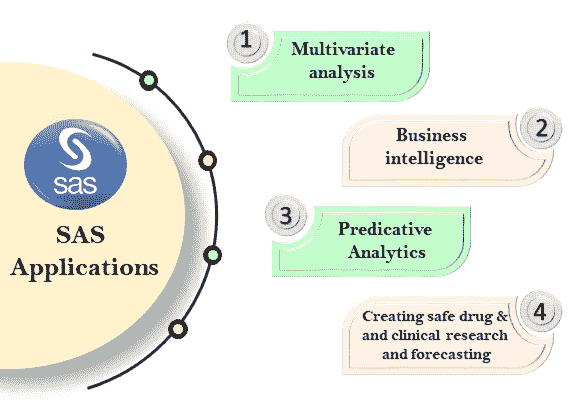

# SAS 应用程序

> 原文：<https://www.javatpoint.com/sas-applications>

## 多元分析|商业智能|预测分析|临床研究和预测

SAS 最初旨在完成统计分析，但现在也用于分析。它主要用于将复杂的原始数据处理成有意义的信息。这些有意义的信息有助于机构做出更好的决策。它也有助于我们从各种资源中编译、分析和提取数据。它为统计人员进行加工、清洗、挖掘和包装。

总的来说，SAS 工具在统计分析和决策中发挥着至关重要的作用。但是在这里，我们介绍了一些主要使用 SAS 软件的特定领域。

*那么，让我们继续....*

### 1.多变量分析

多元分析用于同时分析多个元素或变量。焦虑自评量表调查各种变量之间的关系，而不将它们归类为独立变量或因变量。它使用不同的研究来反映可变因素对单一结果的影响。它包括因子分析、二元分析和许多回归分析。

### 2.商业智能

商业智能与任何企业用于商业信息数据分析的技术和策略相关联。数据分析通过提供决策范围来帮助高级团队。它还提供了关于业务工作的当前、预测和历史视图的直觉。

### 3.预测分析

预测分析使用统计算法、数据和机器学习来基于历史数据识别未来结果的可能性。顾名思义，预测分析使用已经可用的数据进行未来预测。有各种统计技术来推断预测。

比如一家公司的某个产品延续了近几年的销售趋势，通过分析该产品的销售数据，预测该产品的需求不会发生变化。现在，如果同一个公司的另一个产品每个月都持续需求变化的销售趋势，通过分析变异背后的原因、结论、客户反馈过程等所有因素，预测产品存在高风险。在这种产品的情况下，历史数据不能用于销售预测。

### 4.临床研究和预测

在医学领域，由于 SAS，出现了革命性的变化。它用于诊断决策系统。SAS 有助于关键决策，如诊断和预后，两者都是医学的重要元素，必须精确和准确。SAS 用于查看患者是否有风险。SAS 工具甚至被用来寻找改善病人状况的小机会。

## 摘要

在上述所有应用中，SAS 使用统计数据来分析数据并产生结果。它的具体应用在各个领域产生了准确的结果。在多元分析中，它同时分析多个元素或变量。

因此，总的结论是，SAS 凭借其广阔的应用领域成为数据分析领域的先驱。我们非常清楚地解释了所有的应用程序，但是如果您仍然有任何疑问，请随时在我们的联系部分询问。

* * *