# 不下载使用 SAS 安装

> 原文：<https://www.javatpoint.com/use-sas-without-download-and-install>

正如我们在之前的教程中提到的，SAS 是一个商业高预算软件，你不能免费下载它。所以现在的问题是，如果学生想学习 SAS，那么他们需要支付更高的金额吗？

解决方案就在这里，您只需几个步骤就可以使用 SAS 软件，而无需支付任何费用。我们可以登录 SAS 软件并使用其所有功能，为此，请遵循以下步骤:

### 第一步

在你的电脑上打开浏览器，输入“SAS 按需登录”，你会发现一个有很多链接的页面。要进入登录页面，请点击第一个链接“**控制中心-SAS OnDemand for** ”

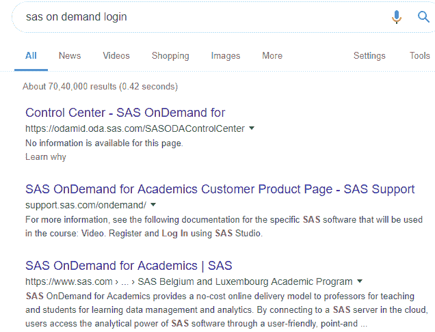

### 第二步

在登录页面上，如果您已经有一个配置文件，那么您可以登录，或者通过单击“**注册一个帐户**来创建一个配置文件

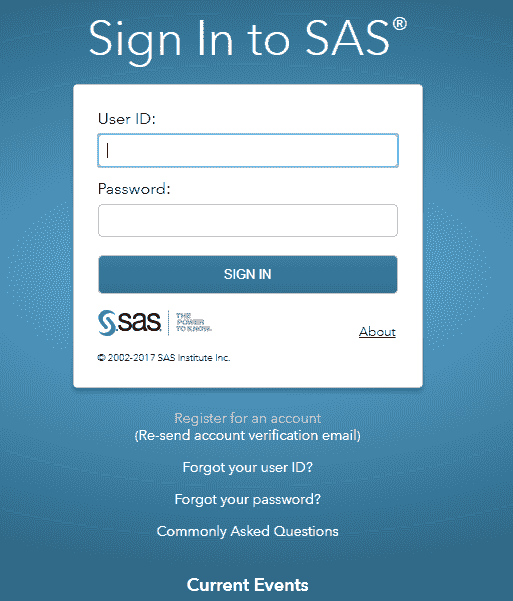

### 第三步

当您点击注册链接时，您将获得一个带有表单的注册页面。在注册页面填写您的详细信息，选择国家/地区印度，然后单击提交。

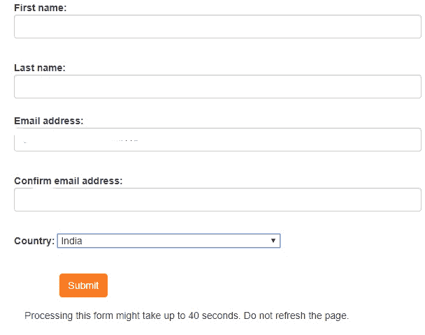

您将在您的电子邮件地址收到一封确认电子邮件。可能需要 15 分钟才能拿到。

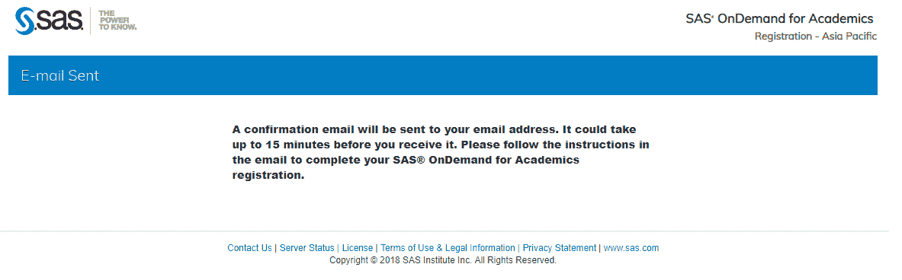

### 第四步

收到邮件后打开，里面有一个链接。单击链接，它会将您连接到激活页面。

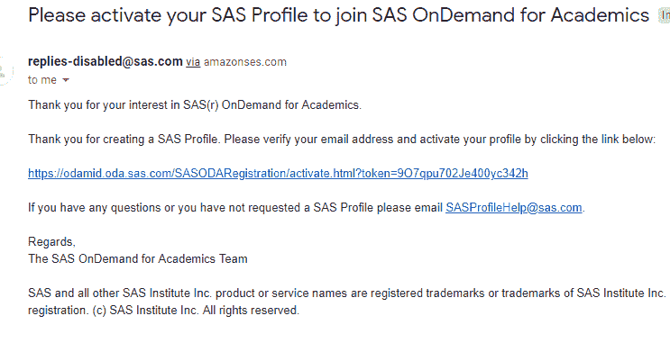

在激活页面上，创建密码并接受许可协议以完成注册。

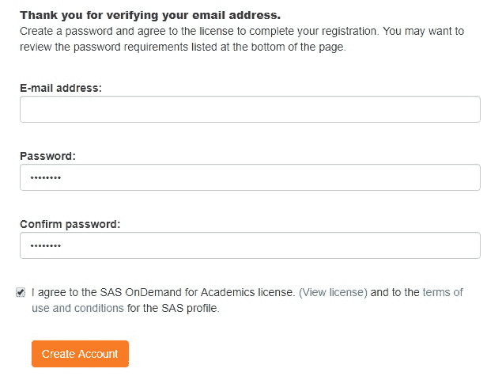

### 第五步

成功完成注册后，等待另一封包含您的完整帐户详细信息的电子邮件。

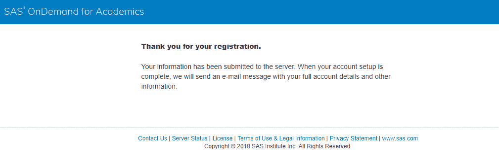

收到邮件后打开，里面有一个链接。点击链接，它会将你连接到登录页面。

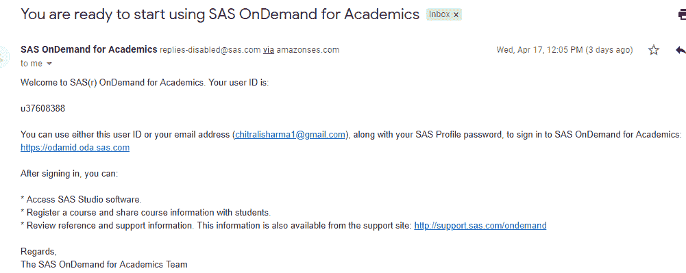

### 第六步

在登录页面上，输入您的用户标识或电子邮件地址以及密码，然后单击提交。

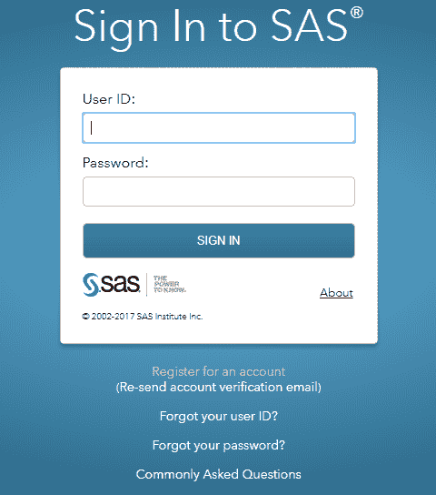

### 第七步

成功登录后，您将连接到显示您姓名的仪表板。现在，点击“SAS 工作室”

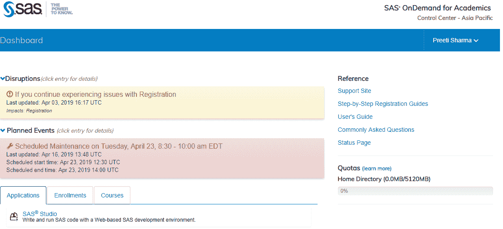

SAS 窗口将开始初始化。

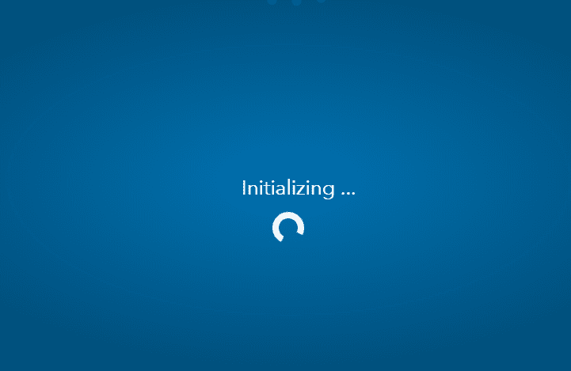

现在，您可以使用带有主窗口的 SAS 软件了。

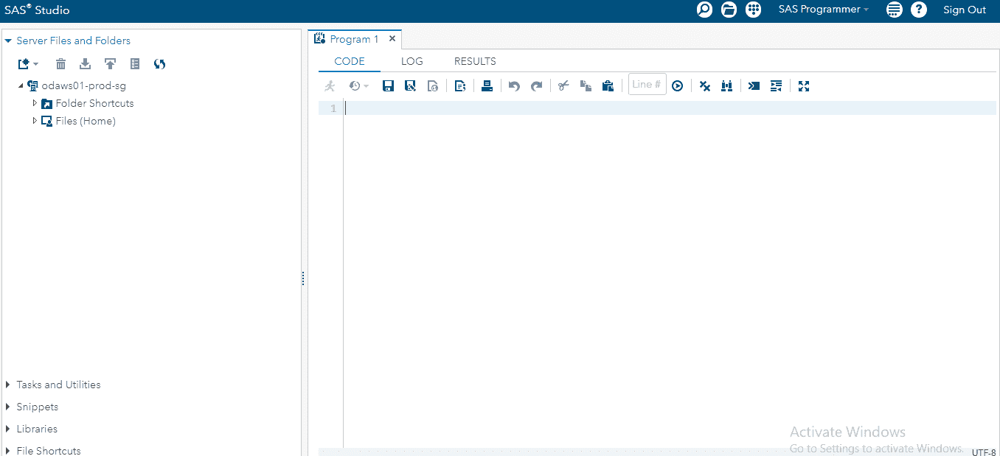

按照上面提到的步骤，您可以登录或创建您的配置文件来使用 SAS 软件。我们用非常简单明了的方式进行了解释，但是如果你在做这个过程中仍然有任何疑问或问题，那么你可以在我们的联系部分发布。

* * *