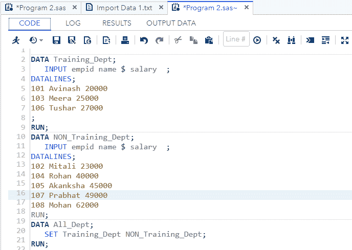
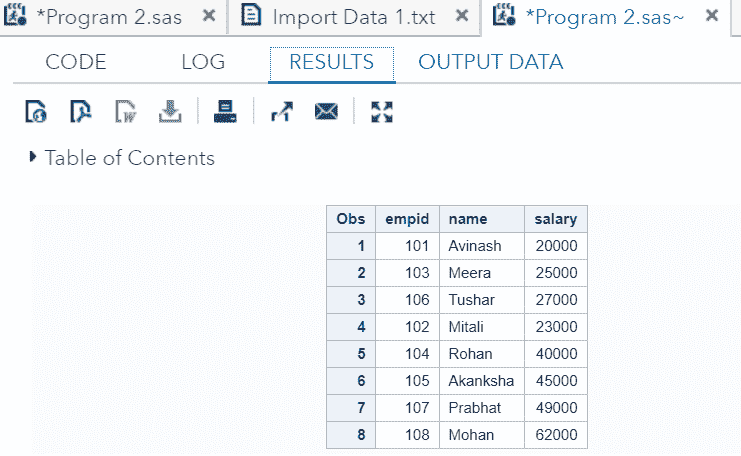
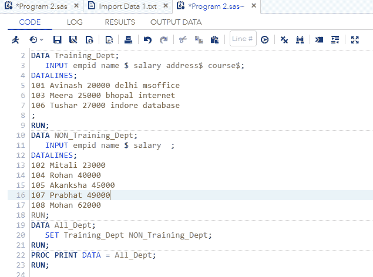
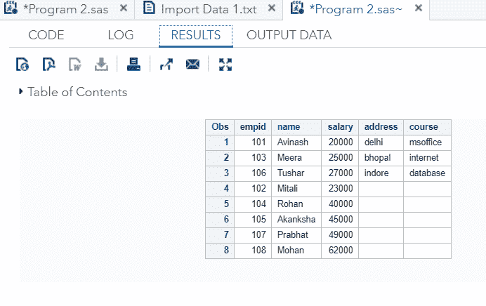
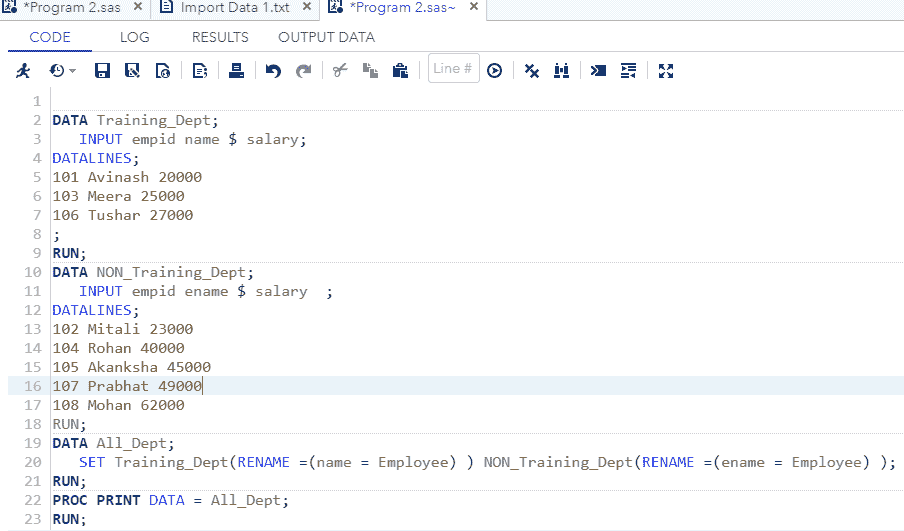
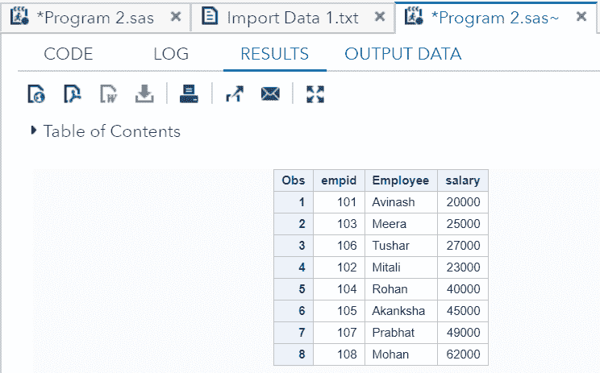
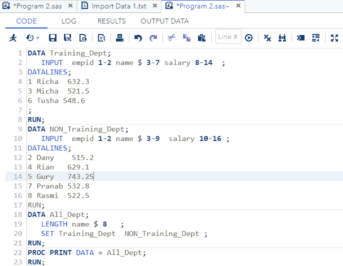
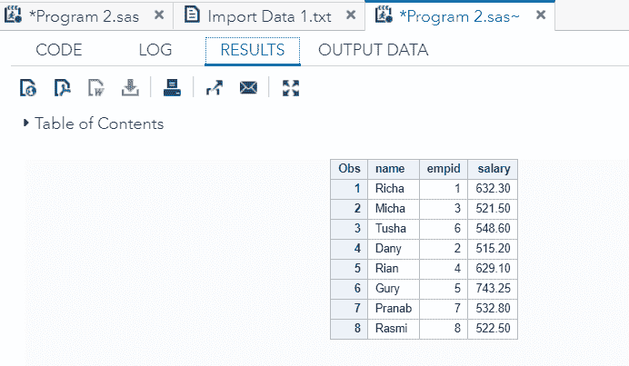

# 连接多个数据集

> 原文：<https://www.javatpoint.com/concatenate-multiple-data-sets-in-sas>

在前一个主题中，我们已经学习了以不同的文件格式编写 SAS 数据集。现在，在本主题中，我们将学习如何用 SAS 编程语言将多个数据集连接成一个数据集。

假设，你在不同的数据集中有很多观测值，你需要在一个数据集中收集所有的观测值，那么你会怎么做。为此，SAS 便于您将不同的数据集连接成单个数据集。

**SET 语句**用于将不同的数据集连接成单个数据集。串联数据集存储原始数据集所有观测值的总和。串联数据集中的所有观察值都遵循一个适当的存储顺序，首先是第一个数据集的所有观察值，其次是第二个数据集的所有观察值，依此类推。

理想情况下，所有的组合数据集应该有相同数量的变量，但是如果它们有不同数量的变量，那么所有的变量都会出现在结果中，小数据集的值会丢失。

### 语法:

```

SET data-set 1 data-set 2 data-set 3 data-set 4........;

```

哪里，

**Set:** 是用于将不同的数据集串联成单个数据集的语句。

**数据集 1 数据集 2:** 这些是正在连接的数据集的名称。

现在，让我们通过一个例子来了解如何连接数据集:

让我们考虑一个组织的员工数据，该数据有两个独立的数据集，一个用于培训部门，另一个用于非培训部门。为了获得所有员工的详细信息，我们需要连接这两个数据集。为此，我们使用 **SET** 语句。

```

DATA Training_Dept; 
   INPUT empid name $ salary; 
DATALINES; 
101 Avinash 20000 
103 Meera 25000 
106 Tushar 27000 
; 
RUN; 
DATA NON_Training_Dept; 
   INPUT empid name $ salary; 
DATALINES; 
102 Mitali 23000
104 Rohan 40000 
105 Akanksha 45000 
107 Prabhat 49000
108 Mohan 62000 
RUN; 
DATA All_Dept; 
   SET Training_Dept NON_Training_Dept; 
RUN; 
PROC PRINT DATA = All_Dept; 
RUN; 

```

现在，在 SAS studio 中执行上述代码:



**输出:**



正如我们在输出中看到的，两个数据集连接在一个表中。

## 不同的案例

有些情况下，数据集的变量会有变化。在这种类型的不同情况下，串联数据集中的观察总数总是等于每个数据集中观察的总和。让我们看看数据集变量有变化的不同情况。

### 1.当不同数量的变量

如果所有数据集的变量数量不相等，那么数据集仍然会连接在一起，但是额外变量的值会在小数据集中消失。让我们通过一个例子来理解。

**例如:**

有两个数据集需要连接。一个是**培训 _ 部门**，有 **empid** 、**姓名**、**薪资**、**地址**、**课程**五个变量，另一个是**非培训 _ 部门**，有三个变量，即 **empid** 、**姓名**、**薪资**。在输出中，数据集**非培训 _ 部门**的**地址**和**课程**的值将消失。

```

DATA Training_Dept; 
   INPUT empid name $ salary address$ course$; 
DATALINES; 
101 Avinash 20000 delhi msoffice
103 Meera 25000 bhopal internet
106 Tushar 27000 indore database 
; 
RUN; 
DATA NON_Training_Dept; 
   INPUT empid name $ salary; 
DATALINES; 
102 Mitali 23000
104 Rohan 40000 
105 Akanksha 45000 
107 Prabhat 49000
108 Mohan 62000 
RUN; 
DATA All_Dept; 
   SET Training_Dept NON_Training_Dept; 
RUN; 
PROC PRINT DATA = All_Dept; 
RUN;  

```

现在，在 SAS studio 中执行上述代码:



**输出:**



在输出中可以看到，**非培训 _ 部门**数据集缺少**地址**和**课程**的值。

### 2.当不同的变量名

当所有数据集包含相同数量的变量，但名称不同时，在这种情况下，我们可以通过应用**重命名语句**来连接数据集。如果我们不使用**重命名语句**，那么 SAS 仍然会连接数据集，但是它会为不同的名称变量产生缺失的结果。我们可以将**重命名语句**应用于我们为连接创建的数据集。让我们通过一个例子来理解。

**例如:**

在下面的例子中，我们有两个数据集一个是**培训 _ 部门**，另一个是**非培训 _ 部门**。两个数据集都有一个引用相同值(即名称)的变量，但它在两个数据集中用不同的名称声明。在数据集**培训 _ 部门**中，变量通过名称声明，而在数据集**非培训 _ 部门**中，变量通过**名称**声明。为了连接它们，我们将 **RENAME 语句**应用于连接的数据集 **All_Dept** 。

```

DATA Training_Dept; 
   INPUT empid name $ salary; 
DATALINES; 
101 Avinash 20000
103 Meera 25000
106 Tushar 27000
; 
RUN; 
DATA NON_Training_Dept; 
   INPUT empid ename $ salary  ; 
DATALINES; 
102 Mitali 23000
104 Rohan 40000 
105 Akanksha 45000 
107 Prabhat 49000
108 Mohan 62000 
RUN;  
DATA All_Dept; 
   SET Training_Dept(RENAME =(name = Employee) ) NON_Training_Dept(RENAME =(ename = Employee) ); 
RUN; 
PROC PRINT DATA = All_Dept; 
RUN; 

```

现在，在 SAS studio 中执行上述代码:



**输出:**



正如我们在输出中看到的，员工姓名由变量 **Employee** 连接。

### 3.当变量的长度不同时

如果数据集中变量的长度不同，那么我们可以通过应用 **Length 语句**来连接它们。当在连接的数据集中应用**长度语句**时，我们应该考虑更大的长度，而不是更小，因为 SAS 将生成更大的长度容器，可以轻松接受小的长度值。

**例如:**

在下面的例子中，变量**名称**在**训练 _ 部门**数据集中的长度为 5，在**非训练 _ 部门**数据集中的长度为 7。当连接时，我们应用了更高的长度，即 8。

```

DATA Training_Dept; 
   INPUT empid 1-2 name $ 3-7 salary 8-14  ; 
DATALINES; 
1 Richa  632.3 
3 Micha  521.5 
6 Tusha 548.6 
; 
RUN;
DATA NON_Training_Dept; 
   INPUT  empid 1-2 name $ 3-9  salary 10-16 ; 
DATALINES; 
2 Dany    515.2 
4 Rian   629.1 
5 Gury   743.25
7 Pranab 532.8 
8 Rasmi  522.5 
RUN; 
DATA All_Dept; 
   LENGTH name $ 8   ;
   SET Training_Dept  NON_Training_Dept ; 
RUN; 
PROC PRINT DATA = All_Dept; 
RUN;  

```

在 SAS studio 中执行上述代码:



**输出:**



正如我们在输出中看到的，变量名由更高的字符长度连接，即 8

* * *