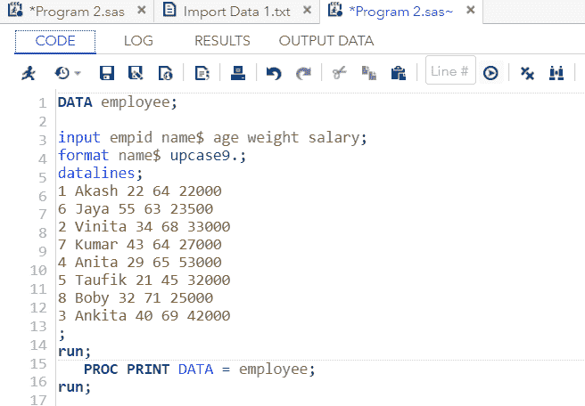
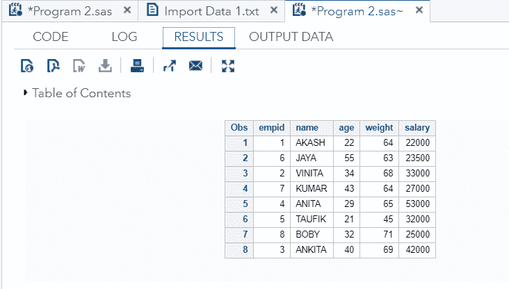
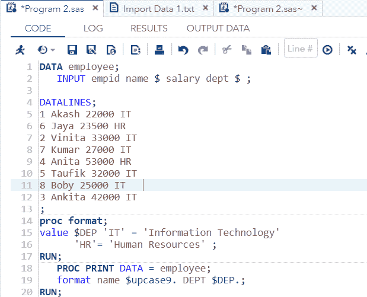
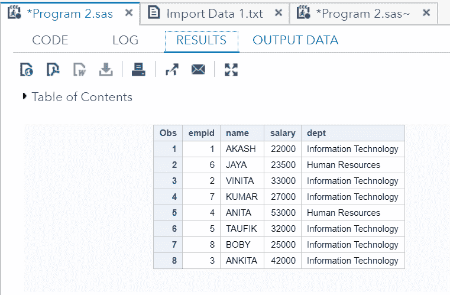

# 格式化数据集

> 原文：<https://www.javatpoint.com/format-data-sets-in-sas>

有时，我们更喜欢将分析的数据表示为不同于数据集中原始格式的格式。例如，在一个文本变量中，所有的文本值都是小写的，我们希望用大写来表示这些值。或者我们需要在包含价格信息的变量中添加小数位。为此，SAS 提供了**格式**语句。

**FORMAT** 语句包含 SAS 内置格式。我们可以应用 **FORMAT** 语句来使用内置格式，并以用户定义的格式应用**PROCRAFT**。

### 语法:

```

FORMAT variable name format name;

```

哪里，

*   **FORMAT:** 表示格式化动作的格式语句。
*   **变量名:**这是需要格式化的变量的名称。
*   **格式名称:**是要应用于变量的 SAS 内置格式的名称。

### 示例:

让我们考虑包含组织员工详细信息的 SAS 数据集员工。这里我们需要以大写形式显示员工姓名，为此我们使用的是 **FORMAT** 语句 **upcase9** ，这是 SAS 内置格式。

```

DATA employee; 

Input empid name$ age weight salary;
FORMAT name$ upcase9.;
datalines;  
1 Akash 22 64 22000
6 Jaya 55 63 23500
2 Vinita 34 68 33000
7 Kumar 43 64 27000  
4 Anita 29 65 53000
5 Taufik 21 45 32000  
8 Boby 32 71 25000
3 Ankita 40 69 42000  
;  
run;
   PROC PRINT DATA = employee; 
run;

```

在 SAS studio 中执行上述代码:



**输出:**



正如您在输出中看到的，所有员工的姓名都已转换为大写。

## 使用 PROC FORMAT

**PROC FORMAT** 用于格式化用户自定义数据。我们可以根据我们的要求格式化数据值或观察值。在下面给出的例子中，我们应用了内置和用户定义的格式语句。

内置格式 **upcase9** 用于将小写文本转换为大写。对于用户定义的格式，我们将变量**部门**的值从缩写改为扩展形式，即信息技术=信息技术，人力资源=人力资源。

```

DATA employee; 
   INPUT empid name $ salary dept $; 

DATALINES; 
1 Akash 22000 IT
6 Jaya 23500 HR  
2 Vinita 33000 IT  
7 Kumar 27000 IT 
4 Anita 53000 HR  
5 Taufik 32000 IT  
8 Boby 25000 IT   
3 Ankita 42000 IT 
;
proc format;
value $DEP 'IT' = 'Information Technology'
      'HR'= 'Human Resources';
RUN;
   PROC PRINT DATA = employee; 
format name $upcase9\. DEPT $DEP.; 
RUN;

```

在 SAS studio 中执行上述代码:



**输出:**



正如您在输出中看到的，所有员工的姓名都已转换为大写，部门的缩写也已转换为扩展形式。

* * *