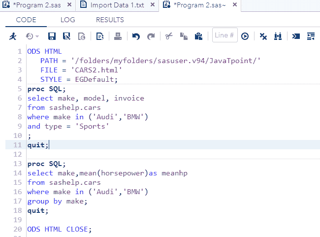
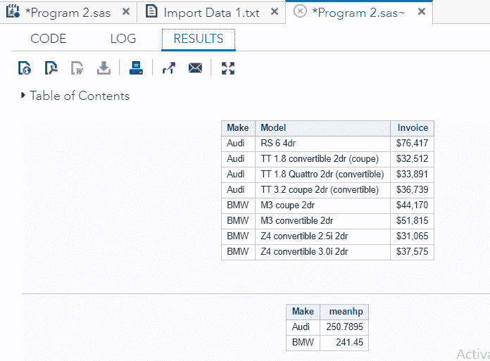
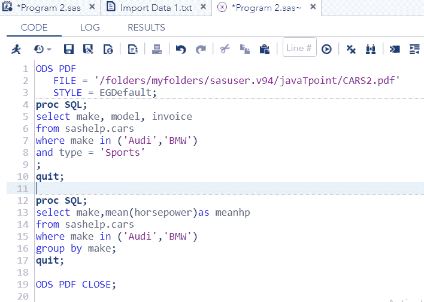
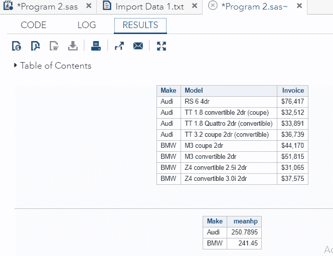
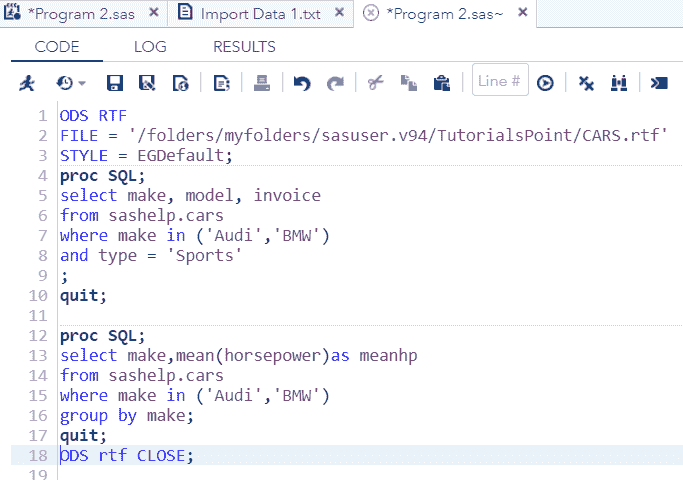

# SAS 输出传输系统

> 原文：<https://www.javatpoint.com/sas-output-delivery-system>

在上一个主题中，我们学习了如何在数据集中使用 SQL 查询来创建、读取、更新和删除表值。现在，在这个主题中，我们将学习什么是 SAS ODS-输出交付系统，以及如何创建各种类型的输出文件。

**SAS 输出传递系统**用于将 SAS 程序的输出转换成更加用户友好的形式，如 **HTML** 、 **PDF** 等。我们可以使用 SAS 软件中提供的 **ODS** ( *输出交付系统*)语句来做到这一点。

最好将 SAS 程序的输出格式化为适合查看和理解的有用报告。它还有助于与其他平台和软件产品共享输出，并将多个 PROC 语句的结果合并到一个文件中。

### 语法:

```

ODS outputtype
PATH path name
FILE = Filename and Path
STYLE = StyleName
;
PROC some proc
;
ODS outputtype CLOSE;

```

哪里，

**PATH:** 是用于将 SAS 程序输出转换为 HTML 形式的语句。对于其他形式，我们使用**文件名**代替**路径名**。

**风格:**代表 SAS 环境中可用的**内置风格**。

We can create three types of files as output in the SAS:

*   **HTML 文件输出**
*   **PDF 文件输出**
*   **RTF 或 Word 文件输出**

## 创建 HTML 输出

当我们需要在网络上发送输出时，我们可以创建一个 HTML 文件作为输出。SAS 提供 **ODS HTML** 语句，创建一个 HTML 文件作为 SAS 程序的输出。在这个例子中，我们将在我们想要的路径中创建一个 HTML 文件。我们正在应用**样式 EGDefault** ，它已经在样式库中可用。

```

ODS HTML 
   PATH = '/folders/myfolders/sasuser.v94/JavaTpoint/'
   FILE = 'CARS2.html'
   STYLE = EGDefault;
proc SQL;
select make, model, invoice 
from sashelp.cars
where make in ('Audi','BMW')
and type = 'Sports'
;
quit;

proc SQL;
select make,mean(horsepower)as meanhp
from sashelp.cars
where make in ('Audi','BMW')
group by make;
quit;
ODS HTML CLOSE;

```

在 SAS Studio 中执行上述代码后，将在提到的路径中生成 HTML 形式的输出文件。我们可以下载这个 HTML 文件，将其保存在不同于 SAS 的环境中。



请注意，我们在代码中使用了两个 **PROC SQL 语句**；这并不意味着它们的输出将被捕获在两个独立的文件中；它将被捕获在同一个文件中。

**输出:**



## 创建 PDF 输出

SAS 提供 **ODS PDF** 语句，创建一个 PDF 文件作为 SAS 程序的输出。在示例中，我们将在所需的路径中创建一个 PDF 文件。我们正在应用**样式 EGDefault** ，它已经在样式库中可用。

```

ODS PDF 
   FILE = '/folders/myfolders/sasuser.v94/javaTpoint/CARS2.pdf'
   STYLE = EGDefault;
proc SQL;
select make, model, invoice 
from sashelp.cars
where make in ('Audi','BMW')
and type = 'Sports'
;
quit;

proc SQL;
select make,mean(horsepower)as meanhp
from sashelp.cars
where make in ('Audi','BMW')
group by make;
quit;
ODS PDF CLOSE;

```

在 SAS Studio 中执行上述代码后，输出将在提到的路径中生成为 PDF 文件。我们可以下载此 PDF 文件，将其保存在与 SAS 不同的环境中。



请注意，我们在代码中使用了两个 **PROC SQL 语句**；这并不意味着它们的输出将被捕获在两个独立的文件中；它将被捕获在同一个文件中。

**输出:**



## 创建 RTF(单词)输出

SAS 提供 **ODS RTF** 语句来创建一个 RTF 文件作为 SAS 程序的输出。在这个例子中，我们将在我们想要的路径中创建一个 RTF 文件。我们正在应用**样式 EGDefault** ，它已经在样式库中可用。

```

ODS RTF 
FILE = '/folders/myfolders/sasuser.v94/TutorialsPoint/CARS.rtf'
STYLE = EGDefault;
proc SQL;
select make, model, invoice 
from sashelp.cars
where make in ('Audi','BMW')
and type = 'Sports'
;
quit;

proc SQL;
select make,mean(horsepower)as meanhp
from sashelp.cars
where make in ('Audi','BMW')
group by make;
quit;
ODS RTF CLOSE;

```

在 SAS Studio 中执行上述代码后，输出将在提到的路径中生成一个 RTF 文件。我们可以下载这个 RTF 文件，将其保存在与 SAS 不同的环境中。



请注意，我们在代码中使用了两个 **PROC SQL 语句**；这并不意味着它们的输出将被捕获在两个独立的文件中；它将被捕获在同一个文件中。

**输出:**


* * *