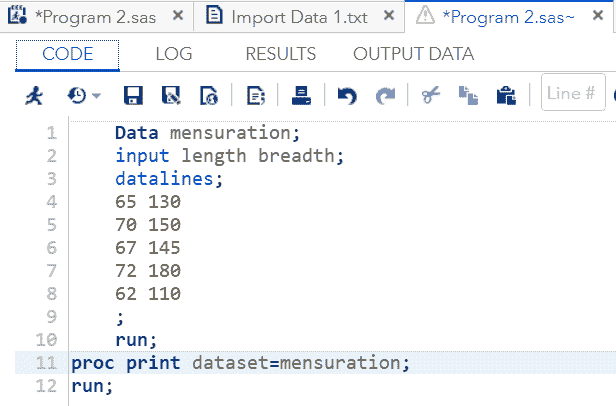
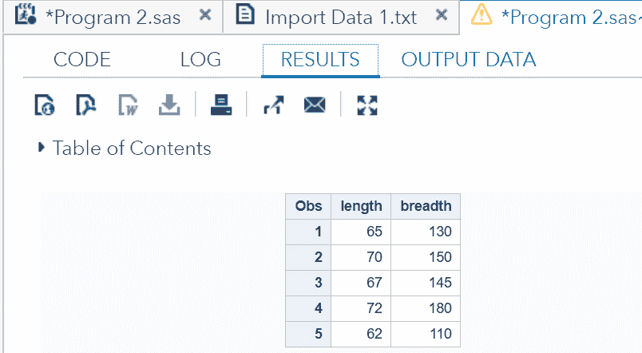
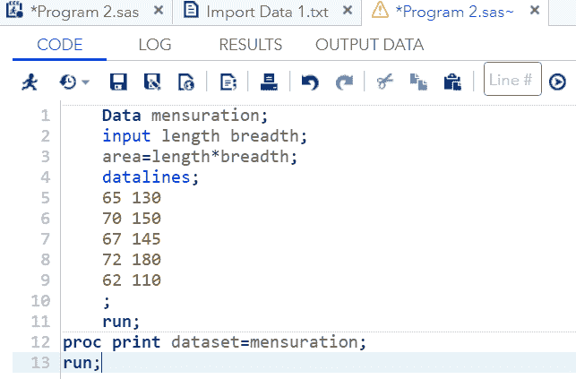
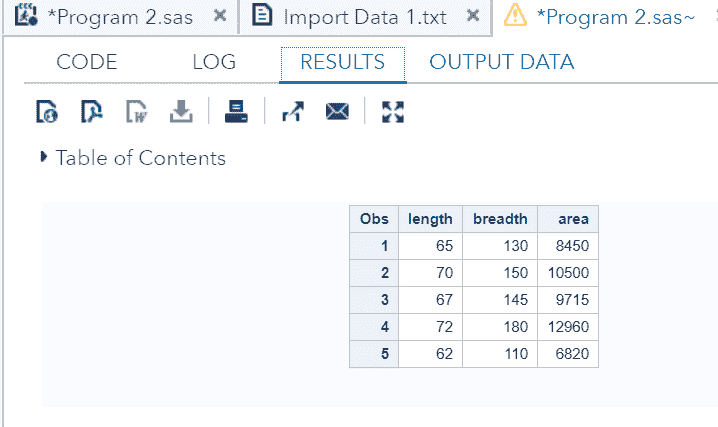
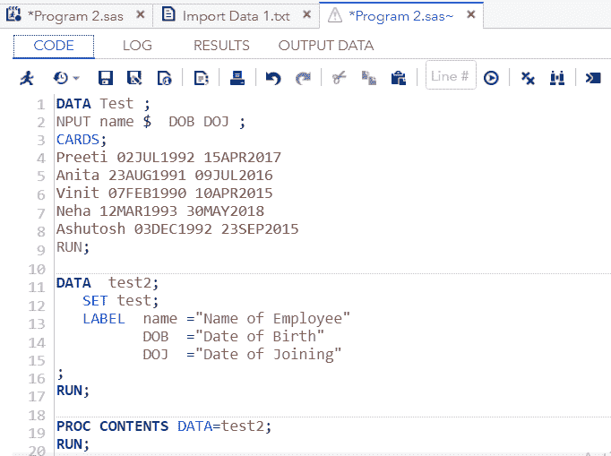
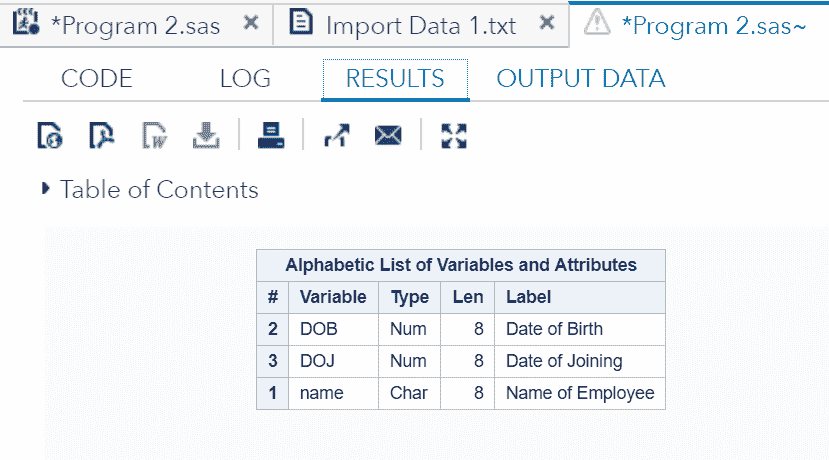
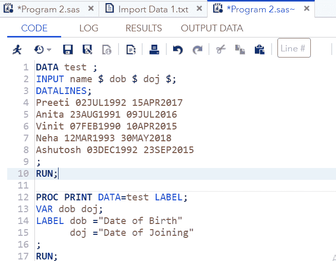
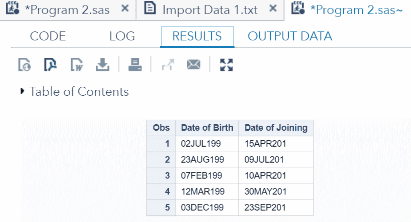

# SAS 变量

> 原文：<https://www.javatpoint.com/sas-variables>

## 类型|属性|在 SAS 中创建变量

在最后几个主题中，我们学习了对数据集的各种操作。现在在这个话题中，我们要学习， **SAS 变量**及其**创造**，各种**类型**，以及**属性**。

## 什么是变量？

在 SAS 中，变量是用户给数据集列的名称。

SAS 中变量背后的目的是，根据特定特征对观察结果进行分类，如姓名、出生日期、身高、体重等。

变量名可以根据它必须表示的特征给出。命名变量时，必须遵循 **SAS 基本语法**文章中的一些规则。

## SAS 变量的类型

SAS 变量有两种类型:

1.  **数字**
2.  **字符**

### SAS 数值变量

数值变量存储数值，即数字。该变量用于执行算术计算，如加法、减法、乘法、除法和所有其他类型的计算。除此之外，这个数字变量也用于存储日期和时间。

数值变量缺少的值按句点(.)显示。).

**语法:**

```

INPUT var1 var2; 

```

**示例:**

```

INPUT id, salary, incentive;

```

### SAS 字符变量

字符变量用于存储文本。这个变量也被称为字符串变量。这些变量是通过在变量名的末尾放一个美元符号($)来定义的。它们可以包含特殊字符(如&、%、()、$)、字母和偶数。

文本变量缺少的值以空格("")显示。

**语法:**

```

INPUT var1 $ var2 $ var3 $;

```

**示例:**

```

INPUT name $ companyname $ address $;

```

## 创建 SAS 变量

如上所述，我们可以在特征的基础上创建变量，所以首先考虑特征，然后根据特征给变量命名。

有两种方法可以创建 SAS 变量:

*   **在新的数据集中创建一个新的变量**
*   **将变量添加到现有数据集中**

### 在新数据集中创建新变量

假设我们正在创建一个名为**测量**的新数据集，它有两个特征，长度和宽度。

以下示例说明了我们如何创建它:

```

Data mensuration;
	input length breadth;
	datalines;
	65 130
	70 150
	67 145
	72 180
	62 110
	;
run;
proc print dataset= mensuration;
run;

```

上面的代码将创建一个以长度和宽度变量作为列的数据集。它还将显示五个观察结果。让我们在 SAS Studio 中执行这段代码。



**输出:**



正如我们在输出中看到的，有两个变量长度和宽度生成了包含五个观察值的列。

### 向现有数据集中添加变量

现在，如果我们需要在现有数据集**测定**中添加一个基于长度和宽度的新变量，我们可以通过以下方式添加:

首先，指定新变量的名称，然后用它所依赖的参数加上等号(=)。

面积=长度*宽度(这是面积的数学公式)

我们可以使用 SAS 在另外两个变量(即长度和宽度)的基础上计算一个名为“面积”的衍生变量。现在，让我们看看如何做到这一点:

```

Data mensuration;
	input length breadth;
	area=length*breadth;
	datalines;
	65 130
	70 150
	67 145
	72 180
	62 110
	;
	run;
proc print dataset=mensuration;
run;

```

**在 SAS Studio 中执行上述代码:**



**输出:**



正如我们在输出中看到的，数据集“测定”添加并计算了新的变量面积。现在，它有三个变量，长度，宽度和面积。

#### 注意:总是在输入语句和数据行语句之间创建新的变量。

## 变量属性

SAS 变量有四个重要属性，名称、长度、格式和标签。

*   **名称**
*   **长度**
*   **格式**
*   标签

属性帮助我们识别变量并定义如何使用它们。

### 名字

SAS 变量遵循一些命名约定，如下所示:

*   变量名不能超过 **32** 个字符。
*   变量名不应该以数字开头，我们可以以字母(a-z)或(A 到 Z)或下划线(_)开头。我们可以在第一个字符后使用数字。
*   两个单词之间不应有空格。例如，变量名不能作为“**姓氏**”，因为空格或空格不会被识别。我们可以用“**姓氏**或“**姓氏**来代替它。”

#### 注意:避免给变量起一大堆名字。还要尽量避免像 a1、a2 这样的通用名称，因为它不提供具体的信息，可能会引起混淆。

### SAS 可变长度

SAS 变量“长度”对应于变量存储的字节数。字符和数字变量的默认字节值都是 8。

### SAS 可变格式

变量的格式指示给 SAS，如何打印输出。格式非常重要，因为它有助于读者理解输出数据。

小数点和日期的 SAS 格式包括以下格式:

*   数值变量的十进制数字格式是 1 或 1.00。
*   日期变量的日期格式为 2013 年 5 月 16 日或 2013 年 5 月 16 日或 2013 年 5 月 16 日。

### SAS 变量标签

如果我们需要提供关于变量的附加信息，可以使用**标签**。例如，考虑一个员工数据，其中我们将员工的**出生日期**和**加入日期**分别作为变量 **DOB** 和 **DOJ** 。现在，我们想提供更多关于这些变量的信息，因为它们由于日期的相似性而产生了错觉。为了克服这种困惑，我们可以使用标签。

**语法:**

```

LABEL variable name= "variable name";

```

让我们通过一个例子来理解 LABEL 是如何工作的:

```

DATA Test ;
INPUT name $  DOB DOJ ;
CARDS;
Preeti 02JUL1992 15APR2017
Anita 23AUG1991 09JUL2016
Vinit 07FEB1990 10APR2015
Neha 12MAR1993 30MAY2018
Ashutosh 03DEC1992 23SEP2015
RUN;

DATA  test2;
   SET test;
   LABEL  name ="Name of Employee"
DOB  ="Date of Birth"
DOJ  ="Date of Joining"
;
RUN;

PROC CONTENTS DATA=test2;
RUN;

```

***过程内容**显示标签实际上已被分配。*

**在 SAS Studio 中执行上述代码:**



**输出:**



正如我们在输出中看到的，所有的变量都根据指令进行了标记。

**标签**可用于数据步骤或过程步骤。

在上面的代码中， **LABEL** 用于数据步骤，当 **LABEL** 用于数据步骤时，它成为数据集的永久部分。上面代码的输出是显示所有变量的标签，这些标签是数据集的永久部分。

当标签用于 PROC 步骤时，它成为数据集的临时部分。这意味着我们可以在另一个表单中标记一个变量名以供临时使用。例如， **DOB =“出生日期”或 DOJ =“加入日期”**

标记的变量 DOB 在输出中将显示为变量**出生日期**， **DOJ** 为**加入日期**。

**让我们看看例子:**

```

DATA test;
INPUT name $ DOB $ DOJ $;
DATALINES;
Preeti 02JUL1992 15APR2017
Anita 23AUG1991 09JUL2016
Vinit 07FEB1990 10APR2015
Neha 12MAR1993 30MAY2018
Ashutosh 03DEC1992 23SEP2015
;
RUN;

PROC PRINT DATA=test LABEL;
VAR DOB DOJ;
LABEL DOB ="Date of Birth"
DOJ ="Date of Joining"
;
RUN;

```

**在 SAS Studio 中执行上述代码:**



**输出:**



在上面的代码中，我们在**进程打印**程序(或进程步骤)中使用了**标签**。在输出中，变量 **DOB** 和 **DOJ** 以标签形式显示，即**出生日期**和**加入日期**。需要记住的事实是，我们可以在 **proc 步骤**中使用 **LABEL** 语句，但只能在<storng>打印程序</storng>中显示，它不能更改数据集中变量的标签。

结论是，当您想要永久更改标签时，请在数据步骤中使用该标签，当是临时标签时，请在 PROC 步骤中使用它。

* * *